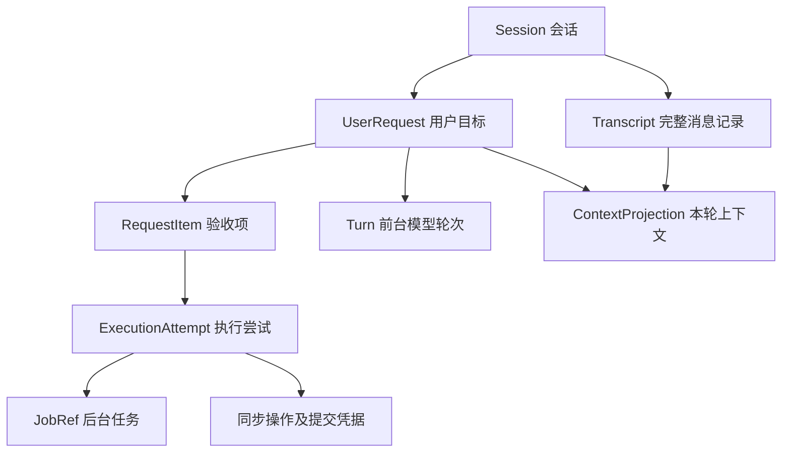

# ADR-040：助手用户请求、执行归属与上下文投影

- 状态：已实施（2026-09-12 用户授权开发）；真实模型语料评估未执行。
- 日期：2026-09-12
- 需求：[FR30](../requirements.md#fr30智能助手用户请求生命周期与长会话上下文)
- Plan：[assistant-user-request-lifecycle](../../plans/assistant-user-request-lifecycle/plan.md)
- 关联：[ADR-008](008-smart-assistant-code-layering.md)、[ADR-018](018-project-session-persistence-v2.md)、[ADR-019](019-unified-task-runtime.md)、[ADR-031](031-native-llm-function-calling.md)。
- 关系：补充 ADR-018 的 Session 内容与应用层写入边界；保留 ADR-019 的任务终态/提交权威。SessionController 对外继续兼容，定位收敛为前台轮次控制，不再承担整个用户目标是否完成的判断。没有修改既有已接受 ADR。

## 背景与当前事实

会话可长期存在，用户目标可以被追问、修订、暂停或替换。一次目标可跨多个模型轮次和后台任务；一次输入也可能涉及多个目标。仅保存聊天历史和当前 THINKING/EXECUTING 状态无法表达这些关系。

当前请求核心位于 `application/assistant_requests/`，RequestService 统一写入 Session schema 4 与不可变 transcript manifest。完整历史和预算投影分开；工具、后台事件及任务中心控制通过请求前置校验和原有正式提交屏障。请求清单负责显示状态和提交显式用户操作。

具体实现、验证命令及性能限制见关联 Plan。上下文窗口默认 32768，可在 AI 服务设置调整；输出预留和工具定义一并计入预算，采用离线保守估计。

本次已完成的取消修复作为基础继续保留；新增请求层不能绕过已有权限、TaskRuntime 取消屏障、图 checkpoint 身份和项目提交规则。

## 决策 1：身份和职责分层

采用以下概念，只有执行引用构成关联，不能把一层的状态当成另一层的状态：

- `assistant_request_id`：持续的用户目标身份；进度查询、目标补充和内部任务重试保留原目标 ID，独立问答追问建立关联请求。与 MCP/HTTP 的 request_id、RequestContext、ADR-029 的单次模型配置术语区分。
- `request_revision`：目标、约束、验收项或执行范围改变时递增。普通进度、批准既定操作、独立问答追问及无关消息不增加它。批准只推进对应 approval/effect 记录版本；撤权推进作用域内的 lease_epoch，不能让一次批准立即使自己的 request_revision 失效。
- `session_revision`：整个 Session 保存的 CAS 版本；不得拿它代替 request_revision 验证确认，否则任意聊天保存会使许可失效。
- `message_id/ingress_sequence`：输入和转录记录身份、接纳顺序。
- `turn_id/turn_generation`：一次模型调用及其回调资格，不能复用 job run_id。
- `attempt_id/dispatch_id/effect_id`：请求项的一次执行尝试、父计划/工作分派身份、一个叶子副作用的逻辑身份。不同上传、写入及循环中的不同操作实例各自分配 effect_id；同一操作的网络重投才沿用该 ID，父计划的 dispatch_id 不能作为所有子操作的幂等键。
- `job_id/run_id`：继续使用 TaskRuntime 身份；一个 attempt 可以关联父计划及多个子 job。

新增类型化 `AssistantExecutionRef(request_id, request_revision, item_ids, attempt_id, dispatch_id, turn_id)` 作为执行归属；叶子接纳生成 `EffectRef(effect_id, operation_hash, approval_ref, lease_epoch)`。应用层验证后注入 ExecutionContext；跨 TaskRuntime 时编码成有命名空间的 metadata，任务桥明确保留这些字段。复制父计划上下文只能继承归属，不能复用另一叶子操作的 EffectRef。owner/session/project/variant 的授权校验始终独立存在，模型不能自行选择 owner。

## 决策 2：生命周期与活动状态分开

请求核心生命周期采用 `OPEN → STOPPING → CANCELLED | SUPERSEDED | FAILED`，以及 `OPEN → COMPLETED | FAILED`。STOPPING 记录确定的停止原因与目标终态，失败后的清理不会误归类为用户取消。

- OPEN 表示目标仍需处理，可以同时存在后台工作、待回答项和待确认项。
- STOPPING 立即关闭新操作接纳，记录停止意图及原因；等待其工作和未知副作用收敛。替换请求的最终状态为 SUPERSEDED，并记录 successor。
- COMPLETED 要求当前修订的所有必要验收项有通过证据，且没有未收敛副作用或必要后处理。
- FAILED 表示必要项已经明确无法完成且结果已经汇总；允许 partial outcome，但不能显示为成功。所有请求终态统一要求：没有仍能继续提交的关联执行，没有未核对的副作用。一项失败但另一项仍在运行时保持 OPEN 并显示部分失败；按依赖策略继续独立项或转 STOPPING 收敛后，才能提交 FAILED/其他终态。
- 终态不可由迟到事件改变。明确重试 FAILED/CANCELLED/SUPERSEDED 的目标创建带 `retry_of/resumes` 的后继请求；任务失败后的内部重试可以在原 OPEN 请求内产生新 attempt。

“待推进、正在回答、后台执行、待确认、待澄清、暂停推进、需要核对结果”是从 item、执行和调度约束派生的活动标签，不再引入一个试图描述所有组合的巨型枚举。

每个请求包含：目标与原文来源、有效约束、冻结执行范围、当前修订、item 集合、必要依赖、关联消息、attempt/job 引用、结果证据、调度暂停原因、停止意图、最后消费事件序号。item 状态为 PENDING/RUNNING/WAITING/SATISFIED/FAILED/CANCELLED；等待原因放在 item 上，多个原因可以共存。

状态不变量：

1. SessionController 进入 IDLE 仅表示本轮释放前台，不会直接完成请求。
2. 问答 item 需关联已保存的完整回答及覆盖声明；程序核对 item ID 和证据存在，不能以此保证语义答案绝对正确，语义覆盖另做模型评估和用户纠正。
3. 执行 item 需要实际 Outcome 及其要求的验证/提交凭据，worker completed 或 LLM 文本不能代替凭据。
4. 部分失败不会抹掉成功结果；仍可回答其他独立问题，最后按当前必要项产生 partial/failed 报告。
5. 已取消请求的旧结果可附加审计证据，不能重新变 OPEN 或触发自动执行。

## 决策 3：输入先接纳，再路由，再执行

输入流程：`持久化 ingress → 读取待路由批次 → 生成 RoutingProposal → 校验并提交指令 → 调度 ready 工作`。

UI 的 QTimer/generation 仅合并唤醒和防旧显示；已持久化的早期输入仍在待路由集合。失败时保留原文及消费位置，重试不会重新创建同一请求。发送状态必须区分本地草稿、接纳中与已接纳；流式输出只在句段或轮次提交点落盘，不对每个 token 重写整份会话。接纳时捕获 origin_scope、project/variant/source、稳定选中条目键或不可变 selection 引用及版本；新请求不能在延迟路由时重新读取“当前 UI 选择”。显式关联旧请求使用其原 scope，资源不可用或范围冲突时等待核对，不能悄悄指向新项目。

RoutingProposal 是独立于业务工具的控制协议，含多个 directives。每个 directive 带稳定 directive_id、message_id、原文 span、CREATE/FOLLOW_UP/AMEND/PAUSE/RESUME/CANCEL/REPLACE、目标请求、expected_revision，以及涉及 item。一个输入可以同时取消 A、修订 B、新建 C；引用新建目标可用批次内临时 ID，由程序分配正式 ID。每项分别保存 pending/applied/needs_clarification/rejected 状态，临时 ID→正式 ID 映射与已应用状态同一次提交；重启只重处理未完成项，不能仅凭整条消息水位决定全部重放。对已应用项重新分类通过显式纠正命令，不生成第二份 CREATE。

模型负责提出关系和拆分建议，程序负责校验所有权、当前修订、原文引用、依赖无环和合法迁移。置信度只用于提示，不能授予权限。明确 UI 操作走确定性命令；自然语言目标不明时不猜测写入或取消对象，受影响 directive 留待澄清，独立问题可推进。初次分类最多一次模型调用，schema 校验失败不无限重试；使用可见澄清作为退路。

FOLLOW_UP 若是查询进度，可直接投影原任务并记录关联回答；需要独立回答时建立新的关联 follow-up 请求，不给原请求添加验收项，也不使原许可过期。若用户确实增加原目标的验收要求，则使用 AMEND 并推进修订。原请求已完成也不重新打开终态。跨目标关系仅是业务关联，不能扩大权限范围。

AMEND 创建新 revision，并逐项判定旧成果是否仍有效。对尚未启动的操作更新计划；对在途不兼容操作先撤销其接纳 lease 并请求取消，再在安全点重新规划。保留原 revision 的结果与已提交事实，不声称已经改变远端在途请求。必要项的删除也必须由有来源的修订记录表达，不能由摘要偷偷省略。

REPLACE 记录旧请求停止意图和后继目标。同一资源上的新写操作等待旧执行收敛；独立只读问题可继续。自然语言“另外看看”默认新增，不隐式替换。

### 模型与程序的协议边界

下列工具及协议已经实现。用户输入通过现有 LLM 原生工具传输能力生成结构化提案，应用层接收、验证并保存；不提供文件写入或 `set_request_state` 能力。

- 路由阶段仅暴露 `submit_request_routing`。一次完整调用提交一个批次提案，不允许混合业务工具、propose_plan 或回答终结调用；格式/阶段违规整轮拒绝，零业务执行。普通说明文字不构成已应用请求变更。此控制调用交独立解析器和 routing validator，不转成 GraphExecutor steps。
- 程序先创建 routing_batch_id、输入集合摘要、候选请求/revision 和当前 turn epoch。模型只返回协议版本、批内局部编号、原文引用和操作建议；正式 request/directive ID 由程序签发。首份合法 proposal、局部编号映射及逐项状态先原子保存，再应用 directive。schema 校验失败整批不接纳；合法提案中的目标歧义可逐项等待。
- `protocol_version` 独立于存储 schema；未知版本、未知字段、伪造 owner/正式新请求 ID 拒绝。同一 command/batch ID 携带不同内容摘要返回冲突。重投读取已保存提案，不能让模型重新编号绕过去重；澄清只修改指定未决 directive，已应用操作只能通过显式纠正命令改变。
- 只有真实用户 ingress/UI 命令能作为路由来源；历史材料、工具结果和引用的示例命令不能作为新控制指令。候选请求被截断或无法确定目标时不自动 CREATE 一个替代目标，应先补充检索或澄清。
- 执行阶段不暴露路由工具。程序捕获 `TurnAdmission(request_ref, revision, ready_item_ids, stage, allowed_tools, scope, epoch)`；所有工具调用、namespace 加载、propose_plan 及嵌套步骤都核对阶段、允许集合和归属。模型参数不得覆盖执行身份。写操作随后进入 Effect admission；没有合法 turn、未应用路由或旧 epoch 时不能回退 legacy 路径执行。

控制工具的 call/result 也保留合法协议关联。回执由程序返回 accepted/rejected/needs_clarification、正式请求引用及当前版本，模型未拿到接受回执前不能宣称请求已经建立或修改。现有 `native_tools.py` 将 propose_plan 以外的调用视为业务 steps，实现时必须增加明确阶段和独立控制解析，而不能只在 prompt 中隐藏工具。

### 回答完成协议

执行轮次可在同轮自然语言回答之外提交唯一终结控制调用 `report_answer_coverage(item_ids, dispositions)`，不与业务工具或 propose_plan 混用。它只提出哪些问答项已回答/被阻塞，不允许设置请求终态或把执行项声明为成功。程序为实际回答生成 message_id/digest，绑定 request_revision、turn_id、epoch 和覆盖声明，并在一个 Session 提交中保存回答及 item 更新。

只有当前有效 turn、provider 报告完整结束（包括正常的工具调用结束）、非空最终文本、合法 item 与完整证据均成立时，问答项才可能满足。length/max_tokens、网络失败、用户停止、旧 epoch、空文本和流式片段仅保存为 incomplete/interrupted，不计作完成。没有覆盖声明的自然语言可以显示，但请求保持未完成并给出协议诊断，不无限自动重试。

回答终结调用在独立控制分支处理，不能沿当前“存在 steps 就移除回答气泡”的分支；所有工具回执补齐后终结本轮，不再因为该控制调用自动触发普通 ReAct 续跑。执行项只由任务 Outcome/正式提交记录更新。程序可校验证据关联和完整性，不能据此保证语义回答质量，仍须保留用户纠正和固定语料评估。

## 决策 4：一个前台轮次，多个可跟踪请求

用户已选择自动继续。推荐首期调度范围限定为当前打开且活动的助手会话：

- 每个 Session 最多一个前台模型轮次，路由调用也占此前台槽位。应用服务按 storage_root/session 持有唯一 `TurnLease(holder_view_id, turn_id, epoch)`；多窗口不能各建一个独立调度者。显式激活/移交递增 epoch，旧持有者输出不可提交回答或新工具，新持有者等待释放或完成 fencing 后才启动。保存 CAS 锁不能代替执行租约。用户新输入中断旧生成并优先处理；已接纳的后台操作继续归属原请求。
- 后台结果先持久化原请求，若有可继续工作则入队。当前回答完整提交、或进入需用户决策的等待后释放前台，再选择下一项。
- 用户新输入优先于自动续跑；自动续跑按入队顺序轮转，每次最多一个模型轮次，防止一个长请求霸占所有旧请求机会。持续用户输入可推迟自动工作，UI 保留待推进状态。
- 队列唤醒可按 request/revision 合并，但选择结果是 `(request_ref, ready_item_ids)`。STOPPING、请求级用户暂停和会话失活阻塞全请求；确认、结果未知及资源依赖只阻塞相关 item 和依赖闭包。同请求中上传等确认不妨碍独立术语问答；入场时再次核对修订及 ready 集合。
- 延续现有模型/工具最大步数，并为自动推进保留每请求累计上限，不能换个 turn 就重置无限循环额度；达到上限等待用户继续。
- 切换会话后，原会话后台任务继续记录结果，但不自动启动新的模型轮次；回到该会话后恢复调度。跨会话无人值守推进属于后续范围。
- 同一资源可能产生冲突的写操作首期由应用级资源调度器跨 Session/窗口保守串行；冲突键按实际 project/variant/source、规范化文件或远端账号/project/file 确定，不能包含 session_id 使同资源写入相互绕开。权限 scope 校验独立于资源键，资源不可声明时采用更粗粒度锁。只读问答不占写入资源；使用既有 revision/commit guard 检测外部修改，不把请求调度锁当作唯一安全机制。

PAUSE/“暂停推进”记录用户来源并关闭新轮次/新操作接纳，运行中的后台工作仍明确显示其状态。RESUME 只解除用户主动暂停原因，不解除待确认、结果未知、资源依赖或会话不活动等其他阻塞。若用户要求暂停正在执行的工作，另行调用 job 支持的暂停能力；只有后台到达安全点才显示执行已暂停。不支持时给出可用的停止或等待选择。

用户点击“停止生成”与新输入造成的技术中断分别处理：主动停止为当前请求保存 user_interrupted 暂停原因，并让本次自动调度安静下来，直到新的用户输入或显式继续；新输入可以正常处理，但不会清掉被停止请求的暂停原因。技术中断保留该请求后续自动继续资格。路由阶段主动停止则保留该批次为用户暂停，未接纳任何业务动作。

任务中心直接取消/暂停带请求关联的 job 时，经应用入口把 user_job_control 阻塞保存到相关 item，防止终态后自动重试；恢复 job 也核对当前请求修订、STOPPING、许可及对应阻塞。用户解除请求暂停不自动恢复被单独暂停的 job，反之亦然。底层 TaskRuntime 继续决定能力和实际控制状态；取消与查询不能因请求失效或保存故障失去入口。紧急取消先触发现有取消屏障，补记失败须显式诊断并禁止新接纳，不能假报已可靠保存用户意图。

## 决策 5：确认绑定操作，结果归属优先于显示

确认记录绑定 request/revision、规范化操作摘要、资源版本及授权范围，并具有独立 approval 版本。批准 A 不改变请求修订，也不使同请求无关 B 的确认失效；撤销对应授权使其 lease_epoch 失效。无关新问题只停用旧卡片的前台交互，保留原请求的“待确认事项”；修订、替换和取消才使相关业务许可失效。当前 UI 临时 token 不能跨重启沿用，恢复后重建方案并重新确认。

这会取代取消修复中“所有新输入均使旧卡片失效”的粗粒度默认：防旧回调的 generation 检查保留，但业务确认需求从 UI 移到请求记录。后台图 HITL 必须能输出持久化的等待描述/安全 checkpoint；缺少该能力时中断后标为需要重新规划，不试图序列化 Python 回调。

任务结束路由由常驻 application 服务订阅 TaskRuntime 完成，不由当前面板负责：

`TaskEvent → scope/身份/序号核对 → 原请求归约与保存 → 通知 UI → 根据当前会话调度`。

核对包括 owner/session/project/variant、request/revision、attempt、job/run 和 sequence。旧修订结果进入旧 attempt 证据，不直接更新当前 item。事件去重标记与请求更新同一次 Session 提交；失败后从运行时 snapshot/history 补核对。TaskBinding 只负责展示，不再充当唯一消费入口。

## 决策 6：接纳、提交与未知结果

应用层建立请求 ExecutionAdmission 边界，所有同步写工具及后台计划都经过它：

1. 校验当前请求修订、许可、项目 scope，持久化 PREPARED effect intent 与稳定 effect_id。
2. 后台任务 register/submit 为未启动 queued job，父计划携带 dispatch_id，叶子副作用携带独立 effect_id；保存 request→JobRef 关联后才 start。关联保存失败撤销未启动 job。
3. 同步写操作也先持久化接纳记录再调用。执行前及正式提交前复核 request lease 与 TaskRuntime/项目提交守卫，避免“先检查后发生修订”的竞态；校验和正式本地提交必须共享有序授权边界。
4. 保存结果凭据、artifact 与 attempt 状态，然后满足 item；调用结果和模型说明分别记录。

接纳、修订和停止通过同一 Session 命令串行器排序。提交守卫需在该顺序下获取当前有效 lease，并与正式本地提交构成不可被修订插入的临界区；不在持锁期间调用模型或等待网络。远端调用在授权分派点固定有效性，分派后新修订只能停止后续请求并核对已发出的结果。

幂等仅对有合同支持的操作成立。进程在外部成功与本地回执之间崩溃时，intent 为 OUTCOME_UNKNOWN；先按稳定操作键/远端回执/提交记录核对。无查询或幂等能力时等待人工处理，不自动重放。取消中的未知结果仍显示“需核对结果”，不能伪造已取消。

实现复用 TaskRuntime 的 submit/start 分离，并增加 effect_id 查询和重复接纳保护。进程内重复通知可幂等，不能据此承诺跨网络 exactly-once。

## 决策 7：完整记录、上下文与摘要各自独立

完整 Transcript 保存 message_id、role、原生 tool-call/result 关联、request/item 关联、来源、顺序与必要附件引用。当前结构化响应和工具原文属于证据；不保存或要求模型隐藏思维过程。大结果完整内容进入不可变 artifact，摘要不能成为唯一副本。

每轮 ContextAssembler 按预算选材优先级选择：固定系统规则；当前请求目标、有效约束、未完成项、授权/等待摘要；真实任务状态；当前输入；近期完整消息组；原请求相关历史和结果引用。这是预算优先级，不是最终消息时序：投影按 message_id 去重，选中的历史及原生调用组保持原始顺序，当前输入位于其后。后台自动续跑使用独立 continuation 事件并注明触发结果，不重新伪造或追加旧 user 输入。其他请求通常仅提供标题和状态摘要，防止无关工具结果进入当前执行。

预算公式为 `messages + tool_schemas + output_reserve + protocol_margin ≤ configured_context_window`。schema、动态环境和检索材料都参与计数；现有 max_tokens 只是输出参数。输入窗口来自模型配置或保守配置值，并标记估算精度，不猜测远端最新规格。

裁剪顺序：先移除无关/低相关历史，再收缩可替代大结果摘要，再缩短近期历史；固定规则、当前输入、有效约束与必要工具协议不可静默移除。原生 call/results 作为完整组保留或整体以带引用的普通摘要替代，不能留下孤立 tool 消息。必需部分超预算时阻止执行并要求缩小材料或提高配置窗口。

请求摘要包含 schema、request_revision、covered_sequence、source_ids、摘要生成方式；摘要为派生数据，可丢弃重建。异步生成后若修订或覆盖水位已变化则不替换当前摘要。首期用结构化请求状态加确定性材料摘录即可工作，LLM 自由摘要与 embedding 检索为后续增强。

回查工具按授权 scope/request 和允许引用分页读取 artifact/历史，返回来源、范围与完整性诊断；路径不由模型随意拼接。检索到的原文作为材料，不转换成新 ingress 或执行许可。不存在的结果、截断缺失或历史已被旧版裁剪须明确标记，不臆造全文。

## 决策 8：Session 原子 manifest 与不可变附件

首期保留 JSON repository 技术路线，不引入 SQLite 或第二套业务状态数据库。Session manifest 保存 typed 请求目录、修订、活动焦点、输入消费位置、effect intents、结果引用与已消费事件水位；完整历史分段及大结果存为带 digest 的不可变文件。

提交顺序：先写并验证新 segment/artifact，再通过条件保存原子替换 Session manifest。只有 manifest 引用的附件视为已提交；失败产生的孤儿不能被恢复为活跃操作。归档长期终态请求也采用不可变详情文件与 manifest 小摘要，避免请求目录无限增长。清理仅回收不被当前 manifest、备份或保留记录引用的文件，禁止依据时间直接删除。

新增 SessionCommandStore/应用写入服务，使用按存储根路径及 SessionRef 共享的条件保存锁；UI 与后台经同一个实例入口提交，冲突时重读、按 command/event ID 重新归约。底层 JsonRepository 已有 root-shared mutation_lock，但目前 Session adapter 的读 revision→save 序列只受自身 RLock 保护；应复用该底层共享锁包住完整条件保存，不能仅新增另一把不相干的锁。跨进程写同一 Session 采用文件租约/互斥；若暂不支持多写进程，则明确拒绝第二写入者，不能用实例 RLock 声称安全。

序列消费位置只随 manifest 成功提交而推进；进度可以合并，接纳、许可变更、停止和终态必须持久化。保存失败暂停新的副作用接纳；进行中的已授权工作由已有运行时管理，保留结果用于补记，不能报成已可靠保存。

SessionSnapshot 的旧 messages/history 字段在迁移后作为兼容输出投影，不与 Transcript 双向合并。后台写入新结果与用户输入通过同一最新聚合提交，禁止用陈旧整份 UI 快照覆盖请求状态。

## 决策 9：恢复顺序与存储版本

生命周期快照只记录恢复位置与引用，具体工作续跑仍由业务 recovery intent/CheckpointPort 负责，不能自行恢复线程、模型内部状态或项目内容。

恢复顺序：

1. 验证 schema、scope、manifest/附件摘要及输入消费位置；失败保持只读诊断，不当空数据覆盖。
2. 恢复请求记录，先应用持久化 STOPPING/暂停意图并封闭接纳。
3. 核对 live runtime、终态 history、业务提交凭据和 checkpoint，幂等补齐结果。
4. 同进程 live job 重新订阅；已完成的操作核对后满足 item；无 live job 但有效 checkpoint 则列出可恢复动作。
5. job 丢失且没有证明时保留目标，等待核对或重新规划；OUTCOME_UNKNOWN 不自动重试；旧确认重新校验生成。
6. 保存核对结果后，活动会话可自动处理已证明安全的只读/问答工作。需要恢复业务执行的操作走既有 feature recovery，创建新 attempt；不因打开应用就自动重放写操作。

对带 AssistantExecutionRef 的候选，任务中心、助手和其他入口先通过请求应用命令校验当前 revision、停止/暂停状态及许可，再调用 admission 和具体 recovery/retry。`application/tasks/actions.py::TaskRecoveryIntentRegistry` 和 `application/tasks/retry.py` 已在组合入口接入请求检查，保留原业务恢复机制。终态请求通过合法后继请求恢复；legacy 无请求关联的候选保留旧控制路径，不能自动挂到当前请求。

采用全局 envelope schema 3→4 的正式升级，Session 增加请求和 transcript manifest 结构；Project/Variant 的 data 不改变，仅按既有迁移机制处理 envelope。现有 migrate_v2_to_v3 使用全局 SCHEMA_VERSION 作为输出版本，实现时须固定其目标为 3，再串接独立的 3→4，不能跳级遗漏请求初始化。升级副作用是旧版对新文件只读/拒写，应在实现验收中核对 future-schema 防护，不能仅靠 additionalProperties 兼容。

旧 Session 迁移保留现存消息顺序并赋予稳定迁移 ID，无法证明的历史关联标记 legacy/unassigned；不让模型从旧聊天猜出活跃请求。旧活跃 jobs 保留 legacy 任务控制入口，用户明确继续时才建立新请求关联。已裁剪丢失的历史无法通过迁移补回。

迁移前备份，staging 验证通过后才激活；损坏或未来版本不写回。回退新调度功能时仍使用新 reader 和停止入口，禁止降版 writer 覆盖请求数据。关闭/删除先停止新接纳，按原任务能力关闭或解绑；删除使用 tombstone 阻止迟到事件重新创建会话。

## 模块边界与接口

以下接口均为设计，不是当前已有 API：

- `application/assistant_requests/`：纯 Python 的 models/reducer、输入路由校验、admission、scheduler、task_events、recovery、transcript/summary ports。service 只组合用例，不拥有 UI、模型客户端、文件系统或业务翻译逻辑。
- `smart_assistant/request_router.py`：RoutingProposal 的模型适配器；`request_context_assembler.py` 与 `context_budget.py` 负责模型输入，复用 provider，使用可注入估计器与默认离线保守估算。
- `persistence/`：Session manifest 条件保存、不可变 transcript/artifact 适配器；复用既有 filesystem/UoW，不在 UI 写文件。
- `ui/tools/smart_assistant/request_binding.py` 与 `request_list_view.py`：焦点、列表、等待事项及操作投影。SessionController 只控制当前轮次，TaskBinding 只显示经过归属验证的事件。

核心命令：`accept_input(command_id, session_ref, text, origin_scope, selection_ref)`、`apply_routing(proposal, expected_revision)`、`amend/pause/cancel/resume(request_ref, expected_revision)`、`admit_effect(execution_ref, operation)`、`apply_task_event(event)`、`select_next_turn(session_ref) -> (request_ref, ready_item_ids, turn_lease)`、`commit_answer(turn_ref, text, coverage)`、`build_context(turn_ref, budget)`。

错误码候选：REQUEST_TARGET_AMBIGUOUS、REQUEST_REVISION_CONFLICT、REQUEST_TERMINAL、REQUEST_SCOPE_MISMATCH、REQUEST_PROTOCOL_INVALID、COMMAND_PAYLOAD_CONFLICT、TURN_LEASE_STALE、ANSWER_INCOMPLETE、ADMISSION_PERSIST_FAILED、OUTCOME_UNKNOWN、CONTEXT_BUDGET_EXCEEDED、ARTIFACT_UNAVAILABLE。错误携带可操作恢复建议，不静默转为空结果。

任何新模块超过仓库规模阈值时按职责拆分，禁止把全部用例塞进 RequestManager 或继续扩展超重 ChatWidget/GraphExecutor。

## 可行备选与取舍

1. 只在 prompt 中维护待办摘要：落地快，但摘要失真、裁剪、并发回调与恢复无程序约束，不能满足本次目标。
2. 每个请求创建一套 SessionController/独立聊天历史：请求内隔离直观，但同时争用前台、重复保存与工具协议，容易把每次追问变成新会话。首期不采用。
3. 请求聚合 + 一个前台调度器 + 既有 TaskRuntime：增加接纳/结果归属边界，能保持原执行框架与 UI；选择此方案。
4. 全量 event sourcing + SQLite/外部队列：可支持更高并发与审计，但目前缺少达到其成本门槛的证据。首期保留命令/事件 ID 和不可变记录，后续可替换 repository，不宣称现有 JSON 已具备数据库事务能力。

## 验收、风险与待定事项

验收以 FR30.12 与 Plan S01～S08 为准，尤其验证“回答 B 时 A 完成→记录 A→B 结束→推进 A”、输入连续到达、修订与提交竞争、同句多操作、跨会话终态保存及崩溃窗口。

重要风险是自然语言归属偏差、manifest 写放大、多写者冲突、审批与 request_revision 漂移，以及结果已经远端提交但本地未知。缓解依赖明确错误状态、固定语料与故障注入，不能只靠正常路径测试。

用户已确认自动继续并授权开发。实现采用“活动会话自动推进、非活动会话归档后台结果”；语义检索和自由摘要后置，结构化目标与约束直接保留。10,000 消息、100 请求及长工具输出的保存、组装和心跳测量见 Plan；受控集成测试已通过，真实模型语料评估仍未执行。
