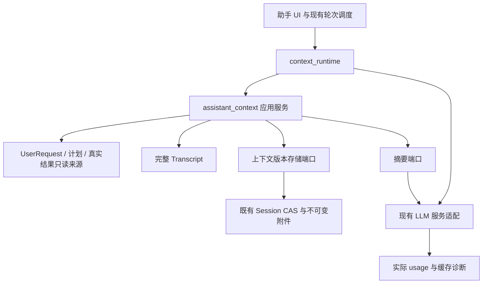
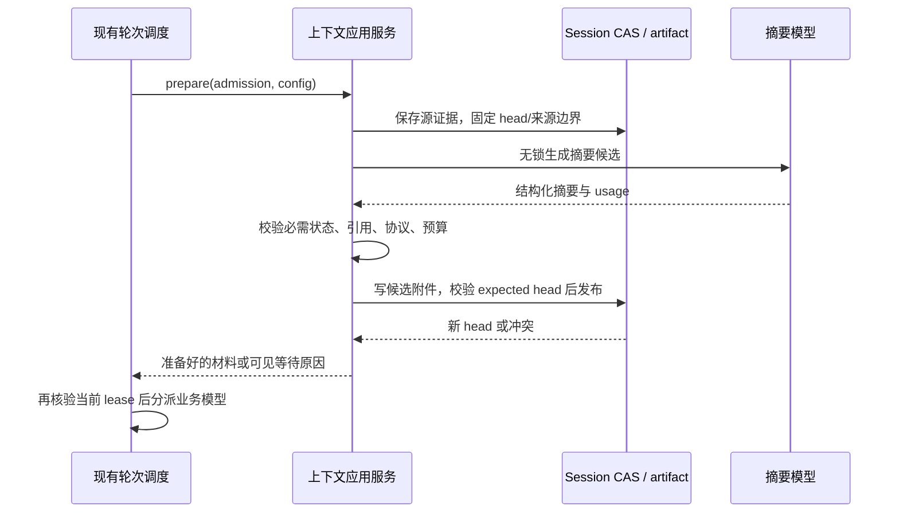

# ADR-041：助手稳定上下文与按预算压缩

- 状态：2026-09-12 用户授权实施后，本地实现及离线验证完成；真实模型收益及重复性能样本待 S09。
- 需求：[FR30.16～FR30.22](../requirements.md#fr30-stable-context)。
- 实施计划：[assistant-context-compaction](../../plans/assistant-context-compaction/plan.md)。
- 基线：[ADR-040](040-assistant-user-request-lifecycle.md)、[ADR-031](031-native-llm-function-calling.md)、[ADR-018](018-project-session-persistence-v2.md)。
- 替代关系：已替代 ADR-040 决策 7 中生产逐轮选材、确定性滚动摘录及每轮摘要刷新策略；保留完整历史、请求隔离、预算及工具协议要求。ADR-040 的目标、计划执行归属、调度、取消、授权和完成证据规则继续有效。

## 1. 问题、目标与范围

目标是减少同一请求续跑时对已发送上下文的改写，同时保留长任务连续性。用户已明确要求保留原有摘要；本方案采用不可变分段摘要链，每次只压缩尚未归入摘要的新历史，旧摘要继续发送给模型，不递归改写或由新摘要替代。完整 transcript、UserRequest、计划图及 checkpoint 是既有业务事实；本次仅为模型维护可恢复的工作上下文，不新增第二套目标或任务运行时。

首期实现：稳定追加、请求级上下文版本、阈值压缩、通用语义摘要、冻结工具结果投影、受限原文回查、供应商缓存适配、实际用量及故障恢复。路由调用保留现有独立控制协议，不强行与执行历史共用前缀。

首期不实现：OpenAI Responses 原生 compaction、跨供应商不透明压缩项迁移、向量长期记忆、后台无人值守推进、固定模型价格表、全量工具一次性暴露。语义摘要使用用户现有 AI 服务配置；不自动更换供应商或启用另一个计费服务。

## 2. 改造前已核实的实现基线

- `smart_assistant/conversation_manager.py` 的 `get_messages()` 默认 20 轮，但 `conversation_orchestrator.py` 在请求执行链使用 `get_transcript()`。完整历史已持久化，不能把现状描述成只保存 20 轮。
- `request_context_assembler.py` 按预算重新选择消息，最终为 `systems + state_messages + summary_messages + body`。状态、摘要变化可能在相同历史前打断可复用前缀。
- `application/assistant_requests/summaries.py` 是确定性摘录：最近 8 条以外达到 8 条或 4000 字符后生成，正文上限 2400 字符。不是 LLM 语义摘要。
- `request_context_preparation.py` 每次执行准备保存历史、刷新摘要并后台组装，已经有租约与过期回调保护。
- `context_budget.py` 默认 32768、输出预留 4096、协议余量 512；估算器为 UTF-8 字节数乘 1.25。估算不是供应商计费 token 数。
- `infra/prompt_cache.py` 当前 profile 校验固定的 2/3 消息拓扑；助手长历史需要独立 profile，不能放宽翻译 profile 冒充兼容。
- `infra/openai_tool_calling.py` 使用 Chat Completions；Anthropic 适配会跳过普通 messages 中的 system，并把连续工具结果转换成 content blocks。应用消息稳定不等于最终供应商 payload 稳定。
- `LlmTurn` 没有 usage；`chat_worker.py` 用字符数估算并只在未取消时回调。当前没有证据支持具体缓存命中率或费用收益。
- `RequestService.read_result()` / `read_request_result` 已能按请求归属分页读取结果；不等同于任意历史原文查询。

## 3. 候选方案与决定

1. 保留滚动窗口，只把摘要挪到最后：实现小，但窗口淘汰、逐次改写和恢复重选仍破坏连续性，不采用。
2. 永远发送完整历史：短期追加简单，无法覆盖有限窗口和巨大工具返回，不采用。
3. 稳定上下文版本、不可变分段摘要链加高低水位压缩：复用当前存储与请求系统，可跨现有供应商工作，首期采用；旧摘要随链保留在活动输入中，新摘要只覆盖新的历史段。
4. 全面迁移到供应商原生 compaction：可能更好地保留供应商内部状态，但需新增协议及不可移植数据支持，后续独立评估。

缓存复用是优化目标，授权正确性、工具协议和用户要求优先。必要的配置切换或来源纠正允许重建上下文，但必须有可识别的原因。

## 4. 模块与依赖

已新增 `application/assistant_context/`，独立于 Qt 和供应商 SDK：

- `models.py`：版本化数据契约、来源引用、冻结消息及压缩候选。
- `ports.py`：中立 SummaryGenerator 协议；计数与存储复用现有 ContextBudget 和独立持久化模块。
- `projection.py`：从源事件生成一次性模型材料；稳定追加、去重、工具组和摘要材料装配。
- `budget_policy.py`：纯预算决策和压缩边界选择。
- `compaction.py`：生成候选、结构/来源校验和发布条件；不执行业务工具。
- `admission.py`：复用现有 Session 串行器、请求资格与事务提交，准备/提交上下文版本。
- `history_queries.py`：按当前请求授权查询原文，返回 material-only 页面。

`smart_assistant/context_runtime.py` 连接上述端口与现有 worker/LLM；`context_summary.py` 适配通用摘要调用并延迟创建独立摘要客户端。`infra/llm_usage.py` 统一供应商 usage；`infra/assistant_prompt_cache.py` 处理助手专属缓存布局；`persistence/assistant_context_store.py` 复用不可变 artifact 存储。`state_projection.py` 构造权威状态，`migration.py` 导入历史摘录。

既有 facade 只增加薄委托。已超过 500 行的 `conversation_orchestrator.py`（635）和 `tool_execution_handler.py`（501）不得继续承载新策略；`llm_client.py`（727）不放摘要、usage 归一化或上下文状态实现。`RequestService`（497）及 `request_binding.py`（465）也不承接新的综合 Manager。这些数字是设计时基线，实施前复核。

## 5. 数据契约与身份

以下描述逻辑数据合同。当前具体接口为 ContextEpoch/FrozenContextItem/CompactionSummary、StoredContext 与 schema_version=1 的 head 字典；持久化通过 base/append 附件和独立摘要附件实现，不要求为每个逻辑概念创建同名类。

### 5.1 ContextHead 与 ContextEpoch

`ContextHead` 保存在 `assistant_state.context_heads[request_id]`，字段为 `schema_version=1`、`epoch_id`、`revision` 和活动 artifact 引用；revision 对应下文逻辑 head_revision。已消费来源与配置摘要位于引用的不可变附件。head 不能内联每个历史版本的全量消息。

`ContextEpoch` 为不可变基底：session/request/scope、epoch_id、config_digest、systems_json、summaries、items、source_digests、state_digest、reason、schema_version。base 附件用有序 summary_refs 引用独立摘要；普通 append 附件保存 parent 引用及新增 items/source_digests。首个版本摘要链可以为空；以后每次压缩继承旧链全部段并在末尾追加新段，不能只保存最后一份摘要，也不在每个版本复制旧摘要正文。

`head_revision` 是上下文发布顺序；`epoch_id` 是一次压缩/重建阶段；`request_revision` 是目标意图；Session revision 是存储 CAS；turn/lease 是执行资格。禁止互相替代。上下文发布不修改请求 revision、不满足验收项、不创建计划步骤。

### 5.2 FrozenContextItem

字段为 item_id、kind、source_digest、message_json 和 group_id。历史来源使用真实 message_id，状态事件有独立稳定身份；scope 由所属 ContextEpoch 及当前权限校验提供。message_json 冻结角色、内容块与必要 provider replay 信息；显示摘要、完整原文和模型表示明确分开。

同一版本内已发送 item 不重排、不重截断、不按当前对象重新序列化。状态数据、检索内容使用 material-only 类型，不创建 ingress；原始用户消息才具有用户输入身份。

配置指纹包括 endpoint/账号隔离标识、provider/model、固定指令版本、有序工具 schema、投影/适配版本，以及会影响模型前缀的请求设置。不得含 API Key、明文凭据或每轮时间戳。指纹是复现/失效检测依据，不是供应商缓存命中证明。

### 5.3 摘要和状态

`CompactionSummary` 是一段不可变摘要，含 summary_id、链内顺序、文本/内容块及 digest、该段独立覆盖的有序来源集合或不可变 manifest 引用。同一已提交链中的各段不得重复覆盖相同源记录；查询返回形成新的来源记录时可单独覆盖，但须保留其原始出处。不能只记一个全会话 sequence 就推断所有低序号消息均已覆盖。

新段只总结尚未覆盖的新历史。必要时读取旧摘要或关键原文作为只读背景，其引用单列为 background_refs，不计入新段 covered_sources，不将旧摘要重述为新段的主体。原段 summary_id、正文、digest 和顺序跨压缩及重启不变；不是仅在磁盘保留，而是继续进入后续模型输入。失败候选可丢弃，已提交旧段不能因压缩被删、被合并或被重写。

旧段中的事实标明其历史时点；后续决定纠正以新事件/新段引用先前决定表达，最新 RequiredState 控制当前有效约束，不能篡改旧摘要。来源归属纠正造成旧段不再允许发送时，阻止该上下文分派并等待范围处理，不以保留为由发送已失去权限的材料，也不暗中删除旧段恢复运行。

程序从权威请求和执行记录构建 `RequiredState`：当前目标及有效约束原文/来源、未完成与待决项、运行任务与必要结果引用。精确 ID、许可状态和完成证据不由摘要模型生成。

模型仅输出 `decisions_with_sources`、`discussion_context`、`unresolved_questions`、`suggested_next_steps`；next_steps 是建议而非已批准计划。结构化字段保留否定条件、原因和不确定性。摘要提示及 schema 有版本，材料标为不可信历史；无业务工具、无控制工具、无隐藏思维提取。

### 5.4 活动模型输入顺序

逻辑顺序为 `固定规则 → S1 → S2 → … → Sn → 本版本的 RequiredState 快照 → 保留的近期完整历史 → 后续新消息/状态事件`；工具 schema 仍经供应商独立参数提供。首版无摘要时省略空链。下一次压缩仅在 Sn 后插入 S(n+1)，再更新状态快照和替换被本次摘要覆盖的原文段；保留的旧摘要块不改写。

例如首次为 `S1(历史 1～20) + 状态 + 原文 21～40`，二次为 `S1(原样) + S2(历史 21～35) + 新状态 + 原文 36～40`。只从活动输入中移出已由新段覆盖的原始历史，完整原文仍保存。不把每次变化的状态快照插到 S1 前面破坏摘要链前缀；实际缓存仍依赖供应商边界、配置与有效期。

## 6. 普通输入、工具续跑及状态变化

1. 沿既有链路保存 ingress、路由、请求变化及工具原文。源证据保存失败阻止准备后续模型执行。
2. 根据已接纳 request/lease 找到 head。首次从授权相关历史初始化；此后读取 manifest 尾部差异，不每轮全量重新选材。
3. 追加新用户原文、模型完整输出、工具完整协议组和必要状态事件。按稳定源 ID 去重；同 ID 异内容报冲突。
4. 状态只在模型相关字段发生实质变化时追加。初始/压缩快照之后的目标修订、待决变化、任务终态和必要进度有明确顺序；重复唤醒、会话保存 revision、诊断时间戳不进入提示。详细百分比进度只在用户询问或决策需要时提供。
5. 生命周期 journal 是审计数据，不直接重放成模型指令。源变更在同一事务中提供有来源的模型状态事件；旧会话缺失事件时从当前权威状态生成注明时点的恢复快照，不伪造旧事件。
6. `ready_item_ids` 等轮次分派条件若变化，以程序生成的追加调度材料传达；未变化不重复追加。执行接纳仍每次读取权威状态核验，不能信任历史快照。
7. runtime 数据用适配器支持的普通内容块封装；不把动态 system 消息插在历史末端后又被 Anthropic 收集到头部。不得插入 call 与必须紧邻的 result 之间。合法分组先于缓存优化。
8. 当前 request 的普通续跑未触发压缩时，新的应用上下文必须以上一份已发上下文为前缀；供应商规范化后的旧内容块也必须保留。消息合并时不得改写既有块内容或丢失既有可复用边界。

切换请求使用各自 head。独立 FOLLOW_UP 首次建立 head 时，可按明确的请求关联和授权来源引入父请求的目标/相关原文片段；这些是带来源的冻结材料，不共享可变 head、不复制执行许可、不修改父请求验收项。不能因新请求的历史为空就丢掉“为什么刚才那样处理”的必要背景，也不能无条件混入父请求全部工具记录。

执行与路由的工具集合和上下文分离；一次路由不重置执行 head。当前全会话已加载工具命名空间继续兼容，增加工具导致指纹变化时登记 `tools_changed` 并重建配置版本，不能假装前缀不变。首期不为缓存改变 get_tool_help 的加载与授权语义。

## 7. 大结果与原文回查

完整结果继续进入现有脱敏证据存储。首次投影输出合法结构化概要，保留 success/partial、错误码、失败项引用、任务/文件引用、总量、有限样例和有摘要校验值的分页引用；不用盲目截前 N 个字符作为所有工具的摘要。

后续保持该表示稳定，额外细节通过查询工具作为新结果追加。控制/覆盖回执和当前必需工具结果不能因 size 策略丢掉协议字段。超大必需内容放不下时明确阻止分派。

复用 `read_request_result`；增加 `read_request_history` 支持按授权 message_id 与字符 offset/limit 读取用户/助手原文，首期无需向量搜索。限制页大小，返回 source_id、范围、总长度、digest、缺失诊断。程序由当前 admission 取得 request_id，不接受模型任意 owner/path。共享原文验证当前归属；纠正为其他请求的来源不能因旧摘要引用而继续可读。

## 8. 预算策略

设 W 为配置窗口，F 为固定规则与工具开销，O 为输出预留，M 为协议及估算余量。可用动态预算 B=W-F-O-M；所有值使用同一计数口径。B≤0 直接报必需材料超限。

首版提议默认：高水位 H=0.80B，压缩后目标 L=0.45B；每个新摘要段目标上限为 min(2048, 0.15B) 个估算 token，并受现有摘要链与必需材料占用后的剩余空间约束。它们是待基准校准的策略值，不是模型规格或承诺。旧摘要链、当前有效状态和未闭合协议均不可为本次压缩裁剪；近期原文按 token 和完整协议组选择，不再以轮数作为主要限制。无法降到 L 但能降到 H 以下时记录实际目标，若连 H 都无法低于则返回容量受限，不反复循环压缩。

预算须计入全部旧摘要 P、新段、RequiredState 和近期原文；不能只计最后一段。生成前检查 `P + 必需状态/协议/当前输入 + 新段最小结构` 是否已经无可用空间，无空间直接进入 `CONTEXT_SUMMARY_CAPACITY` 等待，保留旧链，不自动摘要化摘要。低于硬窗口但无法继续有效压缩时停止自动推进并显示容量原因；扩大可用窗口或改变摘要保留策略需要用户明确选择，不能承诺无限长会话仍能同时携带全部摘要。

本轮新增输入、冻结结果、工具 schema、输出和 margin 在调用前一起计数。摘要调用另算提示、待压缩材料和摘要输出预算，不能发送一个本来已经超窗的整段。使用已就绪 tokenizer；未知模型继续保守离线估算，不在 GUI 或隐式网络下载编码。

未达到 H 直接追加。达到 H 只选尚未归入摘要的旧的已闭合原文组进行压缩，最近用户输入、未解决的协议组和必要状态留在尾部。已提交摘要不是本次压缩源。不可压缩的当前输入自身超窗，提示缩小材料/分块，不以吞掉当前要求来降级。

旧会话首次加载若远超 W，分批读取尚未摘要的完整组，生成各自覆盖范围独立的分段摘要，不做父摘要对旧段的合并替换；权威约束独立注入。每次前台接纳自动摘要调用最多 3 次，总任务可取消、可恢复；已验证块保存处理位置和来源，完成所需批次且整个摘要链加尾部可容纳后才激活。累计链超限时进入摘要容量等待，显式继续也不能绕过容量检查或反复收费。

## 9. 压缩生成、并发与提交

首期采用调用前等待结果、独立后台队列执行压缩；不做与同一请求业务推理并发的投机压缩。输入持久化队列与摘要准备队列分离，取消置位后在后台关闭独立摘要连接；UI 保持响应，后台业务 job 可继续，用户新输入优先。

候选身份固定 `expected_head_revision/epoch_id`、`expected_summary_chain_digest`、新段来源 digest/归属版本、请求 revision、配置摘要和生成 admission。发布校验必须证明旧链按原顺序逐段继承、新段来源未重复覆盖。网络期间不持 Session 锁。

- 仅尾部新增且当前请求/配置/资格仍有效：重新读取尾部，完整追加后重新测量；摘要基底不修改。
- 用户修订、来源归属纠正、模型/工具/规则变更、lease 丢失、暂停、取消或关闭：候选不得激活或触发业务调用。候选可以作为无效派生附件等待既有清理，不能写成当前 head。
- 另一窗口已经提交新 head：CAS 失败，复用新 head；不能在 CAS 重试回调里再次调用模型。
- 容量再次不足：执行有界预算决策，不无限追着快速到来的事件生成摘要。

发布顺序为：写入并校验不可变 artifact → 在既有 Session 条件事务中引用附件并更新 head/源游标 → 返回材料 → 分派前重新检查业务 admission。崩溃前未发布附件不生效；发布后重启直接恢复该版本；不因有候选文件就重放模型调用或工具副作用。

运行状态仅属于上下文准备：`ready / compacting / capacity_wait / preparation_error`，不加入 RequestStatus 或计划步骤状态。摘要不会完成验收项，相关时间和费用独立记账。

容量等待/生成失败通过专用 PreparationWait 返回；不得直接沿当前 preparation_failed → binding.fail 把目标当作业务失败。请求保持原业务状态，通过现有调度可扩展的等待原因阻止重复自动唤醒；显式重试或有效配置/材料变化只清除该上下文等待，不清除用户主动暂停、待确认或其他阻塞。不可恢复的源证据故障是否终止请求仍由既有请求恢复/故障规则判断。

## 10. 模型、缓存与实际 usage

供应商适配测试必须检查规范化后的工具、固定指令、消息/content block 顺序及稳定边界；应用层 JSON digest 只能证明本地结构，不能宣称命中真实 KV cache。支持原始 provider replay 字段的响应按合同保留，不为压缩请求隐藏推理正文；换 provider 时不转发不兼容字段。

缓存为助手新增明确 profile，复用通用能力探测但保持现有翻译 profile 不变。OpenAI 按具体模型/端点能力选择自动或显式边界；Anthropic 按已验证能力给历史末端或稳定块配置缓存，不能仅标 system 就宣称历史已缓存。边界移动不改变内容，限制数量/最小长度/TTL 留在适配能力表，禁止用猜测模型名称扩大能力。

适配器需要 cache key 时，采用隔离账号/端点、会话/请求及稳定配置的摘要 namespace；不把每轮 turn_id/head_revision、时间戳或整份增长历史的 digest 加入 key。配置隔离与内容变更原因分别记录，不能用更换 key 掩盖前缀不稳定，也不能把相同 key 当成强制缓存命中。

当前端点明确拒绝可选缓存或 usage 参数，且尚无响应输出时最多一次兼容重试；明确记录降级。已有输出、网络状态不明或权限错误不以缓存兼容为由重试。降级及额外调用计入费用，不重放业务工具。

`LlmUsage` 区分 reported/estimated/unknown，保存原始供应商 usage 的受限字段、规范化输入总量/输出/缓存读写（未知为 null）、provider/model、调用目的、attempt_id、完整性和耗时。OpenAI prompt/input 总量中的缓存子集不能重复相加；Anthropic input/read/create 的口径由专属转换器归一化。部分流、取消、超时可能无最终 usage，标为 partial/unknown，不能估成精确成本。

路由、执行、摘要、重试分别记录，按实际模型调用 attempt 去重；收到但因业务 lease 失效而丢弃的响应也记录消耗，不应用其业务结果。旧 `on_token_usage` 保持兼容入口，估算值明确区分且不重复累加。没有已核验价格资料时只报告 token 和时延，不编造费用。

## 11. 迁移、损坏与回退

复用当前 Session 外层格式及可扩展 assistant_state；新增子文档采用独立 schema_version=1，在上下文读取入口严格验证，未知版本停止上下文写入并提示升级。若实施检查发现外层 reader 无法安全保留扩展，需修订此 ADR 后做显式外层迁移，不能偷偷放宽全局 schema。

首次启用：从已验证的完整 transcript 和请求状态建立新 head。已有 `request_summaries` 经来源和权限校验后原样导入 legacy-excerpt 段。旧摘录不能证明完整消息已被摘要，因此导入段的 `covered_sources` 为空，原 source_ids/引用片段保存为溯源背景；不把 claimed covered_sequence 当成全覆盖，相关原文仍参与后续选材。迁移期允许摘录与后续摘要有信息重复，以免未摘录内容被误删。失效或无法验证的旧摘要保留在迁移记录中并明确诊断，不伪装成可发送的新链段。新 head 发布后结束旧逐轮刷新接线，保留原有摘要正文与溯源；迁移完成可去掉重复索引键，但不能删摘要内容。兼容读取限于尚未迁移会话，所有受支持旧格式都能懒迁移后移除迁移桥，不长期双写新旧策略。

缓存关闭开关只停止供应商缓存指令，不恢复滚动窗口。用户暂停自动压缩时，硬预算内保留原上下文继续；语义生成失败或达到硬限制则保存输入并进入明确的上下文等待。同一 source/config/head 的失败不因自动唤醒无限重试；显式重试或有效配置/材料改变可重新尝试。

坏的派生 head 或索引进入明确恢复等待；使用既有完整备份恢复并核验原摘要链后再建版本，不扫描孤立附件猜测活动顺序。已激活摘要正文损坏时，从有效备份恢复相同 digest 的原文；无法原样恢复则等待处理，不能重新生成不同正文冒充保留原摘要。原文附件损坏则报告缺口，必要约束/结果无法核验时禁止业务分派。不能用摘要伪装丢失原文。

上下文 artifact 纳入当前 Session、备份及保留引用的同一清理可达图；发布和清理先验证一致性，不按年龄删除。请求归档处理其 head 引用，会话删除后迟到压缩不能复活引用。应用层可限制活动 head 的内联索引大小，但不宣称完整历史存储有固定上限。

换模型或端点时创建有原因的新配置版本，使用当前 provider 可重放的普通历史/摘要，重新计算预算；不自动开始任务、不复用跨账号缓存身份。原生不透明压缩项首期不存在。

回退首先使用同版本应用的缓存关闭/压缩暂停及既有完整备份恢复能力。旧二进制直接打开新数据和运行旧附件清理工具不承诺安全；需要恢复升级前的整套数据备份到独立根再使用旧版。禁止仅回退一个 manifest 而丢失升级后的业务证据。

## 12. 验收与外部依据

确定性门禁：普通追加及工具续跑前缀保持；跨 20 轮不丢要求；调用/结果完整；至少三次压缩及重启后所有旧摘要仍按原 ID/正文/顺序存在于实际模型输入，新段只覆盖新历史；旧决定更正可辨认；当前约束由程序精确保留；摘要链自身超限不自动改写/淘汰；多窗口/修订/关闭/归属纠正不发布过期候选；失败及崩溃不改变计划/目标/副作用；未知 usage 不变成零。

真实评估独立于单测：固定脱敏长任务语料，同模型/设置/调用节奏分别测旧策略和新策略；记录冷/热和压缩前后实际 usage、TTFT、摘要成本、重复操作及约束遵守。对每个策略至少 3 次独立样本，报告离散程度与缓存有效期；不以本地最长公共前缀冒充供应商命中率。实际收益未测前不声明降费比例，所有严重业务正确性回归为零才可启用默认新流程。

官方事实核验日期：2026-09-12。以下支持协议机制，不证明本项目已实现或已获得收益：

- [OpenAI prompt caching](https://developers.openai.com/api/docs/guides/prompt-caching)：缓存依赖前缀与有效边界，工具/设置/压缩可能改变复用。
- [OpenAI Chat Completions](https://developers.openai.com/api/reference/resources/chat/subresources/completions/methods/create)：流式 usage 属于接口能力，兼容端点需单独验证。
- [OpenAI compaction](https://developers.openai.com/api/docs/guides/compaction)：Responses 原生压缩返回包含不透明项的上下文，与本次通用文本摘要分开。
- [Anthropic prompt caching](https://platform.claude.com/docs/en/build-with-claude/prompt-caching)：tools/system/messages 的前缀缓存及 read/create 用量口径。

## 13. 风险与待验证项

语义摘要有丢失因果和否定条件的风险，来源校验不能证明语义保真；通过程序保留硬约束、原文回查及真实语料评估控制。不可变分段摘要避免反复总结旧摘要引入的递归损失，但各段会累计占用上下文，旧决定也可能与新决定并存；用时点、来源和后续更正明确当前有效信息，达到容量边界时等待而非暗中删除。稳定追加仍会积累冗余状态，采用实质变化事件和阈值压缩。压缩增加一次模型延迟与费用，先采集真实 usage 再评估收益。

高低水位与摘要长度需要 S09 实测校准；未知代理端点可能无法返回 usage，标为能力受限，不阻塞基本聊天但不得宣传缓存收益。现有账本保存路径可能全量扫描，首期普通上下文准备不增加全量重选；存储全链路性能若不达预算，应在该根因修正而非增加第二个历史数据库。
