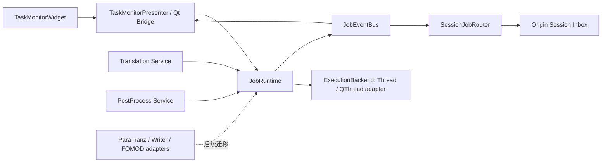

# FR14 后台任务监控面板：需求—架构—方案—Story—代码纵向审查

> 审查日期：2026-08-18  
> 审查范围：FR14（后台任务监控面板 / Task Monitor）  
> 审查方式：独立纵向审查；未读取或引用本轮其他 Agent 的结论  
> 变更边界：本文件仅记录审查结果，不修改需求、ADR、Plan、Story、业务代码或测试

## 1. 结论摘要

FR14 的 UI 外壳已经存在，能够显示任务卡片、状态、进度条和操作按钮；TaskManager 也提供了注册、状态查询、暂停、恢复、取消、清理和完成回调等表面 API。但是，当前实现不能继续按“已实现”验收，建议状态改为“部分实现 / 控制语义待修复”。

核心原因不是少一个按钮，而是任务卡片呈现出来的“状态”与后台任务真实执行状态并不一致：

1. 翻译与润色任务显示“暂停”按钮，点击后 TaskManager 会把状态改成 `paused`，但任务执行路径没有消费对应的 `pause_event`，工作仍会继续。
2. 翻译和后处理在收到取消信号后可能正常返回部分结果，外层包装随后又把任务写成 `completed`；后处理还可能删除原本应保留的 checkpoint。
3. UI 把 `cancelled` 当成终态，允许立即清理，但此时线程可能仍在运行；清理会在 GUI 线程上同步 `join`，造成界面冻结，并可能让仍在运行的线程失去任务句柄。
4. TaskManager 是进程级单例，没有 `session_id`、`project_id` 或 `origin`。会话切换时 UI 先清空，1 秒轮询后又把全局任务重新显示出来；任务完成通知还会写入“当前会话”，而不是启动任务的原会话。
5. SessionController 定义了 `AWAITING_TASK`，但生产代码没有调用 `handle_task_started()`；任务完成回调却直接调用 `handle_task_completed()`，常会触发状态断言并被 TaskManager 的安全回调吞掉。
6. `TaskMonitorWidget.refresh()` 的布局清理算法存在可复现缺陷：刷新为空后仍残留旧 `_TaskCard`，而“无后台任务”标签已被移出布局。
7. Plan 引用了两个 Story 详细文件，但 `plans/task-monitor/stories/` 目录实际为空；文档链路并未闭合。

综合判断：

- UI 可见性：基本具备。
- 状态展示：部分具备，但名称、百分比、错误、终态时长不完整。
- 暂停/恢复/取消：只有后处理的暂停较接近真实语义；整体不可信。
- 实时更新：轮询和完成回调已接线，但订阅、会话路由和生命周期不完整。
- 清理与关闭：存在竞态、UI 阻塞和后台线程泄漏风险。
- 会话隔离：未实现。
- 文档与测试闭环：部分实现，缺少真实业务链验收。

建议采用“应用级 JobRuntime + Qt TaskMonitorPresenter + 兼容 TaskManager Facade”的渐进方案，而不是继续在 Widget 中补条件判断。先修复取消/暂停与终态一致性，再迁移会话归属、事件路由和关闭行为，最后统一其他长任务。

## 2. 审查对象与证据范围

### 2.1 需求与方案

- `docs/requirements.md`：FR14.1～FR14.5、异常场景、范围外。
- `plans/task-monitor/plan.md`：功能边界、Story 01/02、验收标准、风险与回退。
- `plans/task-monitor/stories/`：目录存在，但没有 Story 文件。
- `docs/changelogs/task-monitor/story-01-task-monitor-widget/2026-08-05-001-Story01和02编码实现.md`：Story 01 与 Story 02 合并记录。

### 2.2 架构决策

- `docs/adr/004-qthread-async-pattern.md`：顶层异步模型仍声明为 QThread + 信号总线。
- `docs/adr/008-smart-assistant-code-layering.md`：UI/后端分层、TaskManager 精简、SessionController、SessionManager。
- `docs/adr/011-graph-orchestration-engine.md`：GraphExecutor 自身暂停/恢复/取消语义。

### 2.3 代码

- `src/transbridge/smart_assistant/tools/task_manager.py`
- `src/transbridge/ui/tools/smart_assistant/task_monitor.py`
- `src/transbridge/ui/tools/smart_assistant/panel.py`
- `src/transbridge/ui/tools/smart_assistant/chat_widget.py`
- `src/transbridge/smart_assistant/session_controller.py`
- `src/transbridge/smart_assistant/tool_execution_handler.py`
- `src/transbridge/smart_assistant/tool_registry.py`
- `src/transbridge/smart_assistant/tools/tool_translator.py`
- `src/transbridge/smart_assistant/tools/tool_proofreader.py`
- `src/transbridge/ai_translator/translator.py`
- `src/transbridge/ai_translator/post_processor/post_processor.py`

### 2.4 测试

- `tests/smart_assistant/test_task_monitor.py`
- `tests/smart_assistant/postprocess/test_task_manager.py`
- `tests/smart_assistant/test_session_controller.py`
- `tests/smart_assistant/test_session_controller_integration.py`
- `tests/smart_assistant/test_agent_tool_integration.py`

## 3. 需求到实现映射

| 需求 | 方案落点 | 代码落点 | 实际完成度 | 结论 |
|---|---|---|---:|---|
| FR14.1 右侧底部可折叠监控区 | Plan Story 01/02 | `panel.py:85-97`、`task_monitor.py:215-351` | 75% | QSplitter、折叠、滚动、计数已实现；“不可用”状态和可靠刷新缺失 |
| FR14.2 卡片信息 | Plan Story 01 | `task_monitor.py:40-210` | 55% | 状态、进度、时长有 UI；真实任务名称为英文，未显示百分比，错误不稳定，完成时长不会冻结 |
| FR14.3 取消/暂停/恢复 | Plan Story 01/02 | `task_manager.py:152-187`、`panel.py:190-208` | 30% | API/按钮存在；翻译与润色暂停不生效，取消终态可被覆盖，缺少 capability 控制 |
| FR14.4 自动刷新 | Plan Story 02 | `chat_widget.py:739-772,1098-1130` | 50% | 1 秒轮询与 finished 回调存在；懒初始化、匿名订阅无法精确移除、会话路由错误、全量重建有缺陷 |
| FR14.5 终态保留与清除 | Plan Story 01/02 | `task_monitor.py:156-161,261-267`、`panel.py:194-200` | 45% | 清除入口存在；UI 列表残留，取消任务可在线程未退出时清除，GUI 线程同步 join |
| 异常：TaskManager 未初始化 | Plan 风险 | `chat_widget.py:739-772` | 10% | 失败时只写日志；UI 仍显示“无后台任务”，没有“任务监控不可用” |
| 异常：手动刷新同步 | Requirements 原文 | 无 | 0% | 没有刷新按钮 |
| 异常：>20 任务可滚动/计数 | Plan Story 01 | `task_monitor.py:249,275-288,324` | 80% | 滚动与计数存在；每秒销毁重建全部卡片，且布局清理错误 |
| 当前会话任务语义 | Requirements 范围说明、Plan 会话切换 reset | `chat_widget.py:1140-1150` | 15% | 只清空 UI；轮询会重新显示全局任务，没有 owner/session 过滤 |

建议把 FR14 总体完成度记为约 **45%**。这不是按代码行数计算，而是按用户可观察行为和控制契约计算。

## 4. 文档链路审查

### 4.1 Requirements

优点：

- FR14.1～FR14.5 覆盖了布局、卡片、控制、刷新和清理。
- 明确提出异常场景和当前范围外内容。
- 将 FR13、ADR-008、TaskManager 标为关联项，方向正确。

问题：

1. 状态标为“已实现”，与实际控制语义不符。
2. “暂停”没有定义为状态显示还是后台执行保证。当前代码只完成前者。
3. “取消”没有定义 `cancelling → cancelled`，导致 UI 把仍在退出中的线程当成可清理终态。
4. 没有定义哪些任务支持暂停。翻译、润色、后处理的能力并不相同，UI 却统一显示暂停。
5. “仅内存中保留当前会话的任务”与进程级 TaskManager、长任务跨会话运行没有形成明确产品决策。
6. 没有定义任务完成通知应写入启动会话、当前会话，还是全局通知中心。
7. 没有定义 Dock 隐藏、Dock 关闭、应用退出三种不同生命周期。
8. 没有定义失败原因、取消原因、结束时间和部分完成结果的展示要求。

### 4.2 ADR

ADR-004 与实际实现已经分叉：

- ADR-004 声明 `ApiWorker` 是唯一后台执行通道，顶层采用 QThread + 信号总线。
- FR14/TaskManager 实际使用纯 Python `threading.Thread` + 回调 + 类级 dispatcher。
- GraphExecutor、AI Translator、PostProcessor 又分别管理自己的 Event/线程池/控制流。

ADR-008 的 D7 只讨论 TaskManager API 精简，没有定义任务生命周期、状态转换、owner、capability、终态结果和 UI bridge。D10 将 SessionController 与 GraphExecutor 分层，但没有定义后台任务作为第三种长生命周期对象如何绑定会话。

因此当前不是“代码未遵守一条完整 ADR”，而是 ADR 本身没有覆盖 FR14 引入的应用级任务运行时。

### 4.3 Plan 与 Story

`plans/task-monitor/plan.md` 的两个 Story 验收项都未勾选，状态却标记为“已实现”。此外：

- Plan 多次引用 `plans/task-monitor/stories/story-01-task-monitor-widget.md` 和 `story-02-panel-integration.md`。
- 实际 `plans/task-monitor/stories/` 目录为空。
- Changelog 将 Story 01 与 Story 02 合并写入 Story 01 目录，没有 Story 02 的独立增量记录。
- Plan 声称“限制最多显示 20 个任务卡片”，代码没有限制；Requirements 只要求可滚动并显示计数，本身也不要求截断。
- Plan 要求“TaskManager 未初始化显示任务监控不可用”和“刷新按钮”，代码没有实现。
- Plan 的测试门禁仍写“426+ 现有测试”，属于随时间失效的固定数字，不应继续作为验收标准。

建议不要在旧 Plan 上继续堆补丁，应创建 V2 Plan，并把现有 Plan 标为“V1 UI 原型 / 部分落地”。

## 5. 代码实现问题

### 5.1 P0：暂停按钮会谎报状态

证据：

- `TaskManager.pause()` 在 `task_manager.py:165-175` 只清除 `pause_event` 并把状态改为 `paused`。
- 翻译任务在 `tool_translator.py:91` 注册 TaskHandle，但调用 `AutoTranslator.translate()` 时只传 `stop_event`，未传 TaskHandle 的 `pause_event`（`tool_translator.py:126-131`）。
- 润色任务循环只检查 `stop_event`（`tool_translator.py:237-256`），没有等待 `pause_event`。
- 后处理单独创建并传入了 `pause_event`（`tool_proofreader.py:132-140,184-191`），因此三种任务的真实能力不同。
- UI 仅按 `status == running` 显示“暂停”，没有读取 capability（`task_monitor.py:130-154`）。

影响：用户看到“已暂停”，后台仍可能继续消耗 LLM 额度并修改翻译数据。这是行为欺骗，优先级高于界面细节。

修复方向：任务注册时声明 `capabilities={cancel, pause, resume}`；UI 只显示实际支持的控制。所有支持暂停的 runner 必须统一调用 `control.checkpoint()` 或 `pause_token.wait_if_paused()`，不允许仅修改状态。

### 5.2 P0：取消可能被覆盖为 completed，并删除 checkpoint

翻译路径：

- `cancel()` 立即把状态写成 `cancelled`（`task_manager.py:152-163`）。
- AutoTranslator 在观察到 stop_event 后可以保存 checkpoint 并正常返回 `TranslationResult`。
- 外层 `_run()` 没有在返回后再次检查 stop_event，直接写 `completed` 并发送 completed 通知（`tool_translator.py:126-145`）。

后处理路径：

- `PostProcessor.process_entries()` 在 stop 时多处 `break` 并返回部分 `PostProcessResult`。
- 外层随后把 checkpoint 删除（`tool_proofreader.py:193-195`），生成报告并写 `completed`（`239-251`）。

影响：

- 用户点击取消后，卡片可能先显示“已取消”，随后变成“已完成”。
- 取消后的部分结果可能被当成完整成功结果。
- 本应支持断点恢复的后处理 checkpoint 被误删。
- 完成回调会驱动会话继续推理，语义完全错误。

修复方向：runner 返回明确的 `JobOutcome`：`Completed(result)`、`Cancelled(partial, checkpoint)`、`Failed(error)`。只有 Runtime 能写终态；业务 runner 不得直接 `set_status()`。取消请求先进入 `cancelling`，线程确认退出后才进入 `cancelled`。

### 5.3 P0：SessionController 的异步任务状态没有接入生产路径

证据：

- `SessionController.handle_task_started()` 要求 `EXECUTING → AWAITING_TASK`（`session_controller.py:199-203`）。
- 全仓生产代码没有调用该方法；只有测试直接调用。
- ToolRegistry 的 `is_long_running` 只用于工具帮助文本和 metadata，没有驱动 ToolExecutionHandler 的状态分支（`tool_registry.py:204-205`）。
- ToolExecutionHandler 执行长任务后仍按普通同步工具调用 `_on_step_completed()`（`tool_execution_handler.py:217-254`）。
- ChatWidget 收到 TaskManager 完成回调后无条件调用 `handle_task_completed()`（`chat_widget.py:774-800`），而该方法断言当前必须是 `AWAITING_TASK`（`session_controller.py:184-197`）。
- TaskManager `_safe_callback()` 会捕获该断言并只写 warning（`task_manager.py:296-302`）。

影响：任务卡片可能刷新，但会话状态机并不知道自己在可靠地等待哪个 task；完成后继续推理可能失败，且错误被隐藏成日志。

修复方向：ToolExecutionHandler 根据 `ToolSpec.is_long_running` 和返回的 `task_id` 发出 `TaskStarted(task_id, owner)`；SessionController 维护 awaiting task 集合，而不是单一匿名状态。完成事件必须携带 owner，并只路由给原会话。

### 5.4 P0：会话切换没有任务归属，旧任务会进入新会话

证据：

- TaskHandle 只有 stop/pause/status/progress/created_at/metadata/thread，没有 owner/session/project（`task_manager.py:29-38`）。
- TaskManager 是进程级单例（`task_manager.py:55-70`）。
- 会话切换只调用 `TaskMonitorWidget.reset()`（`chat_widget.py:1140-1150`）。
- 1 秒轮询又调用全局 `TaskManager.list_all()`，没有任何过滤（`chat_widget.py:1114-1128`）。
- 任务完成回调把 observation 写入当前 `self._conversation`（`chat_widget.py:774-800`）。

可预期行为：在会话 A 启动任务，切换到会话 B 后，面板先清空；下一次轮询任务重新出现；任务完成时完成消息写进 B。

修复方向：Runtime 为应用级，但 JobDescriptor 必须有 `owner = {session_id, project_id, origin}`。TaskMonitorPresenter 支持“当前会话 / 全部任务”过滤；完成事件写入原会话的 inbox，若原会话不在前台则显示未读徽标，而不是污染当前对话。

### 5.5 P1：TaskMonitorWidget 刷新算法会留下旧卡片

问题代码位于 `task_monitor.py:299-325`。当前算法假定布局只包含 `empty_label + stretch`，但 `takeAt(0)` 会把 empty_label 本身移出布局，并在停止循环时留下一个旧卡片。

本次最小运行探针结果：

```text
initial 2 ['QLabel', 'stretch']
after1 4 ['QLabel', '_TaskCard', '_TaskCard', 'stretch']
after0 2 ['_TaskCard', 'stretch'] empty_in_layout -1
```

这说明调用 `refresh([])` 后，布局仍保留 `_TaskCard`，且 `_empty_label` 已不在布局中。现有测试只断言 `_tasks`、标题和 visible 标志，没有断言布局中的真实控件集合，因此全部通过。

修复方向：给卡片单独创建 `_cards_container/_cards_layout`，只清理该容器；或者维护 `task_id → TaskCard` 映射做增量 diff。不要在混合有固定控件和 stretch 的布局上按 count 猜测。

### 5.6 P1：关闭行为会冻结 UI，并可能泄漏暂停线程

证据：

- Dock 关闭调用 `ChatWidget.shutdown()`（`panel.py:220-227`）。
- shutdown 最后调用 `TaskManager.reset()`，会停止整个进程级单例的所有任务（`chat_widget.py:475-480`）。
- `reset()` 在持有 TaskManager `_lock` 时逐个 join，单任务最多 2 秒（`task_manager.py:331-347`）。
- reset 只设置 `stop_event`，没有 set `pause_event`；处于 `pause_event.wait()` 的任务不会被唤醒。
- worker 退出时常要调用 `set_status/update_progress` 获取同一把锁，因此 reset 持锁 join 会制造等待和超时。

影响：

- 关闭 Dock 可能每个任务阻塞 2 秒，任务越多越慢。
- 暂停中的后处理线程不能被唤醒，只因 daemon=True 才不会阻止进程退出。
- 关闭一个 UI 面板会取消 MCP 或其他入口创建的全局任务，所有权越界。

修复方向：区分 `hide panel`、`dispose view`、`application shutdown`。View 销毁只退订事件，不销毁 Runtime。应用退出时先广播 cancel + resume wakeup，在后台 shutdown coordinator 中有总超时地等待；绝不在持锁状态 join，也不在 GUI 主线程逐任务等待。

### 5.7 P1：取消后的清理过早且可能阻塞 GUI

- `cancel()` 在工作线程实际退出前就把任务标为 `cancelled`。
- TaskMonitor 对 cancelled 立即显示“清除”。
- Panel 在 GUI 线程调用 `cleanup()`。
- `cleanup()` 先从 `_tasks` 移除句柄，再对仍活跃的线程 `join(timeout=5)`（`task_manager.py:304-312`）。

结果可能是：用户点清除后 UI 冻结 5 秒；线程仍在运行但后续进度和状态写入全部丢失，仍可能修改 collection。

修复方向：引入 `cancelling`；只有 `thread_exited_at` 已设置的 terminal snapshot 才允许 purge。清除只是移除历史快照，不负责等待线程。

### 5.8 P1：任务状态没有受控转换

TaskManager 的 `pause/resume/cancel/set_status`：

- 没有校验当前状态；completed 任务也可被外部改回 paused/running。
- pause/resume/cancel 在取出 handle 后，于锁外修改 handle 字段。
- `get_handle()` 返回内部可变对象，调用方直接替换 pause_event 和 thread。
- `notify_finished()` 不负责设置终态，生产者必须手工按顺序调用多个 API。
- 没有 `queued/cancelling`、`finished_at`、`error`、`result` 和 `version`。

推荐状态机：

```text
QUEUED -> RUNNING <-> PAUSED
RUNNING/PAUSED -> CANCELLING -> CANCELLED
RUNNING/PAUSED -> COMPLETED
RUNNING/PAUSED -> FAILED
```

终态不可逆。每次转换由 Runtime 原子完成并产生版本递增的 JobEvent。

### 5.9 P2：订阅无法精确移除

- `on_completed(self._on_task_completed)` 会创建内部 `_wrapper` 并把 wrapper 加入 listeners。
- shutdown 却调用 `remove_listener(self._on_task_completed)`，不是同一个 callable。
- FR14 又注册了匿名 lambda 刷新 monitor，shutdown 无法持有并移除它。

虽然当前 close 最终会 `TaskManager.reset()` 清空全部 listener，但这进一步绑死了全局生命周期。多窗口、测试重建、未来运行时常驻时会形成悬空 UI 引用。

修复方向：`subscribe(callback) -> Subscription`，由 `Subscription.dispose()` 精确退订；Qt Presenter 自己持有订阅句柄。

### 5.10 P2：卡片展示没有满足真实数据语义

1. 生产者写入 `metadata.type = translation/polish/postprocess`，Widget 直接显示英文；测试使用的“翻译”是假数据，没有覆盖真实集成。
2. QProgressBar 使用 `%v/%m`，没有需求要求的百分比。
3. `_build_detail()` 在 current/total 非零时优先显示 `current/total`，忽略 message/phase；“已翻译 100/500 条”没有呈现。
4. error 不在 detail 的候选键中，失败卡片可能没有错误摘要。
5. 没有 `finished_at`，completed/failed/cancelled 卡片的“运行时长”会随每秒重建继续增加。
6. `update_task()` 是空实现，Plan 所写的增量更新没有落地。
7. 未知 total 时显示无限忙碌条，但没有区别“未开始”“无法估算”“正在等待”。

修复方向：JobSnapshot 提供 `display_name`、`progress.current/total/unit/message/phase`、`started_at/finished_at`、`error_summary`、`capabilities`；Widget 只负责展示结构化快照。

### 5.11 P2：TaskManager “未初始化”异常场景实际上不可观察

TaskManager 通过 `__new__` 随时构造，监控轮询直到第一次发送 LLM 消息才启动。如果初始化/dispatcher 注入失败，代码只写日志，UI 仍显示“无后台任务”。Requirements 要求的“任务监控不可用”没有任何状态源或 UI API 支撑，手动刷新按钮也不存在。

推荐让 Presenter 有显式连接状态：`initializing/ready/degraded/disposed`；degraded 时给出原因和“重试”按钮。

### 5.12 P3：性能与排序策略

当前每秒销毁并重建全部卡片。20 个任务尚可接受，但长会话中终态任务不断保留后会产生无意义的 Qt 对象分配、样式解析和闪烁。任务还按 dict 插入顺序返回，没有定义活跃优先、失败优先或时间排序。

推荐增量事件 + snapshot version，只更新发生变化的 card；默认按 `active first → newest first` 排序，允许切换到失败优先。

## 6. 优先级清单

### P0：进入下一次迭代前必须修复

1. 暂停 capability 与实际执行一致；翻译/润色不得假暂停。
2. 取消结果不得被 completed 覆盖；后处理取消不得删除 checkpoint。
3. 长任务启动必须接入 SessionController 或新的 JobEventRouter；完成回调不得依赖错误的 AWAITING_TASK 断言。
4. 为任务增加 owner/session 路由，禁止任务 A 的完成消息进入会话 B。

### P1：FR14 重新标为“已实现”前必须修复

1. 修复 TaskMonitorWidget stale card/empty label 布局问题。
2. 引入 `cancelling` 与 thread-exit 确认，清除不得等待活跃线程。
3. 重构 shutdown：不持锁 join、不在 Dock close 时 reset 全局 Runtime、暂停任务可被唤醒退出。
4. 建立受控状态机，终态不可逆。
5. 补 Panel—TaskManager—真实 runner 集成测试。

### P2：建议同 Epic 完成

1. 结构化 metadata、中文 display_name、百分比、phase/message、error、finished_at。
2. subscription token 与可靠退订。
3. 当前会话 / 全部任务过滤和后台完成未读提示。
4. degraded/重试状态与手动刷新。
5. 增量 UI 更新。

### P3：后续优化

1. 活跃优先/失败优先排序。
2. 任务详情、阶段日志、失败重试。
3. 可选轻量任务历史持久化；不应与执行状态持久化混在一起。

## 7. 可选方案比较

| 方案 | 内容 | 优点 | 缺点 | 建议 |
|---|---|---|---|---|
| A. 原地补丁 | 修 Widget 布局；给翻译/润色传 pause_event；取消后多加 stop 检查 | 改动小，快速缓解 P0 | 全局单例、owner、关闭、订阅、状态竞态继续存在 | 仅作为紧急热修，不作为最终方案 |
| B. JobRuntime + 兼容 Facade | 新建纯 Python Runtime、状态机、owner、capability、事件订阅；旧 TaskManager 代理到 Runtime；Qt Presenter 订阅 | 可渐进迁移；能同时解决控制、会话、关闭和测试性 | 需要新契约与迁移测试 | **推荐** |
| C. 一次性统一全项目 Worker | 同时迁移 API Worker、AI、Graph、ParaTranz、FOMOD、MCP | 最终一致性最好 | Big-bang 风险大，回归面过宽 | 不建议一次完成；作为 B 的长期终点 |

推荐路线是 B，并把 C 拆成后续多个迁移批次。A 中的少量热修可以先做，但热修代码应服从 B 的状态机命名和 capability 设计，避免再次返工。

## 8. 推荐目标架构



### 8.1 JobSpec

建议字段：

```text
job_type
display_name
owner {session_id, project_id, origin}
capabilities {cancel, pause, resume, retry}
metadata
retention_policy
runner(control, reporter) -> JobOutcome
```

### 8.2 JobSnapshot

```text
job_id
state
progress {current, total, unit, phase, message}
created_at / started_at / finished_at
error {code, summary, retryable}
result_summary
owner
capabilities
version
```

### 8.3 JobControl

Runner 只能通过以下契约感知控制：

```text
control.cancel_requested()
control.wait_if_paused()
control.checkpoint()  # 原子执行 pause/cancel 检查
reporter.progress(...)
```

Runtime 独占状态转换权。业务代码不能直接写 `status`。

### 8.4 Qt Bridge

- JobRuntime 保持 PyQt6-free。
- Qt Bridge 把 JobEvent 投递到 GUI 线程。
- Presenter 做 owner 过滤、排序和 snapshot diff。
- Widget 不导入 TaskManager，也不处理业务生命周期。
- 1 秒轮询只保留为健康检查/兜底，不作为主更新通道。

### 8.5 Session 路由

- SessionController 不直接订阅所有进程任务。
- SessionJobRouter 根据 owner 路由 started/progress/finished。
- 当前会话前台显示实时消息；非当前会话写入 session inbox 并显示未读数。
- 切换会话只切换 TaskMonitor filter，不 reset Runtime。

### 8.6 关闭语义

建议明确三层：

1. `hide panel`：不影响任务。
2. `dispose view/dock close`：停止 timer、退订 presenter，不取消任务。
3. `application shutdown`：请求取消可取消任务，唤醒暂停任务；后台协调总超时等待；不可取消任务给出退出提示或明确转入强制退出策略。

## 9. ADR 修改建议

### 9.1 新建 ADR：应用级 JobRuntime 与任务状态契约

建议新增 `ADR-016-job-runtime-and-task-lifecycle.md`，至少决策：

- JobRuntime 为纯 Python application service。
- 状态机和合法转换。
- owner/session/project/origin。
- capabilities。
- Runtime 独占终态写入。
- 取消请求与取消完成分离。
- JobEvent 与 snapshot version。
- 执行 backend 可用 threading/QThread，但不向业务/UI 暴露。
- Qt Bridge 与订阅生命周期。
- shutdown 协议。

### 9.2 修订 ADR-004

不再声明 `ApiWorker` 是唯一后台通道。建议改为：

- UI 线程间投递使用 Qt bridge。
- 业务任务生命周期由 JobRuntime 统一。
- QThread、threading.Thread、ThreadPoolExecutor 是 backend 实现细节。
- 所有 backend 都必须遵守同一 JobControl/JobOutcome 协议。

### 9.3 修订 ADR-008

- D7 从“TaskManager 精简”改为“TaskManager 兼容 Facade，依赖注入 JobRuntime”。
- UI 层不得直接构造 `TaskManager()`；Panel 接收 Presenter。
- D10 增加第三层：SessionController 管会话对话状态，GraphExecutor 管图状态，JobRuntime 管长任务生命周期。
- D11 增加 `TaskStarted/TaskFinished` owner 路由契约。
- D16 会话切换不再 reset monitor，而是更新 filter。

## 10. Plan 修改建议

建议创建 `plans/task-monitor-v2/plan.md`，原 `plans/task-monitor/plan.md` 标记为“V1 UI 原型，部分实现，由 V2 接续”。

### Story 00：现状特征测试与 P0 热修

验收：

- 复现并覆盖 stale card/empty label。
- 真实翻译、润色、后处理三种 runner 的 pause/cancel contract test。
- cancel 后不会出现 completed。
- cancel 后 checkpoint 保留。
- 完成事件不会写入错误会话。

### Story 01：Job domain 与状态机

验收：

- 实现 JobSpec/JobSnapshot/JobControl/JobOutcome。
- 状态转换表全覆盖，非法转换返回明确错误。
- 终态不可逆。
- cancel request 与 thread exit 分离。
- 所有 snapshot 是不可变副本并有 version。

### Story 02：JobRuntime 与兼容 TaskManager Facade

验收：

- Runtime 通过 composition root 注入。
- TaskManager 旧 API 转发到 Runtime，生产代码不再新增全局 `TaskManager()`。
- subscribe 返回可 dispose token。
- cleanup 只清历史快照，不 join 活线程。
- shutdown 不持锁等待。

### Story 03：三类 SmartAssistant 任务迁移

验收：

- translation/polish/postprocess 都返回 JobOutcome。
- capability 与真实行为一致。
- 所有 LLM 长调用能在约定的控制点响应 pause/cancel。
- partial result 和 checkpoint 有明确语义。
- 取消不会发送 failed 或 completed 事件。

### Story 04：TaskMonitorPresenter 与增量 UI

验收：

- Widget 只接收 snapshot/view model。
- task_id → card 增量增删改，无全量销毁重建。
- 中文名称、百分比、phase/message/error、冻结时长正确。
- 操作按钮由 capabilities + state 决定。
- degraded/手动刷新可用。

### Story 05：Session owner 与完成事件路由

验收：

- 每个 SmartAssistant job 都记录 session_id。
- 当前会话/全部任务过滤可切换。
- 会话 A 的完成消息绝不写入 B。
- 非前台会话有未读/完成提示。
- SessionController 支持等待一个或多个 job_id。

### Story 06：关闭与清理生命周期

验收：

- Dock close 不取消全局任务。
- 应用退出能唤醒 paused 任务并有总等待上限。
- GUI 主线程无逐任务 join。
- 退订后无 UI callback。
- 无后台 daemon thread 丢失句柄。

### Story 07：其他长任务适配（可拆后续 Epic）

逐步迁移 ParaTranz、Writer、Graph、FOMOD 和其他 Worker；每个迁移项独立验收，不与 FR14 V2 首批强绑定。

## 11. 测试审查与新增门禁

### 11.1 本次执行结果

使用系统 Python 3.13.5、`QT_QPA_PLATFORM=offscreen` 执行：

```text
python -m pytest tests/smart_assistant/test_task_monitor.py \
  tests/smart_assistant/postprocess/test_task_manager.py -q
结果：50 passed

python -m pytest tests/smart_assistant/test_session_controller.py \
  tests/smart_assistant/test_session_controller_integration.py -q
结果：46 passed
```

两组测试都通过，但这不能证明 FR14 行为正确，原因是它们主要验证单类表面 API：

- TaskMonitor 测试没有检查布局中残留 widget。
- TaskMonitor 测试使用人工中文 metadata，未与真实 producer 集成。
- TaskManager pause 测试只断言 event/status，不验证工作负载停止推进。
- SessionController 测试手工调用 `handle_task_started()`，生产路径没有该调用。
- 没有覆盖取消后 runner 返回并覆盖终态。
- 没有覆盖会话切换后的 owner 过滤和消息路由。
- 没有覆盖 Dock close 时 paused worker。

### 11.2 必增测试

1. `test_task_monitor_layout_diff.py`
   - 2 个任务 → 0 个任务；布局中 TaskCard 数为 0，empty label 仍在布局。
   - 多轮 add/update/remove 不残留 card。

2. `test_job_control_contract.py`
   - 每种 runner 在 pause 后进度不再增加。
   - resume 后继续。
   - cancel 后不再修改 collection。

3. `test_terminal_state_races.py`
   - cancel 与 worker return 同时发生，最终只能 cancelled。
   - complete 与 cancel 竞争遵守明确仲裁规则。
   - terminal 状态不可回到 running/paused。

4. `test_postprocess_cancel_checkpoint.py`
   - 取消保留 checkpoint，不生成完整成功报告，不发 completed。

5. `test_session_job_routing.py`
   - A 启动、切 B、A 完成；A inbox 收到，B 不被污染。
   - 当前会话/全部任务过滤正确。

6. `test_runtime_shutdown.py`
   - paused worker 会被唤醒并取消。
   - shutdown 不持锁 join。
   - 总耗时受单一 deadline 控制，而不是 N × timeout。

7. `test_presenter_subscription_lifecycle.py`
   - dispose 后无回调。
   - 重建 panel 不重复订阅。

8. `test_real_metadata_rendering.py`
   - translation/polish/postprocess 的生产 metadata 显示中文名称、正确 capability、进度和错误。

### 11.3 发布门禁

- 不再使用“426+ 测试”这类固定数字。
- 门禁改为：FR14 contract suite 全绿、SmartAssistant 全量测试全绿、线程泄漏探针为 0、UI close 不超过约定响应预算。
- 增加 requirements → Story → test case 的可追踪 ID。

## 12. 迁移顺序

### Phase 0：阻止错误行为

- 临时隐藏 translation/polish 的暂停按钮，直到真实 pause 接线。
- cancel 后外层 runner 必须检查 stop_event，禁止写 completed。
- 后处理 cancel 不删除 checkpoint。
- 修 TaskMonitor 布局残留。

### Phase 1：建立新契约

- 新 ADR + Job domain + Runtime。
- TaskManager 作为兼容 Facade，不立刻删除旧 API。
- 新代码只允许依赖 Runtime 接口。

### Phase 2：迁移 SmartAssistant 三种任务

- 先 postprocess（已有 pause_event），再 translation，再 polish。
- 每迁一个 runner，补完整控制契约测试。
- 旧状态写入路径保留 feature flag，完成对比后删除。

### Phase 3：迁移 Presenter 与会话路由

- 先保持原 UI 外观，只替换数据源。
- 完成 owner/filter/inbox 后再移除 reset + 全局 list_all 轮询。

### Phase 4：关闭与资源治理

- composition root 持有 Runtime。
- View 退订与应用 shutdown 分离。
- 清理遗留全局 dispatcher/listener。

### Phase 5：扩展到其他长任务

- 逐个适配 ParaTranz、Writer、FOMOD、Graph、AI Translator GUI worker。
- 不进行一次性大重写。

## 13. 完成定义

FR14 V2 只有同时满足以下条件才能重新标为“已实现”：

1. 卡片状态与后台执行真实状态一致。
2. 不支持 pause 的任务不显示 pause。
3. cancel 最终只会进入 cancelled，不会又变 completed/failed。
4. 终态只有在线程确认退出后才能清理。
5. 任务完成消息路由到启动会话。
6. 会话切换不重置/污染其他任务；过滤行为有明确产品定义。
7. Dock close 不全局 reset 任务；应用 shutdown 有可靠总超时。
8. Widget 多轮刷新无残留、无闪烁性全量重建。
9. 百分比、phase/message、error、finished duration 与真实 snapshot 一致。
10. Story 文件、Changelog、测试用例与 Requirements 可追踪。

## 14. 最终建议

FR14 当前最有价值的部分是已经验证了用户确实需要一个常驻任务视图；但 TaskManager 仍只是一个线程句柄字典，尚不能承担应用级任务运行时。继续在现有 Widget/单例上增加按钮，会扩大“看起来可控、实际上不可控”的风险。

建议本轮迭代按以下优先级决策：

1. 立即把 Requirements/Plan 状态从“已实现”调整为“部分实现”。
2. 先完成 Phase 0，阻止假暂停、取消变完成、checkpoint 误删和旧卡片残留。
3. 接受 JobRuntime ADR，并以兼容 Facade 渐进迁移，避免 big-bang。
4. 把 session owner、完成路由和关闭语义纳入 FR14 V2，而不是留给 UI 临时判断。
5. 等 SmartAssistant 三种任务稳定后，再把其他长任务逐步接入同一运行时。


---

## 整改回填（2026-08-18，Phase 6）

本报告为综合整改正式输入审查结论，保留历史判定与证据不改写。Phase 0～7 已完成，对应根因（R-xxx）由各 V2 Plan/Story 承接并通过 EvidenceManifest 与综合 QA；完整根因→Story→evidence 追踪见 [remediation-ledger](./remediation-ledger.md)，最终汇总见 [final-release-qa-2026-08-18](./final-release-qa-2026-08-18.md)。综合整改 V2 共 37/37 Story 实现完成并通过综合 QA；最终锁定 uv 门禁合计 1374 passed、5 skipped、0 failed。
