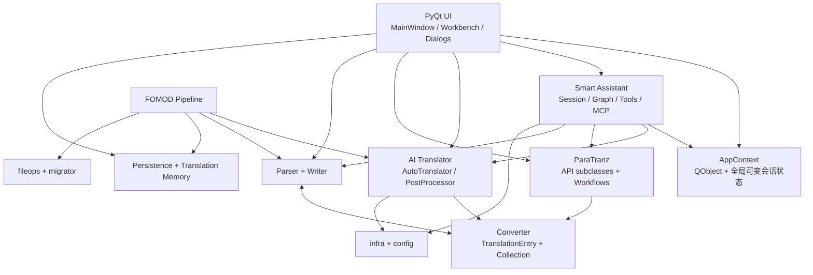
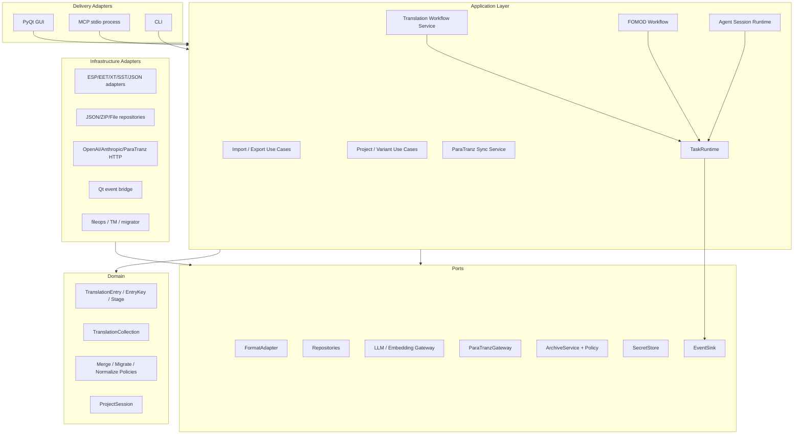

# TransBridge 需求—代码横向架构审查与迭代设计建议

**审查日期**：2026-08-18  
**审查角色**：系统架构师（独立横向审查）  
**审查范围**：`docs/requirements.md`、`docs/adr/`、`plans/`、`src/transbridge/`、`tests/`、`pyproject.toml`  
**审查方式**：只读静态复核；未读取同目录 `fr-*.md` 或其他 Agent 的审查结论；未运行测试  
**变更边界**：本次只新增本报告，未修改业务代码、需求、ADR 或 Plan

---

## 1. 执行结论

TransBridge 已经具备较清晰的功能域包：解析、统一词条、写回、ParaTranz、AI 翻译、持久化、Smart Assistant、翻译记忆、FOMOD、通用文件工具都已有独立目录；ADR-001/002 的统一词条模型、ADR-008 的 UI/后端分离、ADR-010 的共享基础设施、ADR-014/015 的 FOMOD 与通用能力拆分也提供了正确的演进方向。

但从实际依赖与运行时组装方式看，当前架构仍是：

> **以 UI 和模块级全局对象为事实上的应用层，以具体类和动态分派表为跨模块契约。**

这导致三个直接后果：

1. **接口漂移已经造成确定的实现断裂**：Agent parser/writer、Embedding 客户端、MCP 启动链都出现“调用方认为存在的接口”与“被调用类实际接口”不一致。
2. **同一需求存在多条实现入口**：GUI、Agent、FOMOD、批处理各自加载配置、构造翻译器/后处理器/API 客户端、管理线程，行为和错误语义无法稳定保持一致。
3. **新增需求的边际成本持续上升**：`AppContext`、`MainWindow`、`ChatWidget`、`AutoTranslator`、`PostProcessor` 等对象同时承担状态、编排、基础设施和 UI 协调职责；Plan 虽宣称完成，跨模块验收却无法由测试或架构门禁证明。

### 最终建议

推荐采用“**模块化单体 + 显式应用层 + Ports/Adapters + 单一组合根**”作为目标架构，并使用绞杀式迁移：先包装现有实现、冻结契约，再逐条把 GUI、Agent、MCP、FOMOD 切换到同一批 Use Case；不建议一次性重写。

优先级判断：

- **P0：先稳定跨模块契约和可启动/可安装链路**，否则继续迭代会在更多入口复制错误。
- **P1：建立应用层、统一状态所有权和任务运行时**，解决结构性重复与线程模型分裂。
- **P2：再做 UI 瘦身、性能预算、插件化扩展和文档治理**。

---

## 2. 审查基线与量化事实

### 2.1 代码与测试规模

静态统计结果：

| 指标 | 数量 |
|---|---:|
| `src/transbridge` Python 文件 | 225 |
| 生产代码总行数 | 46,407 |
| 超过 450 行的生产文件 | 30 |
| `tests` Python 文件 | 56 |
| 测试代码总行数 | 9,984 |
| 测试中的 `src.transbridge` 导入 | 80 |
| 生产代码中的 `src.transbridge` 导入 | 135 |

最大文件包括：

- `ui/tools/ai_translator/ai_translator_window.py`：1,617 行
- `ui/main_window.py`：1,522 行
- `ui/tools/smart_assistant/chat_widget.py`：1,239 行
- `ai_translator/translator.py`：1,045 行
- `ui/workbench/step2.py`：1,024 行
- `ai_translator/post_processor/post_processor.py`：982 行
- `converter/translation_entry_collection.py`：681 行
- `smart_assistant/graph_executor.py`：606 行

这与 ADR-008 更新节定义的“文件行数 ≤450，超过时评估拆分”存在持续偏差，见 `docs/adr/008-smart-assistant-code-layering.md:365`。FR10 的期望产出更明确写成“最大文件 <400，所有文件 ≤400”，见 `docs/requirements.md:860-864`；但 FR10 又把 `chat_widget.py` 和 `main_window.py` 排除在范围外，见 `docs/requirements.md:846-850`。这说明“文件规模”不是单纯代码风格问题，而是缺少应用层后，业务编排只能继续堆积在 UI 和门面对象中的结果。

### 2.2 主要跨包依赖

按静态 import 统计，最密集的跨包依赖包括：

| 依赖方向 | 显式导入数 | 说明 |
|---|---:|---|
| `ui → paratranz` | 25 | UI 大量直接构造具体 API 客户端 |
| `ui → converter` | 9 | UI 直接操作领域集合与模型 |
| `converter → parser` | 8 | 统一模型/集合反向依赖格式解析实现 |
| `ui → smart_assistant` | 6 | UI 直接组装后端编排器与运行时 |
| `ui → parser` | 6 | UI 自行执行格式分派与导入流程 |
| `writer → converter` | 6 | 合理，但缺少统一 writer port |
| `writer → parser` | 5 | writer 依赖解析器内部状态 |
| `paratranz → converter` | 4 | 工作流直接操作统一集合 |
| `parser → converter` | 1 | 与 `converter → parser` 形成双向依赖 |

最关键的循环是：

```text
converter.translation_entry
    └─ imports parser 的 EET/XT/SST/PluginString 类型

parser.plugin_parser
    └─ imports converter.TranslationEntry
```

证据：

- `src/transbridge/converter/translation_entry.py:4-7`
- `src/transbridge/parser/plugin_parser.py:7`
- `src/transbridge/converter/translation_entry_collection.py:13-16`

这与 ADR-001 声称的“解析器与下游逻辑完全解耦”不一致，见 `docs/adr/001-unified-translation-entry.md:28`。

### 2.3 现有测试的结构性覆盖

现有测试对词条模型、各格式 writer、Smart Assistant 状态机、MCP 局部逻辑、翻译记忆、FOMOD 局部逻辑均有覆盖，这是重要资产；但静态检查没有发现以下类型的架构测试：

- 安装 wheel 后的 CLI/import smoke test；
- 包依赖方向测试；
- 所有 Parser/Writer adapter 的统一契约测试；
- GUI、Agent、MCP 对同一 Use Case 的行为一致性测试；
- FOMOD 完整流水线的故障注入与事务性测试；
- 多任务并发、暂停、取消和 shutdown 的统一生命周期测试。

已有 `tests/smart_assistant/test_mcp.py:17-20` 只用 `FakeToolRegistry` 初始化 server；`tests/smart_assistant/test_session_controller_integration.py:22-43` 使用 mock 组装 Controller；`tests/test_fomod_pipeline.py:22-33` 只验证无 LLM 配置时 `_ai_translate()` 返回 0。它们验证了局部类型行为，但没有验证真实组合根和跨模块契约。

---

## 3. 当前实际架构

### 3.1 现状拓扑



### 3.2 现状优点

1. **统一词条模型方向正确**：`TranslationEntry` 与 `TranslationEntryCollection` 为 UI、AI、ParaTranz、FOMOD 提供了共同数据语言，符合 ADR-001/002 的核心目标。
2. **主索引演进有记录**：ADR-002 将主索引从 `id` 调整为稳定的 `key`，代码也在 `translation_entry_collection.py:29-30` 维护 key 主索引和 id 辅助索引。
3. **Smart Assistant 后端已从 UI 包中抽离**：ADR-008 的第一阶段目标基本实现，`smart_assistant/` 已成为独立包。
4. **共享 LLM/Embedding 基础设施已提取**：`infra/llm_client.py`、`infra/embedding_client.py`、`infra/vector_store.py` 已存在；`config/` 也成为实际配置归属。
5. **FOMOD 与通用文件能力分离合理**：ADR-015 将 `fileops/`、`migrator/` 从 FOMOD 特有逻辑中拆出，`fomod/pipeline.py` 复用这些能力而非重造。
6. **持久化具备基本可靠性措施**：`persistence/_utils.py:8-16` 采用临时文件 + replace 的原子 JSON 写入；`validate_name()` 拒绝路径遍历字符。
7. **安全护栏和结构化工具结果已有基础**：ToolSpec、GuardChain、ExecutionContext、TaskManager、ToolResult 已形成一套可扩展运行时雏形。

这些优点意味着项目不需要推倒重来；最合适的策略是把现有模块包装到稳定的应用层契约后，逐步收口入口。

---

## 4. 架构问题与证据

## 4.1 P0：跨模块契约没有唯一所有者，已产生确定的接口断裂

### 事实

Agent parser 使用动态字符串分派，调用了不存在的模块或方法：

- ESP 分派调用 `PluginParser().parse(path)`，但实际公开方法是 `parse_plugin()`：`tool_parser.py:126-131` 对比 `plugin_parser.py:24`。
- EET 指向不存在的 `parser.eet_xml_parser`，实际模块为 `parser/eet_parser.py`：`tool_parser.py:133-137`。
- XT 指向不存在的 `parser.xt_xml_parser`，实际模块为 `parser/xt/xt_parser.py`：`tool_parser.py:139-143`。
- SST 调用 `parse()`，实际入口为类方法 `from_file()`：`tool_parser.py:145-149` 对比 `sst_parser.py:105-106`。

Agent writer 同样假设了不存在的统一构造/写入接口：

- `EETWriter()` 实际要求 `parser` 构造参数，且实际流程是 `apply_collection()` 后 `write(path)`：`tool_writer.py:44-50` 对比 `writer/eet_xml_writer.py:17-22,99`。
- `XTWriter()` 存在相同问题：`tool_writer.py:55-60` 对比 `writer/xt_xml_writer.py:14-19,87`。

Embedding 初始化也把 LLM 工厂当成 Embedding 工厂使用：

- `chat_widget.py:146-150` 调用 `create_llm_client(api_key, base_url)`；
- 实际 `create_llm_client(config)` 只接收完整 LLMConfig：`infra/llm_client.py:247-258`；
- 正确的 Embedding 工厂其实是 `infra/embedding_client.py:238` 的 `create_embedding_client(config)`。

### 架构原因

当前“接口”主要存在于调用方约定、动态 import 字符串和具体类构造器中，没有一个可被所有入口共同验证的 Port/Protocol。GUI、Agent、FOMOD 各自知道具体类，任何一次类名、模块名、构造器或方法签名变化都可能只修复其中一个入口。

### 影响需求

- FR1、FR4、FR9.1、FR9.6、FR9.12、FR15、FR16；
- NFR2 可靠性、NFR5 可扩展性、NFR6 打包分发。

### 建议

P0 引入明确的 `FormatAdapter` 契约：

```python
class FormatAdapter(Protocol):
    format_id: str
    def parse(self, request: ParseRequest) -> ParseResult: ...
    def write(self, request: WriteRequest) -> WriteResult: ...
```

由 `FormatAdapterRegistry` 注册 ESP/EET/XT/SST/JSON/Strings adapter。UI、Agent 和 FOMOD 只能调用 application use case，不再拼接模块路径或直接构造 writer。

---

## 4.2 P0：应用启动、MCP 和发布入口没有共同组合根

### 事实

`ui/app.py:44-63` 同时承担 QApplication、Agent 预置、工具注册、配置加载、MCP server 和线程启动；但 MCP 分支使用了当前文件未导入的 `ToolRegistry`：`ui/app.py:60-61`。

同时：

- ADR-012 规定 `MCPServer` 应持有 `registry` 与 `AppContext`，见 `docs/adr/012-safety-observability-mcp.md:455-460`；
- 实际 `ui/app.py:60-61` 没有创建/注入 AppContext；
- `MCPAdapter.call_tool()` 会构造 `ExecutionContext(app_context=self._ctx, ...)`，见 `mcp/adapter.py:56-59`，因此真实工具可能在空上下文中执行；
- `ui/app.py:56-59` 没有把 `auth_token` 传给 MCPServer，server 会在后台线程内随机生成并输出临时 token：`mcp/server.py:27-39`；
- server 使用 `select.select([sys.stdin], ...)`：`mcp/server.py:43-50`，与 NFR3 的 Windows 桌面兼容性目标存在风险；
- ADR-012 的设计说明同时出现“GUI 内条件启动后台 server”和“由 MCP Client 以独立子进程启动”两种运行拓扑，见 `docs/adr/012-safety-observability-mcp.md:638` 与 `704-706`，当前缺少唯一决策。

发布入口也没有被组合根覆盖：

- `pyproject.toml:31` 配置 `transbridge = "transbridge:main"`；
- `transbridge/__init__.py` 没有 `main`；
- `src/transbridge/main.py:1` 又通过 `src.transbridge.ui.app` 导入；
- 生产代码共有 135 处 `src.transbridge` 导入，测试也用 80 处相同导入，源码树内测试不能证明 wheel 安装后的包可导入。

### 架构原因

项目没有单一 composition root。QApplication、CLI、MCP 本应是三个 delivery adapter，共享同一个 `build_application()`，但现在各自直接或隐式依赖具体模块和类级全局注册表。

### 建议

新增 `transbridge/bootstrap.py`：

```text
build_services(config, runtime_mode) -> AppServices
build_gui(services)                -> QApplication + MainWindow
build_mcp(services)                -> MCPServer
build_cli(services)                -> CLI handler
```

ToolRegistry 改为实例级 `ToolCatalog`，由组合根构造并注入；GUI 和 MCP 可以共享同一 catalog 定义，但必须各自拥有明确的 `RuntimeContext` 与权限策略。MCP 拓扑必须二选一并写入 ADR：推荐独立子进程 stdio，不在 GUI 主进程后台抢占 stdin/stdout。

---

## 4.3 P1：领域模型与格式适配层双向依赖，统一模型并未真正独立

### 事实

ADR-001 要求所有来源进入系统后立即转换为 `TranslationEntry`，下游只依赖统一模型；但 `TranslationEntry` 本身包含多个 `create_from_*` 工厂并直接导入 parser 类型：`translation_entry.py:4-7,67,101,123,174,245`。

`TranslationEntryCollection` 不只是集合：它直接导入 EET parser、PluginParser、StringsLookup、XT 类型，见 `translation_entry_collection.py:13-16`；并包含：

- `from_eet_xml()` / `update_from_eet_xml()`：`113-229`；
- `from_plugin()`：`230-250`；
- `apply_xt_entries()` / `apply_sst_entries()`：`260-382`；
- 多种 JSON/DSD 序列化：`530-660`。

反向上，`parser/plugin_parser.py:7` 又导入 `TranslationEntry` 并直接返回领域对象。

`translation_memory/manager.py:18` 和 `migrator/key_migrator.py:7-8` 还导入 converter 的私有 `_normalize_text`，说明文本规范化作为领域策略没有独立的公共契约。

### 影响

- 新增格式必须修改 converter；
- parser 与 converter 无法独立测试或替换；
- 写回依赖 parser 实例状态，adapter 边界不清；
- `TranslationEntryCollection` 已增长到 681 行，职责包含容器、格式映射、迁移、序列化。

### 建议

将领域核心收敛为：

```text
domain/
  entry.py              TranslationEntry / EntryKey / Stage
  collection.py         Collection + 索引不变量
  normalization.py      normalize_text 公共策略
  policies.py           merge/migrate/stage 领域规则
```

格式到领域模型的映射归属 adapter；JSON/DSD 持久化归属 serializer/repository。领域包禁止导入 parser、writer、ui、requests、PyQt。

---

## 4.4 P1：缺少应用层，UI 成为事实上的业务编排器

### 事实

`MainWindow` 1,522 行，直接负责：

- 解析 ESP/EET/XT/SST：`main_window.py:442-793`；
- 保存源文件到项目：`699-715`；
- 上传/下载/写回调度：`820-887`；
- workspace 恢复：`981-1042`；
- 项目创建/打开/保存：`1044-1161`；
- 版本创建/复制/切换/删除：`1163-1300`；
- 项目重命名和快照：`1303-1361`。

`AppContext` 同时持有：

- ParaTranz config/user/project：`ui/context.py:57-59`；
- 多集合 slots 与 active key：`62-63`；
- workspace/project/variant/store：`68-71`；
- filter/labels/scope/selection：`74-81`；
- PyQt 信号和主线程 mutation bridge：`40-53,393-421`。

`ExecutionContext` 再通过 `__getattr__`/`__setattr__` 动态代理 AppContext，见 `smart_assistant/tools/types.py:231-242,289-322`。这使工具的真实依赖无法从类型签名得知，也让 AppContext 字段成为隐式公共 API。

### 架构原因

当前包目录虽然分开，但没有 `application/` 层表达“解析源文件”“切换版本”“启动翻译”“同步 ParaTranz”等用例。因此，入口层只能自行组装具体依赖、维护状态和处理错误。

### 建议

引入应用层 Use Case：

```text
application/
  project/       OpenProject, SwitchVariant, SaveSnapshot
  translation/   StartTranslation, PolishEntries, PostProcess
  io/            ImportSource, ExportTranslation
  sync/          UploadProject, DownloadAndMerge
  fomod/         RunFomodTranslation
  agent/         RunTool, ExecutePlan, ManageSession
```

UI 只负责收集 Command、展示 Result 和订阅 Event；不直接 import parser/writer/API client/repository。

---

## 4.5 P1：状态所有权分散，全局对象与“伪依赖注入”并存

### 事实

ADR-008 在 Controller 重构中明确指出：模块级函数引用 AppContext/TaskManager 全局单例会导致隐式耦合，应通过构造函数注入，见 `docs/adr/008-smart-assistant-code-layering.md:294-331`。

实际 Controller 虽有构造参数，但模块级 wrapper 仍会自行创建新的 UI AppContext：

- `tool_translator.py:576-585`
- `tool_proofreader.py:414-423`
- `tool_editor.py:376-385`

这造成两个问题：

1. Smart Assistant 后端重新依赖 UI 包，直接违反 ADR-008 “后端不依赖 UI”的方向；
2. Controller 构造时注入的 AppContext 可能不是 ChatWidget/MainWindow 正在使用的 AppContext，状态身份不唯一。

ToolRegistry 也是 class-level 全局注册表，`tool_registry.py:35-55` 的 `_namespaced_tools` 与所有 classmethod 使测试、MCP、多个窗口或未来多项目运行时共享同一全局可变 catalog。

TaskManager 使用进程级 singleton，见 `tools/task_manager.py:41,55-69`。此外，proofreader 还维护 `_last_report` 全局状态，tool controller 维护各自 `_xxx_ctrl` 全局状态。

### 建议

区分三个生命周期：

- **Application singleton**：不可变配置、adapter registry、client factory；
- **Workspace/Project scope**：ProjectSession、集合、variant、标签；
- **Task/Conversation scope**：TaskHandle、AgentSession、ExecutionContext、trace。

所有 scope 都由 composition root 或显式 factory 创建。禁止业务模块内部调用 `AppContext()`、`TaskManager()` 或写模块级 controller 缓存。

---

## 4.6 P1：SessionController 是状态跟踪器，不是完整的会话协调器

### 事实

`plans/session-controller/plan.md:12-13` 说要删除 ChatWidget 旧控制方法并让 ChatWidget 瘦身；状态标记为“全部完成”。但实际：

- `ChatWidget` 仍有 1,239 行，并直接构造 ToolExecutionHandler、ConversationOrchestrator、SessionController、ExecutionEngine，见 `chat_widget.py:162-220,669`；
- `SessionController._execute_plan()` 是 no-op，并明确写明真实执行依赖 `ChatWidget._on_plan_confirmed`，见 `session_controller.py:244-252`；
- Controller 的回调中包含 `_on_llm_round_start`、`_on_thinking_indicator_hide` 等 UI 操作语义，见 `session_controller.py:62-83`；
- 测试只模拟 Controller 状态转换，Plan 场景在测试中由调用方直接调用 `handle_execution_complete()`，见 `test_session_controller_integration.py:90-117`，没有验证真实 DAG 被 Controller 提交。

### 判断

FR12 的“显式状态机”已实现，但“会话级顶层调度者”只完成一半。当前状态机可以报告状态，却不拥有实际执行生命周期，UI 仍是顶层协调者。

### 建议

将其演进为纯后端 `AgentSessionRuntime`：

- 输入：UserMessage / Confirmation / Cancellation / ToolCompletion / TaskCompletion；
- 输出：领域事件或 presentation event；
- 持有：Conversation、Planner、ToolExecutor、GraphExecutor、TaskRuntime；
- UI 仅把事件映射为 bubble/card/dialog；
- plan/react 不再由 ChatWidget 分别维护旁路。

现有 `SessionController` 可作为状态机内核保留，外层新增 Coordinator，而不是继续把 UI 回调塞入 Controller。

---

## 4.7 P1：线程与任务模型分裂，ADR-004 已不能覆盖实际实现

### 事实

ADR-004 决策是“顶层 QThread + 信号总线，部分内部并发采用 ThreadPoolExecutor”，见 `docs/adr/004-qthread-async-pattern.md:13-32,46-47`。

实际存在至少五套并发机制：

1. UI 的多个 QThread worker：`ui/workers.py:67`、AI 翻译各 `_worker.py`、FOMOD `_PipelineWorker`；
2. Smart Assistant `AsyncWorker(threading.Thread)`：`smart_assistant/workers/async_worker.py:13`；
3. GraphExecutor 内置 ThreadPoolExecutor：`graph_executor.py:43-65`；
4. PostProcessor 每个阶段独立创建 ThreadPoolExecutor，并另起 monitor daemon thread：`post_processor.py:279-291,342,404,465,547`；
5. TaskManager 再创建 daemon thread：`task_manager.py:238-257`。

暂停语义虽多处使用 `pause_event.clear() = 暂停 / set() = 运行`，但并非所有工作单元都轮询同一 token。TaskManager 的 `pause()` 只修改 Event 和状态，见 `task_manager.py:165-187`；FOMOD 只接收 stop_event，没有 pause_event，见 `fomod/pipeline.py:53-60`。LLM 客户端、ParaTranz requests、文件 IO 的可取消能力也不统一。

### 风险

- shutdown 和资源回收路径不一致；
- UI 关闭后 daemon thread 可能继续写状态；
- 任务监控显示“paused”不等于底层真正暂停；
- 嵌套线程池可能造成超额并发和不可预测的 API 限流；
- 任务错误、取消、部分成功的状态语义不统一。

### 建议

更新 ADR-004，定义统一 `TaskRuntime`：

```python
TaskSpec(id, kind, resource_class, concurrency_key)
CancellationToken(stop, pause)
TaskHandle(status, progress, result, error)
TaskRuntime.submit(spec, callable) -> TaskHandle
```

Qt 只作为事件桥接 adapter；业务任务不继承 QThread。TaskRuntime 统一并发预算、取消、暂停、shutdown、日志与 TaskMonitor 数据源。

---

## 4.8 P1：AI 翻译与后处理有成熟能力，但用例入口重复

### 事实

AutoTranslator、PostProcessor、LLMPolisher、LLM 客户端在多个位置重复构造：

- GUI：`ai_translator_window.py:677,747,1245-1258,1352-1365`
- 批量 worker：`_batch_translation_worker.py:194-201`
- 混合 worker：`_mixed_worker.py:146-161`
- Agent translation tool：`tool_translator.py:102-116,216-228`
- Agent proofreader tool：`tool_proofreader.py:71-87`
- FOMOD：`fomod/pipeline.py:150-166`
- AutoTranslator 内部又创建 PostProcessor：`ai_translator/translator.py:632`

配置加载也散落在 UI、GraphExecutor、ToolExecutionHandler、ConversationOrchestrator、PostProcessor 和工具模块中。每条入口可以选择不同默认值、retry、scope、progress 和错误处理。

### 建议

建立 `TranslationWorkflowService`：

```text
TranslationJobSpec
  - collection/session id
  - entry scope
  - mode: translate | polish | mixed | postprocess
  - term/retrieval policy
  - postprocess policy
  - checkpoint policy

TranslationJobResult
  - counts
  - per-entry outcome
  - warnings/errors
  - report reference
  - resume token
```

GUI、Agent、FOMOD 只负责创建 JobSpec；TaskRuntime 执行同一 service。这样 FR5、FR6 的能力只有一个行为源，报告、暂停、断点、重试也能一致。

---

## 4.9 P1：ParaTranz 存在 API 层，但 UI 与工具绕过了统一工作流

### 事实

UI 中至少 25 处直接依赖 `paratranz.api`，每个 tab/dialog 都自行构造继承自 `ParatranzClient` 的 API 类。例：

- `ui/paratranz/files_tab.py:140,244,263,282,305,342`
- `ui/paratranz/strings_tab.py:126,159,235,258,276`
- `ui/paratranz/terms_tab.py:231,308,330,355,377`

另一方面，项目已有 `ParaTranzUploader` / `ParaTranzDownloader` 工作流；Agent 的 `tool_paratranz.py:91-157` 又实现了一套条目级上传/下载和 diff 逻辑，没有复用已有 workflow。

API 类通过继承 `ParatranzClient` 获得 session，导致每个 API 对象都可能创建自己的 `requests.Session`，见 `paratranz_client.py:21-44`。错误统一为 RuntimeError，401 分支还直接 print token，见 `paratranz_client.py:80-90,132-142`。

### 建议

建立共享 `ParaTranzGateway`（组合而非继承）：

- 单一 HttpTransport/session；
- typed error：AuthError / PermissionError / RateLimitError / NetworkError / RemoteValidationError；
- project/files/strings/terms 等资源 client 作为 gateway 的子接口；
- `SyncService` 统一上传、下载、冲突检测、合并、历史记录；
- UI 与 Agent 调用相同 SyncService；
- 凭据由 SecretStore 注入，不进入日志和错误文本。

---

## 4.10 P1：FOMOD 分层方向正确，但流水线缺少可验证的步骤结果与事务边界

### 事实

`FomodPipeline.run()` 已按“解包→diff→逐插件翻译→界面文本→组装→打包”组织，见 `fomod/pipeline.py:53-100`，并复用 fileops、migrator、TranslationMemory，这是现有架构的优点。

但：

- `_ai_translate()` 捕获所有异常后返回 0：`pipeline.py:150-168`；
- `_write_back()` 捕获所有异常并直接 pass：`170-183`；
- 流水线可能最终返回 archive_path，却没有向用户表明某插件未翻译或未写回；
- 临时目录使用 `tempfile.mkdtemp()`，没有明确清理/保留策略：`62-69`；
- 归档接口没有统一 `ArchivePolicy`（成员数、展开体积、压缩比、符号链接、允许路径）；ZIP 自定义前缀判断在 `fileops/archive.py:89`，7z/RAR 直接进入后端 extract：`105-130`；
- `py7zr`、`rarfile` 未在 `pyproject.toml:10-28` 声明，ADR-014/015 的依赖决策没有落实到分发层。

### 建议

将流水线变为显式 step runner：

```text
FomodRun
  ├─ ExtractStep
  ├─ DiffStep
  ├─ PluginMigrationStep[*]
  ├─ TranslationStep[*]
  ├─ WriteStep[*]
  ├─ FomodXmlStep
  ├─ AssembleStep
  └─ PackStep
```

每一步返回 `StepOutcome(success/partial/failed, warnings, artifacts)`；关键步骤失败时不得生成“成功”结果。输出先写 staging，全部门禁通过后再原子移动到最终路径。ArchivePolicy 在 fileops adapter 层强制执行。

---

## 4.11 P1：持久化原子写入良好，但 Project/Variant 生命周期仍由 UI 管理

### 事实

`WorkspaceState`、`ProjectHandle`、`VariantStore` 已清晰分文件；`VariantStore` 支持 apply/collect/snapshot，原子写入也已实现。

但 `MainWindow` 直接决定：

- 何时保存当前版本；
- 切换版本时 prompt/auto-save 行为；
- 如何复制 translations/labels；
- 如何删除 variant 目录；
- 如何移动项目目录、更新 workspace。

证据见 `main_window.py:1120-1359`。这使 FR8 的业务规则依赖 UI 事件顺序，CLI/Agent/FOMOD 无法复用同一项目生命周期。

### 建议

新增 `ProjectSession` 与 repository ports：

```text
ProjectSession
  - project_id / active_variant
  - source descriptors
  - active collections
  - labels / filters / selection
  - dirty/revision

WorkspaceRepository
ProjectRepository
VariantRepository
SnapshotRepository
```

`SwitchVariant`、`SaveProject`、`CreateSnapshot` 等用例持有事务和业务规则；AppContext 缩减为 Qt presentation state，只保存当前视图需要的 observable snapshot。

---

## 4.12 P2：文档、Plan 状态与可执行验收没有形成闭环

### 事实

多个 Plan 标记为“已实现/全部完成”，但所有验收 checkbox 仍为空。例如：

- `agent-tool-expansion`：117 个未勾选项，状态“26 Story 全部完成”；
- `agent-upgrade`：91 个未勾选项，状态“Phase 1 + Phase 2 全部完成”；
- `llm-chat`：60 个未勾选项，状态“已实现”；
- `session-controller`：21 个未勾选项，状态“全部完成”；
- `smart-assistant-refactor`：37 个未勾选项，状态“已实现”；
- `project-persistence`：50 个未勾选项，状态“已实现”。

这不一定表示代码都未实现，但表示“状态字段”与“验收证据”是两套互不约束的事实源。

需求文档结构也存在治理问题：FR6.1 从 `requirements.md:143` 直接开始、FR7.1 从 `178` 直接开始，缺少 FR6/FR7 的三级标题；FR7.13 同一行同时写“Phase 1 + Phase 2 全部完成”和“Phase 2 待方案”，见 `requirements.md:223`。

`.Codex/bm_config/paths.json` 缺失，导致 bm 系列 skill 的路径和索引治理不能按项目配置稳定执行。

### 建议

Plan 不应把“写完代码”直接等同于“完成”。状态模型应改为：

```text
proposed → approved → implementing → code-complete
         → verified → released
```

每个 Story 必须链接：需求、ADR、代码、测试、验证记录。已完成的历史 Plan 不建议大幅重写内容；应追加“实现漂移/被哪个 v2 Plan 取代”的状态说明，并由新的迁移 Plan 承接结构性修复。

---

## 5. FR1–FR16 实际架构覆盖评估

| 需求域 | 当前主要实现 | 已有优势 | 架构缺口 | 目标归属 |
|---|---|---|---|---|
| FR1 解析 | `parser/`、`converter/`、UI/Agent 分派 | 多格式能力完整 | parser/converter 循环；入口不统一；Agent 分派失效 | `ImportSource` + `FormatAdapterRegistry` |
| FR2 条目管理 | `TranslationEntryCollection`、UI table | 统一模型和双索引 | Collection 承担格式映射/序列化；key/id 语义仍散落 | 纯 domain Collection + EntryKey |
| FR3 ParaTranz | `paratranz/api`、`workflow`、UI tabs、Agent tool | API 覆盖面广；已有 uploader/downloader | UI/Agent 重复入口；client 继承与错误语义弱 | `ParaTranzGateway` + `SyncService` |
| FR4 写回 | `writer/`、UI cards、Agent writer | ESP/EET/XT writer 已存在 | 构造器/方法不统一；writer 依赖 parser 状态 | `ExportTranslation` + FormatAdapter |
| FR5 AI 翻译 | `AutoTranslator`、workers、term/retrieval | 三轮策略、断点、术语/向量能力丰富 | 多入口重复构造；任务/取消/配置不统一 | `TranslationWorkflowService` |
| FR6 后处理 | `PostProcessor` 子模块、报告 | 阶段拆分和报告能力成熟 | 嵌套线程池；异常/部分成功语义分散 | Translation Job 的 pipeline steps |
| FR7 UI | MainWindow、Workbench、dialogs | 功能覆盖广 | UI 直接编排业务；多个超大 widget/window | Presenter/ViewModel + application commands |
| FR8 持久化 | Workspace/Project/VariantStore | 原子写；模型已分文件 | 生命周期与事务规则在 MainWindow | ProjectSession + repositories |
| FR9 工具系统 | ToolRegistry、tools、guards | namespace/permission/ToolResult 基础好 | class-global registry；动态 adapter 漂移；上下文代理隐式 | Agent tool adapters 调 application use cases |
| FR10 重构 | controller/graph/types 拆分 | 部分上帝类已拆 | 行数目标未实现；controller 仍有全局 wrapper | runtime-v2 Plan，删除内部单例 |
| FR11 Prompt | prompts/tool schema | 分层加载已经存在 | schema 与真实 adapter 可执行契约分离 | ToolCatalog 同时生成 schema 与执行绑定 |
| FR12 会话控制 | SessionController | 显式状态枚举和转移 | plan 执行 no-op；ChatWidget 仍协调 | AgentSessionRuntime/Coordinator |
| FR13 多会话 | SessionManager | JSON 持久化和 CRUD | 与运行时 scope/ProjectSession 尚未统一 | ConversationRepository + session scope |
| FR14 任务监控 | TaskManager + TaskMonitor | 有统一观察入口雏形 | 底层任务不都受其控制；pause 语义不保证 | TaskRuntime 唯一状态源 |
| FR15 FOMOD | fomod pipeline/TM/fileops/migrator | 复用边界方向正确 | 静默失败；非事务；安全/依赖策略未闭环 | FomodWorkflow step runner |
| FR16 通用工具 | fileops/migrator/TM Agent tools | 通用能力已从 FOMOD 解耦 | 安全策略、typed result、adapter 契约不足 | 通用 application services + Agent adapters |

---

## 6. NFR1–NFR6 架构评估

### NFR1 性能

已有缓存、FAISS/BM25、批量接口和线程池；但缺少全局并发预算、API provider 限流策略、内存预算和大型集合基准。嵌套 ThreadPoolExecutor 可能让局部优化相互放大。应由 TaskRuntime 和 ResourcePolicy 统一 `llm/api/cpu/io` 并发额度，并为 1万/10万词条、超大归档建立性能基线。

### NFR2 可靠性

原子 JSON 写入是明确优点；但错误多使用 `RuntimeError`、空结果或 `except Exception: pass`，部分成功无法被调用方可靠识别。应统一 Result/Error taxonomy、事务性 staging、retry idempotency 和恢复 token。

### NFR3 兼容性

Windows 是核心目标，但 MCP stdio 使用 `select(stdin)`；生产与测试依赖 `src.transbridge` 源码布局；绝对路径校验与桌面文件选择器语义也曾冲突。需要真实 Windows wheel/portable 包 smoke test，而不是仅依赖 `pythonpath = ["src"]` 的源码测试。

### NFR4 安全性

已有工具 permission/guardrail 和名称校验，但安全策略仍分散：归档资源上限缺失、token 进入日志/INI、MCP context/认证组装不完整。应由 SecretStore、ArchivePolicy、ToolAuthorizationPolicy 三个 port 集中管理。

### NFR5 可扩展性

目录分包有利于扩展，但新增格式或入口仍需修改多处分派表/UI/工具。FormatAdapterRegistry、ToolCatalog、application use cases 能把扩展点从“修改调用方”变为“注册 adapter”。

### NFR6 打包分发

当前是高风险项：console script 目标错误、`src.transbridge` 导入普遍、版本号 `pyproject.toml:3` 与 `transbridge/__init__.py:1` 不一致、ADR 指定的 `py7zr`/`rarfile` 未声明。必须把 wheel 安装、CLI 启动、GUI 启动、可选依赖和 PyInstaller 资产检查纳入发布门禁。

---

## 7. 目标架构选择

## 7.1 方案 A：最小契约加固

**做法**：保留现有目录与 AppContext/MainWindow 编排，只增加 Parser/Writer facade、修复 MCP/CLI、补架构测试。

**优点**：改动小，最快恢复可用性；适合先处理 P0。  
**缺点**：UI、全局状态、线程分裂和重复入口仍存在；后续每个新功能仍需跨多个入口修改。  
**适用**：短期发布抢修，不适合作为 1 年以上演进架构。

## 7.2 方案 B：模块化单体 + 应用层 + Ports/Adapters（推荐）

**做法**：保留现有功能包，新增纯 domain/application/ports/composition root；现有 parser/writer/Qt/requests/MCP/FOMOD 作为 adapters。通过 wrapper 逐步迁移，不一次性重写。

**优点**：

- GUI、Agent、MCP、FOMOD 共享同一用例；
- 契约可做统一 contract test；
- 状态和线程生命周期可明确分层；
- 保留当前实现与测试资产；
- 适合桌面单体，不引入服务化复杂度。

**缺点**：需要新增一层类型与组装代码；迁移期会存在兼容 facade；必须严格控制“双路径”持续时间。  
**适用**：当前项目规模与未来迭代需求。

## 7.3 方案 C：全面插件化/事件驱动内核

**做法**：所有格式、工具、工作流和 UI 都通过 plugin manifest/event bus 动态发现，状态转为事件溯源或命令总线。

**优点**：第三方扩展能力最强；格式和工具可独立发布。  
**缺点**：对 4.6 万行桌面应用过重；调试、版本兼容、事件一致性和打包复杂度显著上升；当前没有第三方插件生态的明确需求。  
**适用**：未来确定开放插件 SDK 后再评估，不建议现在采用。

### 推荐决策

采用方案 B，但把方案 A 作为 Phase 0。即：先用最小 facade 修复契约，再让 facade 成为目标应用层的第一批 port adapter，避免临时修复成为第二套永久实现。

---

## 8. 推荐目标架构



### 8.1 依赖规则

1. `domain` 不依赖 parser/writer/ui/requests/PyQt/config 文件系统。
2. `application` 只依赖 domain 与 ports，不依赖具体 adapter。
3. UI、MCP、CLI 只调用 application command/use case。
4. infrastructure 实现 ports；具体类只在 composition root 出现。
5. `AppContext` 不再是业务上下文，只是 Qt presentation state。
6. ToolSpec 的 execute 绑定 application command，不绑定 parser/writer/UI controller。
7. 所有长任务必须由 TaskRuntime 创建并成为 TaskMonitor 唯一数据源。

### 8.2 推荐目录草案

```text
src/transbridge/
  bootstrap.py
  domain/
    translation/
    project/
  application/
    io/
    translation/
    project/
    sync/
    fomod/
    agent/
    runtime/
  ports/
    format.py
    repositories.py
    llm.py
    paratranz.py
    archive.py
    secrets.py
    events.py
  adapters/
    formats/
    persistence/
    remote/
    archive/
    qt/
    mcp/
  ui/
```

不要求第一阶段立即物理移动所有现有文件。可以先在现有包中实现 adapter，再在依赖稳定后迁移目录，减少 import churn。

---

## 9. ADR 变更清单

根据 bm-arch 的“能归入已有 ADR 就追加更新，不另建 ADR”规则，建议如下。当前仅提出草案，正式修改 ADR 前仍需用户选择目标方案。

### P0

#### 新增 ADR-016：模块化单体应用层与组合根

这是现有 ADR 未覆盖的全局主题，应新建，而不是塞入只针对 Smart Assistant 的 ADR-008。

应冻结：

- domain/application/ports/adapters/delivery 的依赖方向；
- GUI、MCP、CLI 的 composition root；
- RuntimeContext/ProjectSession/Task scope；
- typed Command/Result/Error 基线；
- 绞杀式迁移与兼容 facade 的删除门禁。

#### 更新 ADR-001：统一数据模型边界

追加：TranslationEntry 不再 import parser 类型；格式映射由 FormatAdapter 负责；EntryKey/Stage/normalize_text 成为公开领域契约。

#### 更新 ADR-008：Smart Assistant 后端依赖与会话协调

追加：

- 后端禁止实例化 `ui.context.AppContext`；
- Controller wrapper/global cache 废弃；
- SessionController 演进为 AgentSessionRuntime/Coordinator；
- ChatWidget 只保留 presentation mapping；
- ToolCatalog 和 runtime context 由组合根注入。

#### 更新 ADR-012：MCP 运行拓扑和执行上下文

追加并明确：

- 采用独立子进程 stdio，还是 GUI 内后台线程；只能保留一种主拓扑；
- MCP RuntimeContext、认证 token、权限策略和 SecretStore 注入；
- admin/write 工具无 UI HITL 时的最终语义；
- Windows stdio transport 实现；
- MCP 与 GUI 共用 ToolCatalog 定义但不共享可变会话状态。

### P1

#### 更新 ADR-002：Collection 职责与仓储边界

Collection 只维护集合不变量与索引；from_eet/from_plugin/apply_xt/JSON/DSD 迁移到 adapter/application policy。明确 key/id 的类型与外部 API 命名。

#### 更新 ADR-003：翻译 Workflow/Job 契约

在三轮策略之外冻结 TranslationJobSpec/Result、checkpoint、partial success、report、pause/cancel 语义，统一 GUI/Agent/FOMOD 入口。

#### 更新 ADR-004：统一任务运行时

用 TaskRuntime 覆盖 QThread、threading.Thread、ThreadPoolExecutor 的职责边界、并发预算、取消/暂停、shutdown 和 Qt bridge。

#### 更新 ADR-006：ProjectSession 与 repositories

把项目/版本切换、保存、快照和 dirty revision 从 MainWindow 移入 application service；定义 repository 与事务边界。

#### 更新 ADR-010：配置、Client Factory 与 SecretStore

明确 `config/` 是真实配置归属，`infra/config.py` 和 `paratranz/config_manager.py` 仅为兼容层；所有 LLM/Embedding/ParaTranz client 由 factory 注入；凭据不由普通 dataclass/INI 明文日志化。

#### 更新 ADR-011：GraphExecutor 与 AgentSessionRuntime 边界

明确 graph execution、conversation state、task lifecycle 三层状态机的 owner 和事件契约，禁止 ChatWidget 旁路提交 DAG。

#### 更新 ADR-014/015：FOMOD 事务与 ArchivePolicy

追加 step outcome、staging/commit、部分失败、临时目录、资源限制、依赖/二进制许可和打包资产门禁；保持 FOMOD 特有编排与 fileops 通用能力分离。

### P2

#### 更新 ADR-013：索引生命周期与资源预算

定义 vector/BM25 index 的 project/session scope、缓存失效、内存上限、并发访问和降级指标，避免多个入口各自创建索引。

---

## 10. Plan 变更与跨 Epic 组织建议

### 原则

不建议把已完成历史 Plan 直接改写成与当时完全不同的内容。更稳妥的做法是：

1. 在旧 Plan 状态处标记“实现漂移/被 v2 Plan 取代”；
2. 新建跨 Epic 迁移 Plan；
3. 每个迁移 Story 链接旧 Plan、ADR、受影响 FR 和 contract test；
4. 完成迁移后再删除兼容 facade/global wrapper。

### P0：新增 `plans/architecture-contract-stabilization/plan.md`

建议 Story：

1. **S01 发布与组合根 smoke**：修正 package entry/import/version/dependencies，构建并安装 wheel，验证 CLI/GUI import。
2. **S02 FormatAdapter 契约**：定义 ParseRequest/Result、WriteRequest/Result 和 adapter registry；先包装现有 parser/writer。
3. **S03 Agent IO 迁移**：tool_parser/tool_writer 改调统一 Import/Export use case，删除动态模块字符串。
4. **S04 LLM/Embedding factory 契约**：修正工厂误用，统一 config 类型与 contract tests。
5. **S05 MCP 组合根**：显式 ToolCatalog、RuntimeContext、auth/permission config；增加真实组合测试。
6. **S06 架构门禁**：安装包 smoke、禁止 `src.transbridge` 新增、adapter contract matrix。

该 Plan 跨越 `core-data-model`、`file-parsing`、`file-writing`、`agent-tool-expansion`、`llm-chat`、NFR6，不应塞回任一单功能 Epic。

### P0：重定 `session-controller` 与 `smart-assistant-refactor`

- `session-controller` 的 Story 02 应重写为“AgentSessionRuntime 接管真实 plan/react 提交与完成事件”，不能只删除旧方法；验收必须使用真实 ToolExecutor/GraphExecutor fake adapter，而不是调用方手工触发完成。
- `smart-assistant-refactor` 不应继续以“文件已拆”为完成标准；新增“无 backend→ui import、无模块级 controller singleton、ChatWidget 不构造业务具体类”的验收。
- `agent-tool-expansion` 建议拆成两个 v2 计划：
  - Tool Catalog/Guard/Runtime 基础设施；
  - 各业务工具的薄 adapter 迁移。

### P1：新增 `plans/application-layer-foundation/plan.md`

建议 Story：

1. AppServices/composition root；
2. ProjectSession 与 scope；
3. Command/Result/Error 基线；
4. EventSink 与 Qt bridge；
5. architecture dependency tests；
6. compatibility facade 删除策略。

### P1：合并为 `plans/translation-io-kernel-v2/plan.md`

合并承接旧 `core-data-model`、`file-parsing`、`file-writing`、`stage-unification` 的结构性迁移：

- 纯领域 Entry/Collection；
- FormatAdapter registry；
- serialization repositories；
- key/id/stage value objects；
- GUI/Agent/FOMOD 同一 contract matrix。

### P1：合并为 `plans/translation-workflow-runtime/plan.md`

合并承接 `ai-translation`、`ai-post-process`、混合模式相关 Story 的运行时部分：

- TranslationJobSpec/Result；
- Translator/PostProcessor/Polisher step pipeline；
- checkpoint/report；
- TaskRuntime 集成；
- GUI/Agent/FOMOD 入口一致性。

向量检索优化仍保留独立 Plan，因为其算法和性能验收与 workflow runtime 正交。

### P1：新增 `plans/project-session-persistence-v2/plan.md`

承接 `project-persistence` 的应用层迁移：ProjectSession、repositories、variant transaction、snapshot、autosave、recovery、portable archive。

### P1：新增 `plans/paratranz-sync-service/plan.md`

把 API transport、resource gateway、上传/下载/冲突/合并、UI/Agent adapter、错误模型和凭据策略放入一个跨入口 Plan。原 `paratranz-integration` 保留为历史实现基线。

### P1：新增 `plans/unified-task-runtime/plan.md`

承接 ADR-004、FR5/6/12/14/15 的线程与任务迁移：统一 handle/token/progress、资源并发预算、shutdown、Qt bridge、TaskMonitor 唯一数据源。

### P1：新增 `plans/fomod-pipeline-v2/plan.md`

保持与 FR16 通用工具分离，只处理 FOMOD 特有编排：step outcome、事务 staging、插件级失败、清理/保留、报告、TaskRuntime；依赖 `translation-io-kernel-v2`、`translation-workflow-runtime` 和 `agent-infra-tools`。

### P2：新增 `plans/ui-presentation-split/plan.md`

在应用层稳定后拆 MainWindow、AITranslatorWindow、ChatWidget、Step1/Step2 和 cards。按 Presenter/ViewModel/Widget 拆分，禁止提前做纯文件搬迁式重构。

### P2：新增 `plans/release-qualification/plan.md`

覆盖 wheel/portable/PyInstaller、Windows smoke、可选依赖、unrar 资产与许可、版本单一来源、升级/回滚和性能基准。

---

## 11. 分期迁移路线

## Phase 0：止血与契约冻结（P0）

目标：恢复所有入口的同一契约，先让系统“可安装、可启动、可调用”。

1. ADR-016 预沟通并确认目标分层。
2. 建立 characterization tests，覆盖当前 GUI/Agent IO、MCP 组合、LLM/Embedding factory。
3. 修复 package/CLI/import/version/dependency 基线。
4. 引入 FormatAdapter facade，修复 Agent parser/writer。
5. 建立 composition root，明确 MCP 独立进程拓扑。

退出门禁：

- wheel 安装后 `import transbridge` 和 console script smoke 通过；
- 每个受支持格式通过同一 parse/write contract test；
- MCP 用真实 ToolCatalog + test RuntimeContext 完成 tools/list 和一条只读 tool call；
- 不新增 `src.transbridge` import。

## Phase 1：应用层骨架（P1）

目标：让 UI、Agent、MCP 只调用 use case。

1. AppServices/composition root；
2. ProjectSession；
3. Import/Export use cases；
4. typed errors/results/events；
5. 把 MainWindow 的解析/写回/项目切换逐项迁出。

退出门禁：

- domain/application 无 PyQt、requests、parser concrete import；
- MainWindow 不直接构造 parser/writer/repository；
- GUI 与 Agent 对同一 Import/Export fixture 得到一致结果。

## Phase 2：统一运行时（P1）

目标：收口长任务、Agent 会话和 AI workflow。

1. TaskRuntime 与 Qt bridge；
2. TranslationWorkflowService；
3. AgentSessionRuntime 接管 plan/react；
4. TaskMonitor 改为 TaskRuntime 唯一投影；
5. 移除 Controller/TaskManager 模块级 singleton。

退出门禁：

- 所有长任务都有统一 stop/pause/shutdown 测试；
- ChatWidget 不创建 ExecutionEngine/ThreadPoolExecutor；
- GUI/Agent 启动同一翻译 JobSpec 时行为一致；
- 无后台任务在 runtime shutdown 后继续回调 UI。

## Phase 3：远程同步与 FOMOD（P1）

目标：把剩余垂直入口迁入应用层。

1. ParaTranzGateway/SyncService；
2. UI tabs 与 Agent tools 迁移；
3. FOMOD step runner、staging 与 ArchivePolicy；
4. TranslationMemory repository 化。

退出门禁：

- UI/Agent 不直接构造 ParaTranz API 类；
- FOMOD 任一关键 step 失败时不报告整体成功；
- 恶意/资源耗尽归档 contract test 通过；
- 凭据不会进入日志、错误文本和报告。

## Phase 4：清理、性能与发布（P2）

1. 删除 `src.transbridge`、兼容 re-export 和动态代理；
2. UI presentation split；
3. vector/index 生命周期和内存预算；
4. architecture tests、性能基准、Windows/package release gate；
5. 更新旧 Plan 状态与追溯矩阵。

---

## 12. 不建议的迁移方式

1. **不要先大规模移动目录**：在 contract 和 composition root 之前移动文件，只会制造 import churn。
2. **不要让新应用层成为第二套实现**：每个新 Use Case 必须先包装旧实现，并为旧入口设置明确删除 Story。
3. **不要用全局 EventBus 替代所有直接调用**：关键业务流程需要 typed command/result；Event 只用于通知，不作为隐式控制流。
4. **不要把 TaskRuntime 绑定 PyQt**：Qt 应是 adapter，否则 CLI/MCP/测试仍需另一套线程模型。
5. **不要把所有域合并成一个 services.py**：应用层按用例域拆分，避免产生新的上帝服务。
6. **不要直接全面插件化**：先把内部 adapter contract 做稳，未来确有第三方扩展需求时再开放 plugin manifest。

---

## 13. 架构验收门禁建议

### 依赖门禁

- `domain` 禁止依赖 `ui/parser/writer/requests/PyQt/config filesystem`；
- `application` 禁止依赖 concrete adapters；
- `smart_assistant` 后端禁止导入 `ui.context`；
- 新代码禁止 `src.transbridge`；
- module-level mutable singleton 必须进入例外清单并有生命周期说明。

### 契约门禁

- 每个 FormatAdapter 运行同一 parse/write round-trip suite；
- GUI/Agent/MCP 对相同 Command 使用同一 application result schema；
- ToolCatalog 生成的 schema 与 execute binding 在注册时验证；
- factory 使用 typed config，禁止 `*args/**kwargs` 掩盖签名漂移。

### 运行时门禁

- 每个 TaskHandle 都可查询最终状态；
- pause/stop 必须有底层 cooperativeness 声明；
- shutdown 后没有存活的非托管 worker；
- 部分成功必须包含逐项 outcome，禁止静默吞错。

### 发布门禁

- build wheel → 新虚拟环境安装 → import/CLI/GUI smoke；
- Windows stdio MCP smoke；
- PyInstaller 可选资源/许可证检查；
- 版本号单一来源；
- optional dependency 缺失时功能明确降级或给出可操作错误。

---

## 14. 建议的首轮决策点

正式开始改 ADR/Plan 前，建议用户只需先确认三件事：

1. 是否接受“方案 B：模块化单体 + 应用层 + Ports/Adapters”作为长期方向；
2. MCP 是否确定采用独立子进程 stdio，而不是 GUI 内后台线程；
3. Phase 0 是否允许把 package/CLI、FormatAdapter、MCP composition、LLM/Embedding factory 放入同一个跨 Epic P0 Plan。

一旦三项确认，可以先编写 ADR-016 和 `architecture-contract-stabilization` Plan；其余 ADR 更新和 P1 Plan 按迁移阶段展开，避免一次产生大量尚未验证的文档。

---

## 15. 最终评级

| 维度 | 评级 | 判断 |
|---|---|---|
| 功能域拆分 | 良好 | 包结构和 ADR 已形成模块化基础 |
| 领域纯度 | 较弱 | converter/parser 双向依赖，Collection 职责过宽 |
| 应用层 | 缺失 | UI/工具/FOMOD 各自编排具体实现 |
| 跨模块契约 | 高风险 | 已出现 parser/writer/client/MCP 真实漂移 |
| 状态管理 | 高风险 | AppContext、ExecutionContext 代理、多个全局 singleton |
| 线程模型 | 高风险 | QThread/thread/ThreadPool 多套并存，无统一 runtime |
| 可靠性与安全 | 中高风险 | 原子写是优点，但 silent failure/archive/token/MCP 未闭环 |
| 可扩展性 | 中等 | 目录可扩展，运行时入口不可扩展 |
| 测试资产 | 中等 | 局部测试较多，缺少真实组合与架构门禁 |
| 打包分发 | 高风险 | 入口、import、版本、依赖未形成可验证发布链 |

**总评**：当前代码不是“架构失败”，而是已经越过了直接分包即可维持一致性的规模阈值。下一轮迭代的最高收益不在继续拆文件，而在建立一个真正拥有用例、状态和生命周期的应用层。只要采用绞杀式迁移并先解决 P0 契约，现有 4.6 万行实现和测试资产大部分可以保留。

---

## 16. 用户主场景校正：ParaTranz JSON 双 ID 边界

用户提供的 ParaTranz 样本表明，外部数值 `id` 被平台生成/重写，用户稳定 ID 存在 `key`。因此横向架构中的“统一 key/id”必须解释为**统一内部业务关联使用 EntryKey**，而不是让外部文件的两个字段强制相等。

对目标架构的追加要求：

- Domain 定义 `EntryKey`；Ports 定义 namespaced `ExternalEntryRef`；
- `ParaTranzJsonAdapter`、在线 Gateway 和 ProjectRepository 共享身份映射合同；
- `FormatAdapter` 明确区分 TransBridge JSON、ParaTranz JSON 和 DSD JSON；
- ParaTranz JSON import/export 提前进入 Phase 0，作为 Application Layer 的首个真实端到端切片；
- `translation-io-kernel-v2` 与 `paratranz-sync-service` 都依赖该 Adapter，不得各自实现一次；
- UI/Agent/MCP 只适配同一 import/export use case。

完整规则、错误策略和验收矩阵见 [ParaTranz JSON 双 ID 兼容性调整](paratranz-json-compatibility-adjustment.md)。

---

## 整改回填（2026-08-18，Phase 6）

本报告为综合整改正式输入审查结论，保留历史判定与证据不改写。Phase 0～7 已完成，对应根因（R-xxx）由各 V2 Plan/Story 承接并通过 EvidenceManifest 与综合 QA；完整根因→Story→evidence 追踪见 [remediation-ledger](./remediation-ledger.md)，最终汇总见 [final-release-qa-2026-08-18](./final-release-qa-2026-08-18.md)。综合整改 V2 共 37/37 Story 实现完成并通过综合 QA；最终锁定 uv 门禁合计 1374 passed、5 skipped、0 failed。
