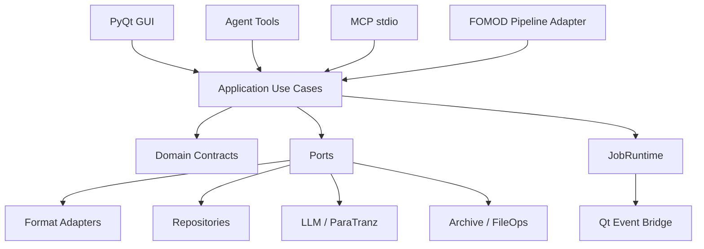
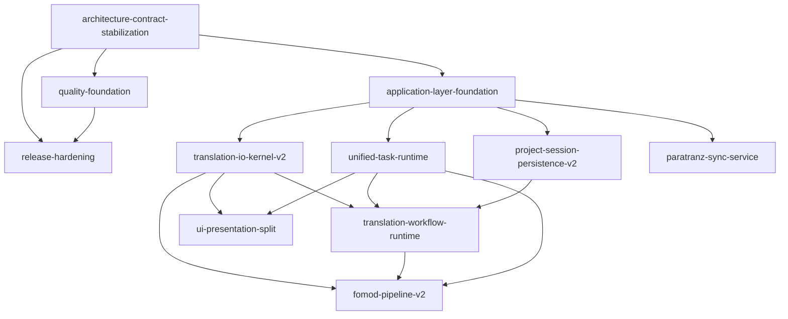

# TransBridge 需求—代码审查综合结论与迭代路线图

- 日期：2026-08-18
- 审查方式：16 个需求纵向 Agent + 3 个独立横向 Agent + 主 Agent 交叉综合
- 范围：`docs/requirements.md`、ADR、Plan、Story、Changelog、`src/`、`tests/`、打包与发布入口
- 本文件性质：审查与决策建议，不表示代码、requirements、ADR 或 Plan 已被修改

## 1. 执行结论

TransBridge 不是“多数需求没有代码”，而是“多数功能组件已经存在，但跨入口合同、状态所有权、任务生命周期和发布验证没有收口”。因此，继续逐个在 GUI、Agent、MCP、FOMOD 中补丁式迭代，短期会增加代码，长期会继续制造相同类型的断裂。

纵向与横向审查在互不读取对方报告的情况下，独立收敛到同一判断：

1. 需要保留当前模块化单体，不需要微服务化，也不适合现在全面事件溯源或插件化。
2. 应新增纯 Python Application Layer、Ports/Adapters 和单一 Composition Root。
3. GUI、Agent、MCP、FOMOD 必须调用同一用例，不能再直接构造 Parser、Writer、Translator、API Client 或 Controller。
4. `TranslationEntry` 的 key/Stage/label/variant/provenance 必须有唯一状态合同和唯一 mutation 入口。
5. 所有长任务应进入统一 JobRuntime；Qt 只做事件桥接和展示。
6. “已实现”必须升级为“成功链合同测试 + Windows/安装/发布 smoke 可重复证明”。

推荐总体路线：**Phase 0 先做最小契约止血，再用绞杀式迁移进入模块化单体 + Application Layer + Ports/Adapters。**

不建议：大规模先移动目录、全面重写、用全局 EventBus 代替明确调用、把 TaskRuntime 绑定 PyQt、立刻引入完整 Actor/Event Sourcing。

### 1.1 用户主场景修订：ParaTranz JSON 双 ID

用户提供的主要兼容样本是 ParaTranz 的 `id/key/original/translation/stage/context` 数组，共 32,372 条、约 12MB。ParaTranz 会生成或重写数值 `id`，用户原始稳定 ID 保存在 `key`。

因此本路线图做以下关键调整：

- `key` 是本地 EntryKey，必须贯穿导出、平台重写、下载、再导入；
- ParaTranz `id` 是外部引用，不是本地主键；
- 原路线中“统一 id/key”改为“内部关联全部使用 key，外部 id namespaced 保存”，不要求文件中的两个字段相等；
- ParaTranz JSON 与 TransBridge 内部 JSON、DSD JSON 使用三个明确 Adapter；
- 离线 ParaTranz JSON 导入/导出从 P1 网络同步阶段前移到 Phase 0；
- 该功能作为验证 EntryKey、FormatAdapter、GUI/Agent/MCP parity 的第一条垂直切片。

完整专项说明见 [ParaTranz JSON 双 ID 兼容性调整](paratranz-json-compatibility-adjustment.md)。

## 2. 审查可信度与独立交叉验证

### 2.1 纵向线

每个 FR 使用独立 Agent，按以下顺序审查：

```text
Requirement
  -> ADR
  -> Plan
  -> Story
  -> Changelog
  -> Real Product Entry
  -> Actual Code Call Chain
  -> Tests and Release Evidence
  -> Better Design / Migration / Acceptance Gates
```

FR1–FR16 的原始报告均独立保存为 `fr-01.md`～`fr-16.md`。

### 2.2 横向线

三名 Agent 未读取任何纵向报告，分别完成：

- 全局架构与依赖边界；
- 真实实现契约与入口调用链；
- 测试、安全、性能、Windows 和发布门禁。

### 2.3 独立重复出现的根因

以下问题同时被多个纵向需求和至少一个横向 Agent 独立发现，可信度最高：

| 根因 | 独立发现来源 | 主要影响 |
|---|---|---|
| 缺 Application Service，入口各自编排 | FR1/3/4/5/6/7/9/15/16 + 三横审 | GUI 可用不等于 Agent/MCP/FOMOD 可用 |
| 内部 key、历史 id、ParaTranz external id、Stage/label/variant 合同分裂 | FR1/2/3/5/6/8/9/15 + 架构/契约横审 | 原始 ID 丢失、丢译文、串版、错误重译、状态跨重启丢失 |
| 任务/会话/线程模型分裂 | FR5/6/7/10/12/13/14/15 + 三横审 | 假暂停、取消后完成、跨会话污染、checkpoint 失效 |
| Parser/Writer 多入口签名漂移 | FR1/4/9/16 + 架构/契约横审 | Agent 成功入口实际不可用 |
| MCP 没有可工作的 Composition Root | FR7/9/10/16 + 架构/契约/质量横审 | enabled 即崩溃或所有调用无 context |
| FOMOD 缺事务步骤与失败终态 | FR4/5/6/15/16 + 三横审 | 吞异常、取消后仍打包、假成功 |
| 测试以 mock/negative path 证明“完成” | 几乎所有 FR + 质量横审 | 单测绿但真实成功链失败 |
| 安装/导入/依赖/版本基线漂移 | FR4/5/7/9/15/16 + 三横审 | clean install、CLI、7z/RAR、打包不可证明 |

这说明问题不是偶发 bug，而是缺少几个跨需求的共享架构合同。

## 3. 各需求的真实状态摘要

以下不是精确百分比，而是下一迭代的风险基线。每项细节以对应 `fr-XX.md` 为准。

### FR1 文件解析

基础 EET/XT/ESP 解析组件存在，但 Agent ESP/EET/XT/SST 分派不可用，DSD 入口调用错误，缺少明确 ParaTranz JSON Adapter，SST GUI 入口丢失，上下文在转换中丢字段，SST 写回未通过 xTranslator 验证。

建议状态：**部分实现 / 存在阻断回归**。

### FR2 条目、Stage 与标签

UI 与数据类存在，但 Variant 是 overlay 非 replace，Stage 不持久化，清空译文会复活，标签有多份状态源，AI/TM/Writer/PostProcessor 对 key/Stage 的解释不同。ParaTranz 的 `id != key` 本身是预期格式；真正缺陷是没有将 remote id 建模为带 scope 的外部引用。

建议状态：**基础 UI 完成，核心状态合同未完成**。

### FR3 ParaTranz

GUI 主链基本可用；Agent API 构造和方法错误；Token 可泄露；上传/下载会把部分失败伪装完成；缺事务合并、取消和原子 Artifact；用户最需要的离线 ParaTranz JSON 双 ID 导入/导出尚未形成明确产品合同。

建议状态：**核心可用 / 同步可靠性未验收**。

### FR4 文件写回

ESP/EET/XT writer 部分存在；EET/XT builder 不存在；缺独立 ParaTranz JSON export target；本地化 Strings 可能丢未翻译 string_id；全版本异步写回可能串版；Agent writer 成功链错配；非原子、无统一备份。

建议状态：**部分实现 / 有数据完整性风险**。

### FR5 AI 翻译

普通翻译主链存在；MixedWorker 实际不可执行；Agent mixed/polish mode 被忽略；Prompt target/profile 未贯通；checkpoint 非原子；BM25 依赖缺失且重启语义错误。

建议状态：**普通主链部分可用；FR5.11/5.12 部分实现**。

### FR6 AI 后处理与报告

阶段骨架存在，但润色未消费修复结果；Stage 写错；会扩大到已审核/锁定/隐藏条目；checkpoint 恢复仍重复 LLM 调用；批次失败可被标 completed；UI/Excel 报告快照不同源。

建议状态：**功能骨架约完成，生产语义未闭环**。

### FR7 工作台与智能助手

组件丰富，但多 Agent 关键文件/入口与文档不符；Agent 注册顺序使 namespace 工具为空；Step2/AppContext 双状态；上传文档没有真正知识注入；MCP 与长任务状态机断裂。

建议状态：**Workbench 基本可用；FR7.13 产品闭环未完成**。

### FR8 持久化与版本

入口约完成 65%，可靠验收约 35–40%。存在版本串写、关闭/切项目/导出前未统一 collect、加载快照后可能覆盖快照、标签三状态源、多源无 source_id 命名空间、Agent 接口失效。

建议状态：**部分实现 / 数据生命周期需要 V2**。

### FR9 Agent 工具扩展

工具注册数量和文件很多，但端到端约 45%。Parser/Writer、ParaTranz、MCP、AppContext/Step2、初始化顺序和路径策略使多项成功链不可用。Mock 测试掩盖真实签名漂移。

建议状态：**工具目录已建立，真实业务可用性未验收**。

### FR10 Smart Assistant 重构

文件拆分约 80%，职责边界约 50%，DI/全局状态治理约 25%。Graph pause/checkpoint/条件分支有 P0；Controller 仍有模块级单例和后端→UI 反向依赖。

建议状态：**结构阶段完成，架构治理待 V2**。

### FR11 工具提示词分层

构建函数和单测存在，但完整帮助在真实 Observation 链中从 4180 字符被截到 150；Agent 注册顺序导致 namespace 为空；历史 LLM 回归正确率约 13% 却被错误判为通过。

建议状态：**静态构建完成，运行态目标未实现**。

### FR12 SessionController

AWAITING_TASK 在生产路径不可达；TaskManager 监听无法移除且跨会话广播；LLM 错误后卡 THINKING；Plan cancel 后卡 AWAITING_CONFIRM；assert 被 `python -O` 移除。

建议状态：**部分实现 / 异步状态机未接通**。

### FR13 SessionManager

恢复只渲染 UI、未恢复 LLM conversation；任务和计划无会话 owner；失败切换可错写；路径、损坏 JSON、保存提示和监听清理存在问题。

建议状态：**UI 会话管理存在，运行态隔离与恢复未完成**。

### FR14 Task Monitor

UI 外壳存在，约 45%。Translation/Polish 假暂停；cancel 可被 completed 覆盖并误删 checkpoint；任务无 session owner；关闭/清理可能冻结 UI 或泄漏线程。

建议状态：**展示基本实现，任务控制合同未完成**。

### FR15 FOMOD 与 TM

TM 基础可用，FOMOD 更接近原型。写回失败可被吞并继续打包；取消后仍发布；target language 不一致；TM Stage/STALE 不正确；默认过滤可能删除 FOMOD 图片；7z/RAR 发行依赖缺失。

建议状态：**TM 基础可用 + FOMOD 原型，不宜生产验收**。

### FR16 通用文件与词条 Agent 工具

后端函数部分可用，但 `migrate_entries` 固定 NOT_AVAILABLE；绝对路径被自身安全层拒绝；MCP 四类阻断；Archive 缺资源限额/事务/取消；依赖和 root normalization 不完整。

建议状态：**约 45%，Agent/MCP/桌面成功链未闭合**。

## 4. 目标架构决策

### 4.1 推荐：模块化单体 + Application Layer + Ports/Adapters



核心依赖规则：

1. Domain 不依赖 parser、writer、ui、PyQt、requests 或文件配置。
2. Application 只依赖 Domain 与 Ports，不依赖具体 Adapter。
3. GUI、Agent、MCP、FOMOD 只调用 Application command/use case。
4. 具体 Adapter 只在 Composition Root 中实例化。
5. AppContext 退化为 Qt presentation state，不再承载业务真相。
6. ToolSpec execute 绑定 Application command，不绑定 UI Controller 或具体 Parser/Writer。
7. 所有长任务由 JobRuntime 创建，TaskMonitor 仅投影 JobSnapshot。

### 4.2 七个必须收口的共享合同

1. `SourceDocumentService`
   - ParseRequest/ParseOutcome、WriteRequest/WriteResult、FormatAdapterRegistry。
   - 保存 SourceDescriptor、格式、模板、原始路径、fingerprint 和可写能力。

2. `EntryMutationService`
   - 唯一 translation/stage/label/provenance 修改入口。
   - 使用 stable EntryKey、revision、StageTransitionPolicy、ExportPolicy。
   - ParaTranz 数值 id 等外部身份进入 `ExternalEntryRef(system, scope, value)`，不参与本地唯一性。

3. `ProjectSession` / `ProjectStateRepository`
   - project/variant/source/session 生命周期、schema migration、replace materialization、snapshot 与 dirty revision。

4. `JobRuntime`
   - JobSpec/JobHandle/JobSnapshot、owner、资源 lease、pause/cancel/shutdown、typed events。

5. `ToolExecutionService`
   - GUI/Graph/MCP 共用 schema、validation、path authorization、HITL、execute 和 ToolResult normalize。

6. `RunStore`
   - AI/PostProcess/Graph checkpoint 的稳定 run identity、input/config/version hash、原子和幂等恢复。

7. `ArchiveService`
   - ArchivePolicy、manifest、canonical path、文件/字节/压缩比预算、临时工作区、事务式产物。

### 4.3 领域状态模型

建议渐进演进为：

```text
EntryDefinition (immutable source)
  + VariantEntryState[key]
      translation
      stage
      labels
      provenance
      revision
  -> EntryView / compatibility TranslationEntry facade
```

当前不必一次把全部 Entry 改成不可变对象；可先引入 `VariantStateV2 + EntryMutationService`，禁止新增直接字段写入。

## 5. 必须先做的 P0 止血

这些工作应在继续新增大功能前完成。

### 5.1 发布与 Composition Root

- 修正 console entry、统一 `transbridge` import、版本单一来源。
- 将 py7zr/rarfile/BM25 等真实运行依赖纳入声明和锁文件。
- clean wheel build/install/import/CLI smoke。
- MCP enabled 在 runtime 未完整时必须安全拒绝，不能让 GUI 崩溃。

### 5.2 Parser/Writer 成功链

- 修 Agent parser/writer 的真实构造和方法签名。
- 修 DSD loader、SST 当前入口状态、EET/XT source template 与 output path。
- Localized writer 保留全部 string_id。
- 导出统一 Stage policy、备份、staging、校验和原子发布。
- 增加显式 ParaTranz JSON import/export：key 保留用户 ID，remote id 仅保存为 scoped external ref。
- ParaTranz/内部/DSD JSON 不再共用含糊的单一 loader。

### 5.3 Entry/Variant 数据完整性

- TransBridge 旧内部 JSON 缺 key 时可按迁移规则回填历史本地 id；ParaTranz JSON 缺 key 必须报错，不能用 remote id 兜底。
- Variant 切换使用 replace/materialize，不得 overlay 泄漏。
- translation 清空、Stage、labels 持久化。
- AI/TM/PostProcess/Writer/Agent 统一 key 与 Stage。

### 5.4 Security

- 删除 ParaTranz 完整 Token 输出。
- 凭据迁移到 SecretStore，所有日志/ToolResult/report 做脱敏。
- 路径策略改为用户授权根内的 canonical absolute path，而非拒绝全部绝对路径。
- ArchivePolicy 加成员路径和资源预算；缺依赖时显式 capability degradation。

### 5.5 假成功与任务终态

- 上传/下载/FOMOD/PostProcess 不得吞异常后 completed。
- cancel 后不能被 completed 覆盖；stop 保留可恢复 checkpoint。
- 长任务必须绑定 session/project/variant/slot owner。
- 任务失败、partial、cancelled、completed 必须结构化且互斥。

## 6. ADR 调整建议

### 新增 ADR-016：模块化单体应用层与组合根

冻结：

- domain/application/ports/adapters/delivery 依赖方向；
- GUI/MCP/CLI composition root；
- RuntimeContext/ProjectSession/Job scope；
- typed Command/Result/Error；
- 兼容 facade 与删除门禁。

### 更新现有 ADR

- ADR-001：EntryKey/Stage/provenance/context detail；领域模型不依赖 parser 类型。
- ADR-002：Collection 只维护集合不变量；parse/import/migrate/serialize 移到 adapter/use case；内部关联统一 EntryKey；外部 ID 使用 namespaced reference。
- ADR-003：TranslationJobSpec/Result、Round barrier、quest lane、unknown context、checkpoint/partial/cancel。
- ADR-004：纯 Python JobRuntime 与 Qt bridge；pause/stop/shutdown、资源预算、owner。
- ADR-005：PromptSpec、profile/lang/version/hash、结构化输出、LLM request metadata。
- ADR-006：ProjectSession、Variant schema v2、replace materialization、repository transaction。
- ADR-007：废止专用 MixedWorker，改为 ActionPlan。
- ADR-008：后端禁止 import UI；SessionRuntime、ToolCatalog、全局 Controller 退役。
- ADR-010：Client Factory、typed config、SecretStore；移除明文 secret 所有权。
- ADR-011：Graph frontier/checkpoint/idempotency 与 Session/Task 边界。
- ADR-012：确定 MCP 主拓扑、auth/capability/context、Windows stdio、无 UI HITL 语义。
- ADR-013：Index manifest、inactive row、shared resource scope、RRF/BM25 benchmark、资源预算。
- ADR-014：FOMOD typed stages、staging/commit、failure policy、TM arbitration。
- ADR-015：ArchivePolicy、授权路径、Agent 工具只作为薄 adapter。

## 7. Plan 组合与依赖图

不建议把所有发现分别追加回 20 多个历史 Epic。旧 Plan 保留历史，在状态处标记 `partially-verified`、`superseded_by` 或 `blocked_by`；新增少量跨 Epic V2 Plan。



### 7.1 `architecture-contract-stabilization`（P0）

建议 Stories：

1. Package/import/version/dependency smoke。
2. FormatAdapter request/result contract 与 registry，先包旧 parser/writer。
3. Agent parser/writer 迁移到统一 IO use case。
4. LLM/Embedding typed factory contract。
5. MCP composition root + RuntimeContext + auth/permission。
6. 架构/import/adapter contract gates。
7. ParaTranz JSON Identity Adapter：双 ID 映射、显式 GUI 导入/导出、用户样本结构 round-trip。

### 7.2 `quality-foundation`（P0）

1. 可复现 QA 证据：commit、环境、lock hash、命令、JUnit、coverage、artifact hash。
2. Golden corpus 与 parse/write/reparse contract。
3. 性能/资源 benchmark harness 与 Windows 基准 VM。
4. Fake HTTP、磁盘错误、kill/restart、慢流、并发故障注入。

### 7.3 `release-hardening`（P0）

1. Wheel/CLI/import 契约。
2. 7z/RAR/unrar/BM25 依赖、资源与许可证。
3. onedir vs onefile ADR、版本单一来源与产物矩阵。
4. Windows 安装/升级/卸载/签名 smoke。

### 7.4 `application-layer-foundation`（P1）

1. AppServices 与 Composition Root。
2. ProjectScope/ProjectSession。
3. Command/Result/Error 基线。
4. EventSink 与 Qt bridge。
5. 依赖架构测试。
6. 兼容 facade 删除策略。

### 7.5 `translation-io-kernel-v2`（P1）

承接 FR1/2/4/9/16：

- Entry State Contract v2。
- Parse/Write Adapter Registry。
- SourceDescriptor/ParsedDocument。
- ExportPolicy/OutputTransaction。
- DSD/Strings/SST/EET/XT/ESP fixtures。
- ParaTranz JSON fixture、EntryKey/ExternalEntryRef 与 platform-id rewrite round-trip。
- GUI/Agent/MCP/FOMOD 等价合同。

### 7.6 `project-session-persistence-v2`（P1）

- JSON schema v2 与 v1 migration。
- stable project_id/variant_id/source_id/session_id。
- Variant replace/materialization、Stage/label/provenance/revision。
- snapshot/backup/recovery/portable archive。
- SessionRuntime restore 与 task owner。

### 7.7 `unified-task-runtime`（P1）

承接 FR5/6/12/13/14/15：

- Job domain/state machine、owner、resource lease。
- TaskManager 兼容 facade。
- pause/cancel/stop/shutdown。
- Qt Presenter/TaskMonitor 投影。
- Session 完成事件路由。
- RunStore/checkpoint identity 与幂等恢复。

### 7.8 `translation-workflow-runtime`（P1）

- JobSpec/ScopeSpec/ActionPlan。
- RoundPlanner/quest lanes。
- 候选状态后处理流水线。
- LLM usage/cost/retry/cancel。
- checkpoint/report canonical snapshot。
- GUI/Agent/MCP/FOMOD 入口迁移。

向量检索作为独立 `term-retrieval-v2`：manifest、共享模型/索引、BM25/tokenizer、RRF benchmark、增量/删除/重启。

### 7.9 `paratranz-sync-service`（P1）

- Transport/Gateway/typed response。
- PlanUpload/ExecuteUpload、PlanDownload/ExecuteDownload。
- transaction merge、Stage policy、partial error。
- artifact `.part` + validate + atomic publish。
- term sync freshness/provenance。
- GUI/Agent/MCP 共用 use case。

其身份映射不得在本 Plan 重做；必须复用 Phase 0 的 `ParaTranzJsonAdapter`/EntryKey contract。

### 7.10 `fomod-pipeline-v2`（P1）

- Extract/Normalize/Diff/Migrate/TM/AI/Write/XML/Assemble/Package typed stage。
- StageOutcome/manifest/failure policy/cancel。
- TemporaryDirectory RAII、ArchivePolicy、事务式最终发布。
- TM V2、当前 mod QueryContext、conflict/needs_review。
- Dry-run/preview 和 E2E fixtures。

### 7.11 `ui-presentation-split`（P2）

只在 Application/Job/IO 契约稳定后拆 MainWindow、AITranslatorWindow、ChatWidget、Step2 和 Cards。验收应基于“UI 不构造具体业务对象”，不是文件行数。

## 8. 分阶段实施路线

### Phase 0：可信基线与 P0 止血（约 1–2 周）

目标：系统能在干净环境安装、启动、调用；关键成功链不再假成功。

工作：

- 建立会失败的真实 contract tests。
- 修 package/import/version/dependency。
- 修 Agent parser/writer、DSD、MCP 安全启动。
- 实现 ParaTranz JSON 显式导入/导出和双 ID round-trip。
- 修 Token 泄露、路径授权最小策略。
- 修 Variant 串版/Stage/清空译文最小问题。
- FOMOD/上传/下载/后处理出现关键失败时禁止 overall success。

退出门禁：

- clean wheel 安装后 import/CLI smoke 通过。
- 每个支持格式有真实最小 parse/write/reparse。
- ParaTranz JSON 经模拟平台重写全部 id 后，重新导入的 key/translation/stage digest 不变。
- MCP `tools/list` + 一条只读 tool call 使用真实 context 成功。
- Variant A/B 隔离、清空译文、Stage 重启测试通过。
- 关键 partial/failure 不显示 completed。

### Phase 1：应用层和状态合同（约 2–3 周）

目标：GUI、Agent、MCP 不再直接依赖具体业务实现。

工作：

- ADR-016、Composition Root、AppServices。
- EntryMutationService、VariantStateV2、LabelStore。
- SourceDocumentService、Import/Export use cases。
- ProjectSession/Repository。

退出门禁：

- domain/application 不 import PyQt/requests/concrete parser/writer。
- MainWindow 与 Agent tools 不直接 new parser/writer/repository。
- `id != key`、七级 Stage、labels、variants 全链一致。
- GUI/Agent 对同一 IO fixture 结果相同。

### Phase 2：Job/Session/AI 运行时（约 2–3 周）

目标：暂停、取消、checkpoint、会话与报告有统一语义。

工作：

- JobRuntime + TaskOwner + ResourceLease + Qt Bridge。
- AgentSessionRuntime 接通 AWAITING_TASK。
- Session 完整恢复和跨会话隔离。
- Translation Job/ActionPlan、PostProcess candidate pipeline、RunStore。
- TaskMonitor 改为 JobSnapshot presenter。

退出门禁：

- 所有长任务 pause/cancel/shutdown 可证明。
- cancel 后无晚到 mutation；stop 保留 checkpoint。
- 切会话不串 observation/task result。
- 重启后 LLM conversation 和 Job checkpoint 均真实恢复。
- UI/Excel 报告同一 snapshot。

### Phase 3：ParaTranz、FOMOD 与 Archive（约 2–3 周）

目标：外部同步和包流水线事务化。

工作：

- ParaTranz Transport/Gateway/Use Cases。
- FOMOD typed stage runner 与 TM V2。
- ArchivePolicy、资源预算、staging/atomic publish。
- SecretStore 与全通道脱敏。

退出门禁：

- UI/Agent 不直接构造 ParaTranz API。
- FOMOD 任一必要阶段失败不发布最终包。
- ZIP/7z/RAR 恶意与资源耗尽 corpus 通过。
- target_lang 在 AI/XML/Strings 一致。
- 临时目录在成功/失败/取消后均清理。

### Phase 4：发布、性能、UI 清理（约 1–2 周）

- 删除兼容全局 Controller、`src.transbridge` 和重复入口。
- UI presentation split。
- index 生命周期/性能资源预算。
- Windows nightly、PyInstaller/Inno、升级/卸载、SBOM/许可证/签名。
- 回写 requirements/ADR/Plan/Story 状态与追溯矩阵。

总体静态估算：单人约 30–45 人日；2 人在边界清晰的前提下约 4–6 周。大型真实格式 fixture、Windows VM、xTranslator/SST 兼容认证和外部服务验证可能增加日历时间。

## 9. 测试与发布门禁

### PR 门禁

- 静态/secret/依赖/许可证/import contract。
- 纯单元与属性测试。
- Parser/Writer/LLM/ParaTranz/Tool registry 组件合同。
- changed-lines coverage ≥90%；核心合同分支覆盖 ≥85%。
- Wheel 构建、隔离安装、import/CLI smoke。
- 每个 Story 至少一个用户成功链和一个失败/边界测试。

### Windows Nightly

- Windows 10/11、Python 3.12 矩阵。
- 全量 pytest + JUnit + coverage + 有期限 quarantine。
- 真实格式 roundtrip corpus。
- FOMOD ZIP/7z/RAR E2E、MCP stdio、GUI heartbeat、checkpoint kill/restart。
- P95 性能回退 >10% 或内存回退 >15% 阻断。

### Release Candidate

- Wheel + PyInstaller/Inno 在干净 VM 安装。
- 非 ASCII 用户名/路径、长路径、无网络、无 API key、旧配置升级。
- 安装/升级不覆盖项目与词典；卸载数据策略明确。
- SBOM、NOTICE、unrar 许可、签名、杀毒 smoke。
- 所有 P0/P1 关闭，或有明确 owner/到期/回滚的风险接受。

### 初始性能预算

- 中型 ESP：P95 ≤30s，RSS ≤1GB，UI heartbeat ≤200ms。
- 小型 ESP：P95 ≤3s，首个进度 ≤500ms。
- AI fake server 100 条、并发 3：活跃请求 ≤3，取消 P95 ≤1s，无重复写回。
- Checkpoint 10 万条、连续 100 次：P95 ≤100ms，崩溃恢复 100%，无半 JSON。
- FOMOD 选择提取：只展开必需资源，任务后 temp=0。
- 500 轮会话/100 工具：RSS 稳态增长 ≤15%，关闭后线程/对象可回收。

## 10. 需要用户先确认的架构决策

在正式修订 ADR/Plan 之前，建议先确认：

1. 接受“模块化单体 + Application Layer + Ports/Adapters”作为长期目标。
2. MCP 采用哪种唯一主拓扑：
   - 推荐：独立子进程 stdio，通过受控 RuntimeContext/IPC 访问桌面能力；
   - 备选：GUI 内后台线程，但需解决 Windows stdin、生命周期和 context。
3. Windows 正式分发口径：
   - 推荐：签名安装器 + onedir payload，另提供便携包；
   - 不建议为满足旧 NFR 文本强制 onefile。
4. SST Writer 在 xTranslator 认证前保持 experimental/feature flag 关闭。
5. Stage 输出策略和 locked 空译文行为作为 ADR-001 的明确业务决定。
6. Phase 0 是否合并为一个跨 Epic `architecture-contract-stabilization` Plan。

## 11. 建议下一步

当前不要直接开始全量编码，也不要立即改完所有 ADR。建议下一步只做：

1. 用户确认第 10 节六项决策。
2. 修订/新增 ADR-016，并同步最少量 ADR-001/002/004/006/008/012/014/015，明确 EntryKey 与 ExternalEntryRef。
3. 编写 `architecture-contract-stabilization` Plan，把 ParaTranz JSON Identity Adapter 作为首个用户垂直切片。
4. 先让真实 contract/release tests 失败，再实施 Phase 0。
5. Phase 0 通过后，再逐一展开 P1 Plans。

这样能保留当前 parser、writer、AI、TM、UI 的大部分实现价值，同时停止在四套入口上重复修补同一种问题。

## 12. 完成定义

这次审查本身的完成定义已经满足：

- FR1–FR16 各有独立纵向报告；
- 架构/实现契约/质量各有独立横向报告；
- 两条线在综合前相互隔离；
- 原始中间报告均已本地保存；
- 综合路线图已归并重复根因、目标架构、ADR/Plan 变更、迁移阶段和验收门禁；
- 未修改业务代码、requirements、ADR 或现有 Plan。

---

## 整改回填（2026-08-18，Phase 6）

本报告为综合整改正式输入审查结论，保留历史判定与证据不改写。Phase 0～7 已完成，对应根因（R-xxx）由各 V2 Plan/Story 承接并通过 EvidenceManifest 与综合 QA；完整根因→Story→evidence 追踪见 [remediation-ledger](./remediation-ledger.md)，最终汇总见 [final-release-qa-2026-08-18](./final-release-qa-2026-08-18.md)。综合整改 V2 共 37/37 Story 实现完成并通过综合 QA；最终锁定 uv 门禁合计 1374 passed、5 skipped、0 failed。
