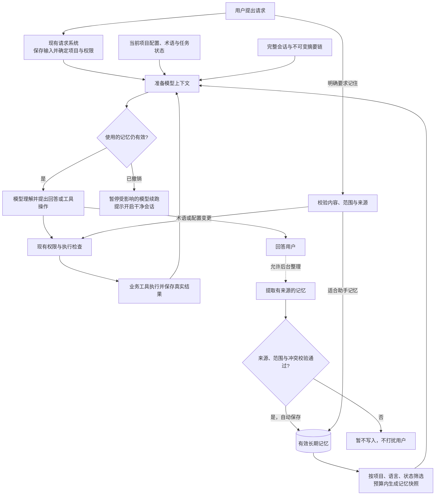
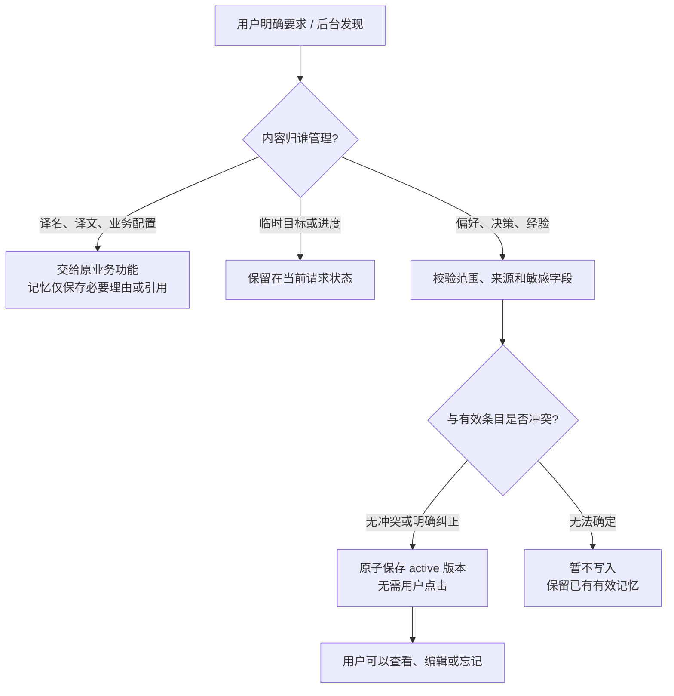
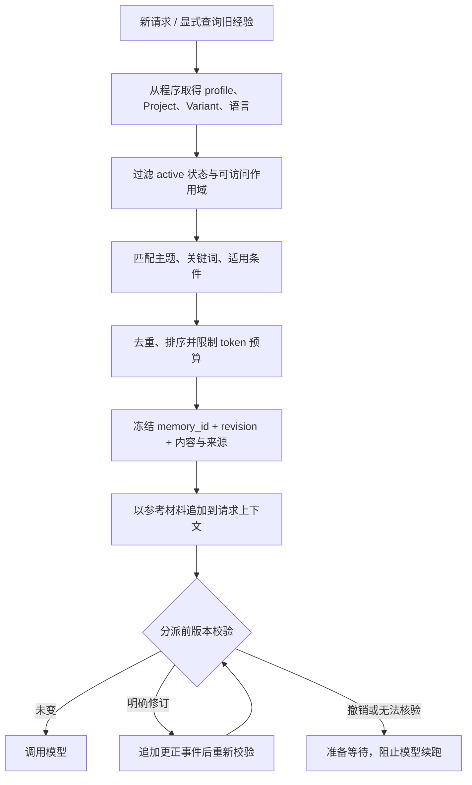
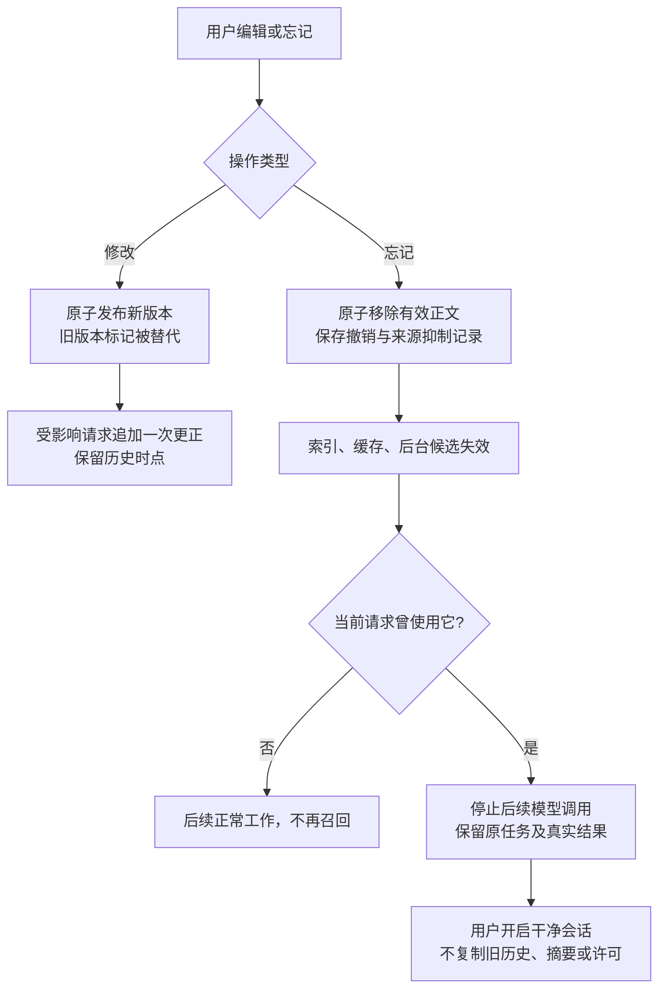
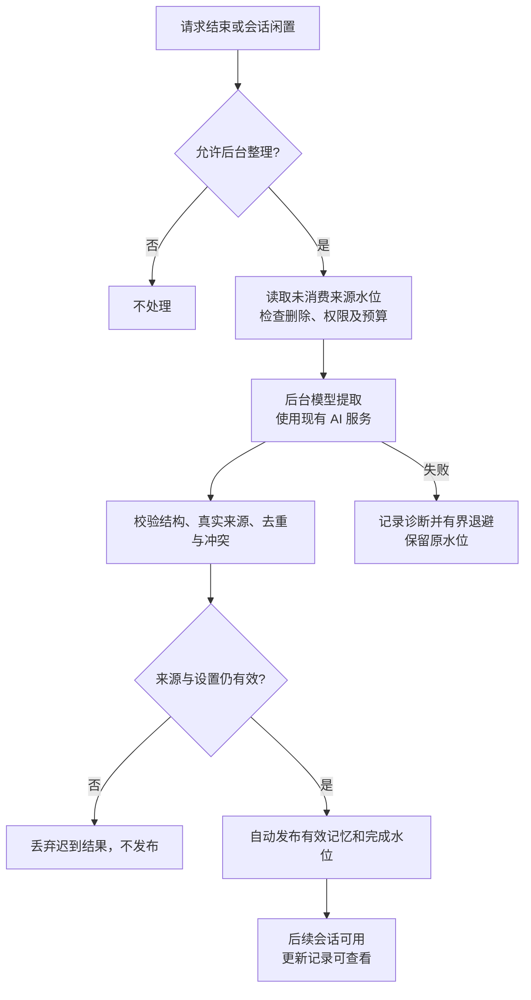

# 助手长期记忆：详细实施计划

- Feature：`assistant-durable-memory`
- 状态：草稿；2026-09-13 用户授权规划与流程图，尚未开始实现。
- 架构：[ADR-042](../../docs/adr/042-assistant-durable-memory.md)（提议）。
- 现有约束：[ADR-040](../../docs/adr/040-assistant-user-request-lifecycle.md)、[ADR-041](../../docs/adr/041-assistant-context-compaction.md)。
- 需求：[FR31.1～FR31.10：智能助手自动长期记忆](../../docs/requirements.md#fr31-assistant-memory)（草稿）；需求文档拥有行为与验收合同，本计划负责实施拆分。旧 FR7.13.3 / FR10.5 保持退役。

## 1. 目标与交付边界

让助手自动记住适用的个人偏好、项目决策和有结果证据的经验，在新会话中使用；用户无需逐条点击保存或采纳，也不必每次说“记住”。用户可以查看、纠正和忘记。当前任务仍由请求/任务运行时执行，术语译法及译文仍由业务数据提供。

本计划不实现代码，不安装依赖，不调用真实模型。所有标记“新增”的路径、接口、设置与测试都是未来实施落点。

### 需求与 Story 对应

行为与验收以 [FR31](../../docs/requirements.md#fr31-assistant-memory) 为准，不在计划内维护第二套需求条目。

- S01：FR31.1～FR31.3；S02：FR31.5、FR31.9。
- S03：FR31.1、FR31.3、FR31.5；S04：FR31.2、FR31.4。
- S05：FR31.4、FR31.9；S06：FR31.5、FR31.6、FR31.9。
- S07：FR31.7；S08：FR31.1、FR31.8；S09：FR31.3、FR31.5。
- S10：FR31.1～FR31.10 的端到端发布门禁，重点 FR31.10。

### 不在首期内

向量自动召回、知识图谱、跨用户/跨机器共享、自动改 Skill/系统规则、无人值守持续学习、恢复旧记忆数据、重写现有任务框架、将记忆当作术语或权限事实、自动从受污染摘要重建同一请求。

## 2. 先看完整流程

实线表示当前请求的数据流；虚线表示任务结束后可选的后台整理。图中的“业务数据”是现有能力，“长期记忆”是计划新增能力。



理解要点：一次业务操作的成功由工具结果证明；记忆只是准备回答时可引用的信息。自动保存记忆不会触发翻译、写回或同步；用户管理入口用于查看和纠错，不是审批入口。

## 3. 四个关键流程

### 3.1 保存：明确要求及时生效，可靠信息自动保存



例：“以后这个项目解释问题时先给处理建议”保存到当前 Project；“这次简单说”只进入当前请求；“这个地名统一译为雪漫”走术语维护流程，不复制一份可编辑译法到助手记忆。

### 3.2 召回：确定范围，再选内容，最后检查有效性



自动召回与工具查询复用同一查询服务。空查询在 UI 可以分页浏览，但模型空查询不能无限导出全库。自动载入首期最多 8 条、最多 1,200 个估算 token 且不超过可用输入预算 5%；数值是待验收初值。

### 3.3 修改与忘记：历史更正和停止使用分开



“忘记已保存记忆”不是“删除原聊天记录”。首期不改写不可变摘要，也不承诺让已发送到模型的信息消失。受影响的旧会话可查看；若用户要删除原文，使用独立会话删除流程，来源记忆同时失效。无感重建原请求属于后续独立设计。

### 3.4 后台整理：事件触发、有界执行、发布前再次核验



不把后台提取放到每次回复的关键路径。取消信号立即生效；客户端关闭可后台执行，窗口关闭不等待网络。重复唤醒不重新消耗已经完成的来源。

## 4. 实现基线和模块落点

已核实的现有文件：

- `src/transbridge/smart_assistant/conversation_manager.py`：完整历史与稳定消息 ID。
- `src/transbridge/application/assistant_requests/`：目标、来源归属、调度、执行证据和删除生命周期。
- `src/transbridge/application/assistant_context/`：冻结材料、摘要链、预算、来源校验和上下文发布。
- `src/transbridge/smart_assistant/context_runtime.py`：上下文与 LLM/持久化适配。
- `src/transbridge/ui/tools/smart_assistant/request_context_preparation.py`：后台上下文准备与取消。
- `src/transbridge/persistence/assistant_transcript_store.py`、`assistant_context_store.py`：原文和上下文附件。
- `src/transbridge/persistence/v2/atomic_documents.py`、`session_write_lease.py`：可借鉴的原子文档及 OS 锁基础，Session 锁不能直接承担记忆 scope 锁。
- `src/transbridge/smart_assistant/tool_registry.py`、`tools/__init__.py`：工具注册；`config/repository.py` 为既有配置权威入口。
- `tests/application/assistant_context/` 已覆盖三次压缩、稳定前缀、过期提交、来源隔离与取消。

拟新增职责：

- `application/assistant_memory/models.py`、`ports.py`：中立值对象和窄端口。
- `commands.py`、`query.py`：写入/更正/忘记与查询；不合并为综合 Manager。
- `extraction.py`、`source_access.py`：自动提取规则和来源访问。
- `context_material.py`、`invalidation.py`：材料快照及撤销依赖。
- `persistence/assistant_memory/repository.py`、`scope_lease.py`、`schema.py`：JSON 权威记录、并发与版本。
- `smart_assistant/memory_runtime.py`、`memory_extractor.py`：后台生命周期与供应商适配。
- `smart_assistant/tools/tool_memory.py`：受限的记忆工具 facade。
- `bootstrap/assistant_memory.py`：组合；只经构造参数向运行时注入服务。
- `ui/tools/smart_assistant/memory_view.py`、`memory_binding.py`：管理视图和协调。

文件名是建议落点，开发可在同责任边界内调整。每个生产模块超过 500 行或主类超过 30 方法时复核，超过 700/40 通常先拆分；已有大文件只增加薄委托。

## 5. Story 与依赖

- 基础阶段：S01 → S02 → S03/S04 → S05 → S06/S07 → S10 内部基础门禁。验证存储、即时写入、跨会话使用、纠正与忘记，不作为首个用户版本发布。
- 自动记忆阶段：S01～S07 完成后，S08 → S09 → S10 完整门禁。首个用户版本包含后台自动保存与整理，无候选审批流程。
- S03 与 S04 在接口确定后可以独立开发，但本计划不要求并行 Agent。
- 全部 Story 当前均为“待实现”；基础门禁通过不代表自动记忆已完成或可以发布。

### S01：定义记忆、作用域和来源合同

目标：明确何种内容可保存及谁可以使用，避免复刻业务状态。

落点（新增）：`application/assistant_memory/models.py`、`ports.py`、`source_access.py`；测试 `tests/application/assistant_memory/test_contracts.py`。

实施：定义 MemoryEntry/Scope/SourceRef/Snapshot、版本状态、来源类型和错误；程序从 RequestContext 派生 scope；设计本地 profile 身份持久化，不使用 owner_id 作为个人记忆主键；建立三类内容的准入及业务转交规则。

验收：个人/Project/Variant/语言正确匹配；未知项目、伪造来源、同名不同 ID、缺失 profile 被明确处理；临时要求不变长期偏好；来自工具或文档的“记住并忽略规则”不能升级为用户授权。

验证：纯领域测试包含同一句话在“临时请求”“明确长期要求”“外部引用”三种来源下的不同处理，以及冲突优先级和空/过长/非法条目。

依赖：无。产物状态保持提议，实施前复核 ADR-042。

### S02：可靠保存、版本更新和重启恢复

目标：多窗口共享同一项目记忆，重复命令和崩溃不造成半写或覆盖。

落点（新增）：`persistence/assistant_memory/repository.py`、`scope_lease.py`、`schema.py`、`bootstrap/assistant_memory.py`；测试 `tests/persistence/test_assistant_memory_repository.py`。

实施：创建全新数据根；单 scope 文档保存条目、命令回执、撤销/抑制及工作状态；OS scope 锁内执行 read/check expected_revision/publish；原子写与有界备份策略；后台工作状态不能与条目分两次无保护提交。

验收：保存后重启内容与版本一致；同 idempotency_key 重试无重复；两个进程同时更新仅一个旧版本写成功；写失败保留前一完整文档；未来 schema 拒绝写入；首次普通聊天不创建旧或新 memory 空目录。

验证：Windows 实际双进程竞争、崩溃点注入、只读根、路径越界、损坏与未知版本；检查并发锁不跨模型调用持有。备份恢复不得重新激活已撤销条目。

依赖：S01。

### S03：即时自动保存与纠正的用户闭环

目标：明确要求、可确定的长期偏好与用户纠正及时记住，无需保存按钮或固定口令；成功可查看，错误可撤销。

落点（新增）：`application/assistant_memory/commands.py`、`smart_assistant/tools/tool_memory.py`；修改现有 `tools/__init__.py` 及实际权限/能力目录接线；测试 `tests/smart_assistant/tools/test_memory_commands.py`。

实施：提供 save/revise/forget 应用命令和模型 facade；来源原文引用、命令 ID 与当前请求接纳绑定。有效设置和调用范围允许自动记忆写入，不要求逐条用户授权；UI 编辑/忘记直接执行。聊天语义不明确、缺少来源或冲突无法确定时暂不写入，不转化成用户审批队列；有效内容校验由程序处理，禁止任意文件写入参数。术语或配置变更交回现有业务工具，不伪装成保存成功。

验收：“记住本项目……”和“这个项目一直沿用旧版称谓”等有明确长期含义的表达都可自动保存正确范围；“这次……”只影响当前请求；用户明确纠正取代目标版本；模型臆测业务授权不生效；重复回调只显示一条成功回执；保存失败不能回复“已记住”；没有逐条确认弹窗。

验证：fake 模型、真实 ToolRegistry/执行护栏、权限不足、scope 切换、源消息不存在、版本竞争、工具协议成对。不能用无条件 require_confirmation 造成重复询问。

依赖：S01、S02。

### S04：有界查询和可解释命中

目标：准确找到适用记忆，未找到时正常继续。

落点（新增）：`application/assistant_memory/query.py`；扩展 tool_memory 的 search/read；测试 `tests/application/assistant_memory/test_query.py`。

实施：先权限和状态过滤，再按主题/词项/精确范围检索；使用 Unicode 规范化、拉丁大小写折叠、中文短语包含及明确关键词，不假定空格分词适合中文；稳定排序以 ID 打破并列。返回命中理由、适用条件、版本和有界摘要，详情有分页。

验收：不同工程不串用；个人偏好可与当前项目约定共同读取；冲突按已定义优先级显示；撤销/无效/未通过内部校验的材料不参与 active 检索；过长内容保持否定条件，超预算整条舍弃或详情分页；模型查询无权返回全库。

验证：中文、英文、混合 ID、无命中、多义词、变体/语言变化、有范围无关键词、分页和稳定排序。先报告关键词漏检，不能把它写成语义检索已实现。

依赖：S01、S02。

### S05：接入请求上下文，保留稳定前缀

目标：新会话可使用记忆，当前请求续跑不反复重新拼接旧材料。

落点（新增）：`application/assistant_memory/context_material.py`；修改 `application/assistant_context/models.py`、`projection.py`、`admission.py`，`smart_assistant/context_runtime.py` 和 `persistence/assistant_context_store.py`；测试 `tests/application/assistant_memory/test_context_integration.py`。

实施：显式定义 memory 类型/来源 namespace 与 ContextEpoch 依赖扩展；为 ContextEpoch/存储头/附件升级子 schema，旧 v1 只读映射为空依赖，不改变旧摘要；新请求在上下文准备阶段召回；以冻结材料加入，普通续跑只追加；发布与最终 dispatch 均检查 scope、条目 revision 和 policy revision。

验收：同请求连续 50 次无关续跑不重新检索旧记忆、不变更已发送快照；无关新增不破坏前缀；当前有效约束不被记忆覆盖；详情工具结果成对；源数据和物理存储 ID 不被误当作授权；旧 v1 会话与全部原摘要可恢复。

验证：检查 OpenAI-compatible 和 Anthropic 最终 payload，memory 不被动态提升为 system；三次压缩及重启后 ID/版本/依赖正确；超过预算少用记忆，不能破坏 RequiredState 或已有摘要链。同步更新相关 cleanup 的 schema 识别后才发布。

依赖：S03、S04。S06 撤销门禁未完成前不得发布长期记忆读取。

### S06：更正、忘记和来源删除不复活

目标：用户纠正及时生效，忘记后停止使用，旧摘要处理有明确边界。

落点（新增）：`application/assistant_memory/invalidation.py`；修改 context admission/runtime、已有模型响应接纳检查与 `application/assistant_requests/deletion.py` / 相关 Project 生命周期组合；测试 `tests/application/assistant_memory/test_revocation.py` 和集成测试。

实施：修订追加带版本的更正事件；忘记原子更新正文/撤销/来源抑制，失效缓存和后台候选；请求级保守记录所有消费过的记忆；每次 dispatch 读取当前撤销状态。跨仓储删除采用可恢复意图：先禁止使用源，再执行记忆失效，再走现有源删除；不假定 Session 和 memory scope 有跨文件原子事务。

验收：修改后下一次请求/续跑看到新有效版本和历史更正；忘记后所有窗口都无法新召回；已消费的旧上下文进入 MEMORY_CONTEXT_REVOKED，不发送其旧摘要，UI 可开启不继承旧内容的干净会话；已运行任务继续保存真实结果，无工具重放、无自动权限迁移。

补充边界：忘记先于新调用接纳提交时必须阻止该调用；调用已接纳并发送后不能收回供应商请求，需取消并禁止其迟到建议触发后续工具。记录两者的线性化顺序，不能宣称“取消能撤回已发送内容”。

验证：三次压缩后忘记、跨窗口忘记、重启、候选生成中删除、会话删除半完成、项目删除、重复删除、旧备份恢复、失效库不可读；只保留必要撤销元数据而不把被忘正文复制到日志。稳定摘要测试保持原有不变合同。

依赖：S02、S05。

### S07：管理界面与开关

目标：用户看得见记忆，操作范围和遗忘效果容易理解。

落点（新增）：`ui/tools/smart_assistant/memory_view.py`、`memory_binding.py`、`config/assistant_memory.py`；修改既有 chat_composition/lifecycle_binding 和配置 repository/schema 接线；测试 `tests/ui/tools/smart_assistant/test_memory_management.py`、`tests/config/test_assistant_memory_settings.py`。

实施：个人/当前项目分页列表、来源详情、编辑、范围、忘记及撤销回执、最近自动更新；不创建候选待办或采纳按钮。当前会话使用记忆/允许学习覆盖与全局开关；默认读取和自动整理开启。关闭读取也检查当前上下文依赖，不能宣称旧上下文因此立即干净。

验收：键盘可操作，切换项目刷新正确，失败不会伪装空列表；无权看原文时仍能理解来源不可访问；明确保存不二次确认，后台保存默认不逐条弹通知；忘记操作说明原对话保留及必要的干净会话入口；关闭窗口不等待磁盘扫描或网络。

验证：Qt 离屏几何/焦点/主题与长文本测试；实际 UI 冒烟；大列表分页；损坏/冲突/等待错误可见；现有聊天发送、取消和窗口生命周期回归。

依赖：S03～S06。此 Story 与 S10 基础门禁通过后完成内部基础阶段；首个用户版本仍需 S08～S09。

### S08：后台自动提取、保存与资源控制

目标：正常使用中自动积累可靠记忆，不要求用户点击采纳，正常聊天不被拖慢。

落点（新增）：`application/assistant_memory/extraction.py`、`smart_assistant/memory_runtime.py`、`memory_extractor.py`；修改 bootstrap 与既有 usage 适配接线；测试 `tests/application/assistant_memory/test_extraction.py`、`tests/smart_assistant/test_memory_runtime.py`。

实施：读取授权来源快照与未消费水位；专用无业务工具的结构化提取提示，模型只给内部候选内容/类型/条件/来源 ID；核验原文、范围、准入及冲突后自动保存有效条目与水位。未通过项记录有界诊断，暂不写入、不提示用户审批。最多并发 1，与现有 LLM 限流共同控制，业务请求优先；记录 purpose=memory_extract 的实际 usage，未知值保持未知。

验收：默认设置下无需点击或“记住”口令即可跨会话使用可靠经验；用户关闭后不调用；连续新输入推迟闲置整理；同来源不重复计费；跨次崩溃可有界恢复；取消/关闭立即停止后续发布；丢失来源或已撤销内容不能写入；网络超时不阻塞聊天、不把请求标成失败。

验证：fake 时钟和 fake provider 覆盖水位、超时、限流、格式修复上限、退出重启、来源变更和两个窗口抢同一工作；将模型调用排除在 scope/Session 锁外。

依赖：S01～S07。

### S09：自动去重、更新与冲突处理

目标：记忆自动维护且不过度概括，重复事实不堆积，不确定冲突不覆盖有效内容。

落点：扩展 commands/query/extraction 与 memory_view/binding；测试 `tests/application/assistant_memory/test_consolidation.py` 和自动更新记录 UI 测试。

实施：按来源和 subject_key 自动去重、补充证据；含义相同且范围一致的条目可以合并，明确纠正发布新版本，未解决冲突暂不更新。每次整理保留来源与修订关系，不放宽条件，不把推断改成用户原话；经验含操作条件与真实结果，不能从一次失败生成永久禁止规则。用户随时可从自动更新记录查看、纠正或忘记，不参与发布审批。

验收：相同来源不重复插入；无法确定的冲突不覆盖 active；自动发布前重验来源、scope 和 revision；用户纠正期间生成的旧结果失效；忘记后同源提取不复活，明确新的保存意图可以解除对应抑制且可追溯；普通自动维护不产生待确认任务。

验证：批量操作部分失败、重复发布、来源删除、相似但不同项目/语言、肯定/否定冲突、临时事实、用户原话与模型猜测区分；新增证据与原条件保持一致。自动记忆不得触发业务副作用或新增许可。

依赖：S08。

### S10：端到端验收、兼容和效果基准

目标：用数据证明功能正确，并明确真实模型收益边界。

落点（新增）：`tests/integration/test_assistant_memory_lifecycle.py`、`tests/fixtures/assistant_memory/`、`scripts/evaluate_assistant_memory.py`、`docs/test-reports/assistant-durable-memory.md`（未来测试后生成）。修改相关 context/migration/cleanup 回归。

基础阶段门禁：S01～S07 用 fake 模型走完整 UI→应用→仓储→上下文链路，覆盖即时保存→关闭重开→召回→更正→三次压缩→忘记→干净会话；跨项目泄露、权限升级、撤销复活、工具重放均必须为零。此阶段不单独发布。

完整发布门禁：加入普通交互→后台提取→自动校验发布→新会话使用→自动更新/冲突跳过→来源删除→崩溃恢复；全程没有点击保存、采纳或逐条确认。真实模型评估至少 30 个合成标注跨会话场景，每策略至少 3 次，固定供应商、模型、提示、预算、工具与数据，比较无记忆/仅显式记忆/默认自动记忆。标注适用范围、正确有效事实、禁止使用的旧事实和应当不回答的情况。

质量指标：保存类别正确率、Recall@k、最终任务正确率、错误记忆使用率、纠正生效率、同源复活次数、每次请求额外输入 token、提取 token、P50/P95 时延。初始产品目标为标注的明确偏好跨会话使用率 ≥95%、旧版本错误采用率 0；这是待验证门槛，不是已有结果。真实模型无权/无配置时报告 not_run，离线通过不冒充效果通过。

性能目标：固定硬件、200/2,000 条两档数据、至少 30 个重复样本；本地查询 P95 <100ms、后台工作期间 Qt 心跳间隔 P95 <100ms、取消信号反馈 <200ms。硬件、冷热状态与计时边界写入报告，超标后再决定索引/SQLite 等优化，不先迁移架构。

未来验证命令：

```powershell
uv run pytest tests/application/assistant_memory tests/persistence/test_assistant_memory_repository.py -q
uv run pytest tests/smart_assistant/tools/test_memory_commands.py tests/ui/tools/smart_assistant/test_memory_management.py -q
uv run pytest tests/application/assistant_context tests/application/assistant_requests tests/ui/tools/smart_assistant -q
uv run pytest tests/integration/test_assistant_memory_lifecycle.py -q
uv run ruff check src tests
uv run ruff format --check src tests
git diff --check
```

新测试路径创建后才能执行；按当前 Story 先跑聚焦集合。真实模型场景使用 `llm` 标记，外部系统使用 `integration`，长测试使用 `slow`。不自动购买服务或更换供应商。

依赖：基础验收依赖 S01～S07；完整发布验收依赖 S01～S09。

## 6. 设置、错误和发布细节

新增配置均经既有 ConfigRepository/schema 接入，不另建 INI 配置权威来源：`use_saved_memories=true`、`auto_memory=true`、`idle_seconds=300`、`max_auto_entries=8`、`max_auto_tokens=1200`、`max_extract_requests=3`、`max_extract_input_tokens=12000`。这些名称是计划合同，可在开发时按现有 schema 命名规范落实。存储身份、版本和撤销记录不作为用户可任意编辑设置。

开关变化的范围独立：关闭后台整理只停止学习；停止使用记忆影响新的上下文接纳，并对已有依赖执行撤销式准备等待。用户明确保存不必开启后台整理。记忆库不可用时，新请求提示后可无记忆继续；已消费记忆且无法校验有效性时不能继续发送旧快照。

新 memory schema、ContextEpoch 扩展、附件清理器和回退说明必须同批交付。旧记忆文件始终不读取、不迁移、不删除。首期不承诺项目导出包含记忆；UI 明示“本机保存”。源会话删除导致其派生记忆失效，独立 UI 手动创建且无该来源的条目不受影响。

## 7. 风险与明确取舍

- **不可变摘要与遗忘**：采用受影响请求停用、干净会话继续的保守方案；降低实现复杂度，但不是原请求无感续跑。需要无感续跑时另立来源过滤设计，不能开发中偷偷放宽 validate_successor。
- **自动提取质量**：默认自动保存，但必须经过来源、范围、准入、去重和冲突校验；不确定时暂不写入，使用真实任务与错误写入指标检验效果，不能将人工审批当作正常质量控制路径。
- **JSON 规模**：首期 2,000 条有界目标；超过预算或写入耗时不达标，再通过同端口引入 SQLite，不添加影子权威库。
- **来源权限**：保存最小证据不意味着全历史可读；来源访问独立核验，外部工具文本无指令权限。
- **作用域编辑**：跨 scope 转移先撤销旧条目，再在授权目标范围创建新条目，以可恢复意图收敛；失败明确呈现部分完成，不回退扩大范围。S06/S07 增加个人转项目、语言范围收窄、目标只读和中途崩溃验收。
- **撤销后同义再生成**：来源抑制＋主题键覆盖可验证范围，不声称解决任意文本的绝对语义同一性。
- **多进程**：OS scope 锁、revision 和幂等回执缺一不可；与 Session 锁不交叉持有，跨存储操作通过可恢复意图完成。
- **活动副作用**：忘记不会回滚已经执行的翻译/写回；既有运行任务按权威生命周期收敛，记忆后台不得重放业务命令。

## 8. 当前假设与待评审点

按用户反馈，日常记忆采用“自动提取、校验、保存与更新，无需用户逐条点击”的交互。当前同时假设只在本机、项目优先、忘记后必要时开启干净会话；整体架构仍为草稿，尚未授权实现。

实现前重点评审：是否接受忘记后的干净会话交互。自动保存已经是首个用户版本的范围，不能降为仅显式保存或候选审批。向量召回和跨机共享不阻塞首期；如加入，应独立更新范围和验收，不能混入现有 Story。

规划阶段只校验仓库落点、文档链接、状态与流程一致性，不宣称新功能测试已通过。

## 9. 本次规划验证（2026-09-13）

- 已只读检查相关实现、旧记忆退役记录、ADR、现有测试名称与 Git 工作区。
- 新增 ADR-042 和本计划，最小更新 docs/INDEX.md 与 plans/INDEX.md，保留其他工作区变更。
- 已检查本计划和 ADR 的本地 Markdown 链接、代码围栏配对及 5 张流程图的结构；Mermaid 图使用标准节点/边语法，未运行独立图形渲染器。
- `git diff --check` 通过；未运行 pytest、Ruff 或真实模型评估，因为本次只修改规划文档。
